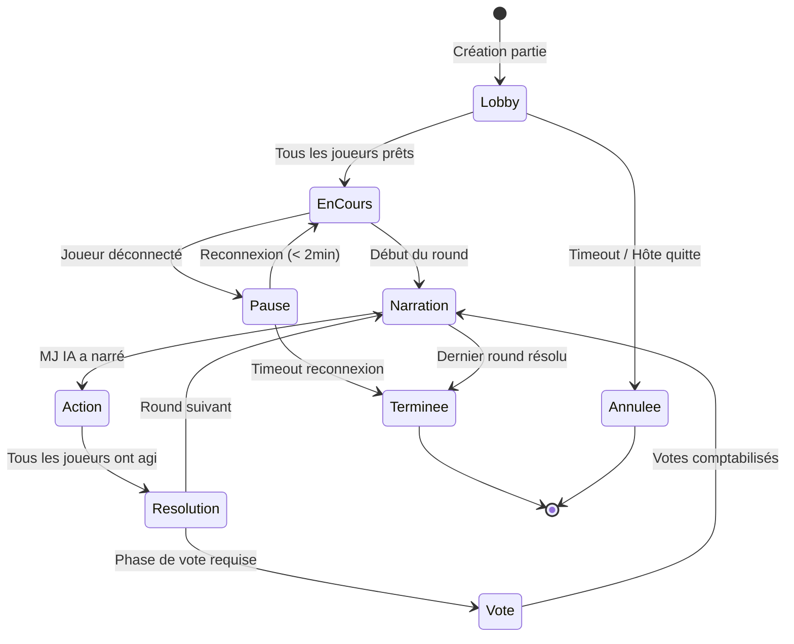

# ETUDE DE FAISABILITE — Projet MYTHOS

**Plateforme web de jeux narratifs multijoueurs avec Game Master IA**

| Information | Valeur |
|---|---|
| **Projet** | MYTHOS |
| **Version du document** | 1.0 |
| **Date de rédaction** | 09 février 2026 |
| **Auteur** | Kays ZAHIDI — Équipe MYTHOS |
| **Classification** | RNCP — Bloc 1 : Planification et organisation d'un projet de développement logiciel |
| **Statut** | En cours de validation |

---

## Table des matieres

1. [Synthese decisionnelle](#1-synthese-decisionnelle)
2. [Analyse des besoins](#2-analyse-des-besoins)
3. [Etude de marche](#3-etude-de-marche)
4. [Faisabilite technique](#4-faisabilite-technique)
5. [Faisabilite organisationnelle](#5-faisabilite-organisationnelle)
6. [Faisabilite financiere](#6-faisabilite-financiere)
7. [Analyse SWOT](#7-analyse-swot)
8. [Matrice de decision GO / NO-GO](#8-matrice-de-decision-go--no-go)
9. [Conclusion et recommandations](#9-conclusion-et-recommandations)

---

## 1. Synthese decisionnelle

Ce document pose noir sur blanc notre analyse avant de nous lancer sur 14 semaines de dev. En tant que chef de projet et architecte technique, j'ai bossé cette étude avec toute l'équipe pour vérifier que MYTHOS tient la route avec nos compétences, notre budget étudiant et nos contraintes de temps. On a passé une bonne soirée sur Discord à débattre de certains points -- Samy voulait qu'on pousse plus loin l'analyse IA, Youri trouvait qu'on sous-estimait la partie frontend. Au final, chaque section reflète nos discussions et nos choix.

### 1.1 Contexte du projet

MYTHOS est une plateforme web de jeux narratifs multijoueurs en temps reel ou un moteur d'Intelligence Artificielle assume le role de Maitre du Jeu (Game Master). Le projet se situe a la croisee de trois tendances majeures : l'explosion de l'IA generative (marche mondial estime a 67 milliards USD en 2025, projection 207 milliards USD en 2030), la croissance du marche du jeu casual et social (+18 % par an depuis 2022), et le renouveau du jeu narratif interactif porte par des titres comme *AI Dungeon*, *Inkle Studios* et le succes des jeux de societe narratifs (*Loup-Garou*, *Mysterium*, *Pandemic Legacy*).

### 1.2 Proposition de valeur

MYTHOS se differencie par trois piliers :

1. **Moteur universel a scenarios modulaires** : Les scenarios (Scenario Packs) sont de simples fichiers JSON charges dynamiquement. Le moteur de jeu se fiche du theme : un meme systeme de regles generique gere les roles, les jauges, les tours et les evenements. Concretement, ca veut dire qu'on peut sortir de nouveaux contenus sans toucher au code. Yassir a bien resume le truc en reunion : "un scenario c'est juste un fichier de config, pas du dev".

2. **IA Game Master adaptative** : Le Game Master IA ne se contente pas de lire un script. Il narre en temps reel, arbitre les actions des joueurs, gere les PNJ, introduit des rebondissements contextuels et adapte le rythme en fonction de l'engagement mesure des joueurs (temps de reponse, frequence d'interactions).

3. **Sessions courtes et accessibles** : Format 15-25 minutes, 2 a 8 joueurs, zero installation, jouable sur navigateur. Le positionnement vise le segment casual social, sous-exploite par les plateformes narratives existantes qui ciblent les joueurs hardcore.

### 1.3 Perimetre

- **MVP (14 semaines)** : Moteur de jeu universel, 2 Scenario Packs jouables (TRIBUNAL et DEEP), matchmaking basique, interface temps reel, IA Game Master via API LLM.
- **Post-MVP** : Editeur de Scenario Packs communautaire, systeme de classement, monetisation via scenarios premium, applications mobiles natives.

### 1.4 Synthese de la decision

| Critere | Evaluation | Niveau de confiance |
|---|---|---|
| Faisabilite technique | Realisable avec contraintes identifiees | Eleve |
| Faisabilite organisationnelle | Realisable sur 14 semaines avec equipe de 4 | Moyen-Eleve |
| Faisabilite financiere | Budget maitrise (infrastructure cloud + API IA) | Moyen |
| Risque global | Modere — risques principaux identifies et mitigables | Moyen-Eleve |
| **Recommandation** | **GO conditionnel — sous reserve de validation du POC IA (semaine 2)** | — |

---

## 2. Analyse des besoins

### 2.1 Personas detailles

#### Persona 1 : Lucas — Le joueur casual social

| Attribut | Detail |
|---|---|
| **Age** | 22 ans |
| **Situation** | Etudiant en communication, Paris |
| **Profil gaming** | Joueur mobile casual (Among Us, Gartic Phone, Jackbox) |
| **Temps de jeu** | 30-60 min par session, 3-4 fois par semaine |
| **Budget loisirs** | 15-25 EUR/mois pour le gaming |
| **Equipement** | Smartphone Android, laptop basique, connexion fibre |
| **Canaux** | TikTok, Discord, YouTube Shorts |

**Pain points :**
- Les jeux narratifs existants (D&D, jeux de roles sur table) demandent trop de preparation et un MJ humain disponible.
- Les jeux en ligne multijoueurs deviennent repetitifs apres quelques parties car les scenarios sont statiques.
- Difficulte a reunir un groupe d'amis pour des sessions longues (2h+).
- Les plateformes existantes (Roll20, Foundry VTT) sont trop complexes pour un joueur non initie.

**Jobs-to-be-done :**
- *Fonctionnel* : Lancer une partie narrative en moins de 2 minutes avec 2 a 4 amis.
- *Emotionnel* : Vivre des moments de surprise et de tension narrative sans effort de preparation.
- *Social* : Partager des anecdotes memorables de parties sur les reseaux sociaux.

**Criteres de satisfaction :**
- Temps d'onboarding < 3 minutes.
- Chaque partie raconte une histoire differente.
- Partage facile des moments forts (screenshots, recaps).

---

#### Persona 2 : Camille — La joueuse narratrice

| Attribut | Detail |
|---|---|
| **Age** | 28 ans |
| **Situation** | Designeuse UX, Lyon, joueuse de JdR sur table |
| **Profil gaming** | Joueuse mid-core, narrative-first (Disco Elysium, Inkle, Choices) |
| **Temps de jeu** | 1-2h par semaine, sessions planifiees |
| **Budget loisirs** | 30-50 EUR/mois |
| **Equipement** | MacBook Pro, iPhone, connexion fibre |
| **Canaux** | Reddit, Twitch, podcasts JdR |

**Pain points :**
- Frustree par la qualite narrative mediocre des IA generatives actuelles (AI Dungeon trop aleatoire, pas de structure).
- Cherche des experiences narratives structurees mais qui restent surprenantes.
- Ses amis joueurs de JdR sont disperses geographiquement.
- Les jeux narratifs solo manquent de la dimension sociale et de l'imprevisibilite humaine.

**Jobs-to-be-done :**
- *Fonctionnel* : Jouer des parties narratives structurees en ligne avec des amis distants.
- *Emotionnel* : Retrouver la magie d'une table de JdR avec la surprise d'une IA creative.
- *Social* : Construire des histoires collectives memorables avec sa communaute.

**Criteres de satisfaction :**
- Coherence narrative sur toute la session.
- Mecaniques de jeu qui soutiennent le recit (pas de pur hasard).
- Possibilite de rejouer avec des variantes significatives.

---

#### Persona 3 : Groupe "La Bande du Jeudi"

| Attribut | Detail |
|---|---|
| **Composition** | 5 amis, 19-24 ans, mix de profils (gamers, non-gamers) |
| **Contexte** | Se retrouvent en ligne le jeudi soir apres les cours |
| **Profil** | Jouent deja a Jackbox, Among Us, Skribbl.io |
| **Budget** | Un membre paye, les autres jouent gratuitement |
| **Equipement** | Mix smartphones/laptops, qualites de connexion variables |

**Pain points :**
- Lassitude des memes jeux repetes chaque semaine.
- Pas de jeu qui combine narration, deduction et interaction sociale en format court.
- Certains membres du groupe ne sont pas gamers — les jeux complexes les excluent.
- Les jeux gratuits sont souvent envahis de publicites intrusives.

**Jobs-to-be-done :**
- *Fonctionnel* : Trouver un jeu qui plaise a tout le groupe, gamers et non-gamers.
- *Emotionnel* : Creer des "inside jokes" et des moments memorables de groupe.
- *Social* : Renforcer les liens du groupe via des experiences partagees uniques.

---

### 2.2 Exigences fonctionnelles (MoSCoW)

| Priorite | Fonctionnalite | Justification |
|---|---|---|
| **Must Have** | Moteur de jeu universel (chargement de Scenario Packs JSON) | Coeur de la proposition de valeur technique |
| **Must Have** | IA Game Master (narration, arbitrage, PNJ) | Coeur de la proposition de valeur utilisateur |
| **Must Have** | Systeme de sessions temps reel (WebSocket) | Experience multijoueur synchrone indispensable |
| **Must Have** | Interface joueur responsive (desktop + mobile) | Accessibilite multi-device requise par les personas |
| **Must Have** | Scenario Pack TRIBUNAL (roles caches, plaidoiries, verdict) | Premier scenario vitrine |
| **Must Have** | Scenario Pack DEEP (survie sous-marine, jauges de ressources) | Second scenario pour prouver l'universalite du moteur |
| **Should Have** | Systeme d'authentification (OAuth Google/Discord) | Facilite d'acces et retention |
| **Should Have** | Historique des parties jouees | Retention et partageabilite |
| **Should Have** | Systeme de lobby / invitation par lien | Friction minimale pour reunir un groupe |
| **Could Have** | Mode spectateur | Potentiel streaming/Twitch |
| **Could Have** | Recap narratif de fin de partie genere par l'IA | Partageabilite sur reseaux sociaux |
| **Won't Have (MVP)** | Editeur communautaire de Scenario Packs | Prevu post-MVP |
| **Won't Have (MVP)** | Application mobile native | Prevu post-MVP |
| **Won't Have (MVP)** | Monetisation et paiement en ligne | Prevu post-MVP |

### 2.3 Exigences non fonctionnelles

| Categorie | Exigence | Cible |
|---|---|---|
| **Performance** | Latence de reponse IA < 3 secondes | P95 |
| **Performance** | Temps de chargement initial < 2 secondes | Sur connexion 4G |
| **Scalabilite** | Support de 50 sessions simultanees au lancement | Dimensionnement initial |
| **Disponibilite** | Uptime 99,5 % hors maintenance planifiee | SLA interne |
| **Securite** | Chiffrement TLS en transit, tokens JWT | Standard minimum |
| **Securite** | Moderation du contenu genere par l'IA (filtre de toxicite) | Obligation legale et ethique |
| **Accessibilite** | Conformite WCAG 2.1 niveau AA | Cible |
| **Compatibilite** | Chrome, Firefox, Safari, Edge (2 dernieres versions) | Navigateurs cibles |
| **Compatibilite** | Responsive design : mobile (360px) a desktop (1920px) | Breakpoints |

---

## 3. Etude de marche

### 3.1 Dimensionnement du marche (TAM / SAM / SOM)

#### TAM — Total Addressable Market (Marche total adressable)

Le marche mondial du jeu video est estime a **218 milliards USD en 2025** (source : Newzoo Global Games Market Report 2025). Le segment du jeu casual et social represente environ **35 %** de ce marche, soit **76 milliards USD**.

Le sous-segment des jeux narratifs et des jeux bases sur l'IA connait une croissance acceleree. Le marche mondial de l'IA dans le gaming est projete a **7,2 milliards USD en 2025**, avec un TCAC (taux de croissance annuel compose) de **26,8 %** jusqu'en 2030.

> **TAM = 7,2 milliards USD** (marche IA gaming mondial)

#### SAM — Serviceable Addressable Market (Marche adressable)

En se restreignant au segment specifique :
- Jeux narratifs multijoueurs en ligne (web-based)
- Marche francophone et europeen dans un premier temps
- Segment casual social (sessions courtes, 2-8 joueurs)

Le marche europeen du jeu represente environ **32 milliards USD** en 2025. Le segment casual social en Europe est estime a **11 milliards USD**. Les jeux narratifs / IA representent une niche estimee a **2-3 %** de ce segment.

> **SAM = 250 millions USD** (jeux narratifs IA, casual social, Europe)

#### SOM — Serviceable Obtainable Market (Marche capturable)

En tant que nouveau produit, sur un horizon de 18 mois post-lancement, avec une strategie de croissance organique (communaute Discord, bouche-a-oreille, contenu createur) :

- Cible : **5 000 a 15 000 utilisateurs actifs mensuels** a M+12
- Panier moyen estime : **3,50 EUR/mois** (modele freemium + scenarios premium)
- Taux de conversion free-to-paid : **4-7 %** (benchmark industrie jeux casual)

> **SOM = 200 000 a 630 000 EUR/an** (a M+18, scenario realiste)

### 3.2 Tendances du marche

| Tendance | Donnees chiffrees | Impact sur MYTHOS |
|---|---|---|
| Croissance de l'IA generative dans le gaming | Marche IA gaming : +26,8 % TCAC 2024-2030 | Fort positif — MYTHOS est au coeur de cette tendance |
| Essor du jeu casual social | +18 % par an depuis 2022, porte par Among Us, Jackbox | Fort positif — positionnement exactement sur ce segment |
| Declin des temps de session moyens | Session moyenne sur mobile : 12 min en 2025 (vs 18 min en 2020) | Positif — format 15-25 min aligne avec la tendance |
| Fatigue du contenu statique | 67 % des joueurs casual declarent vouloir plus de variete (Newzoo 2024) | Fort positif — IA genere du contenu dynamique |
| Croissance du JdR en ligne | Marche du JdR numerique : +22 % TCAC (Roll20 : 10M+ utilisateurs) | Positif — bassin d'early adopters identifie |
| Regulation de l'IA en Europe (AI Act) | Entree en vigueur progressive 2025-2026 | Neutre a surveiller — jeu narratif = faible risque reglementaire |
| Cout decroissant des API LLM | Cout moyen par million de tokens : divise par 5 entre 2023 et 2025 | Fort positif — viabilite economique croissante |

### 3.3 Analyse concurrentielle

| Concurrent | Type | Forces | Faiblesses | Positionnement vs MYTHOS |
|---|---|---|---|---|
| **AI Dungeon** | Jeu narratif IA solo/coop | Pionnier, large base utilisateurs, IA creative | Solo-first, pas de structure narrative, qualite inegale | MYTHOS est multijoueur-first avec narration structuree |
| **Roll20 / Foundry VTT** | Plateforme JdR en ligne | Ecosysteme riche, communaute etablie | Complexe, necessite un MJ humain, sessions longues | MYTHOS cible le casual, pas le hardcore JdR |
| **Jackbox Games** | Jeux de societe en ligne | Excellent UX, format party game, accessible | Pas de narration profonde, contenu statique | MYTHOS ajoute la narration IA et la rejouabilite infinie |
| **Among Us** | Jeu social a roles caches | Enorme base joueurs, gameplay simple | Repetitif, pas de narration, gameplay simpliste | MYTHOS offre deduction + narration riche |
| **Character.AI** | Chatbot IA conversationnel | IA conversationnelle avancee, gratuit | Pas de jeu structure, solo, pas de mecaniques | MYTHOS est un jeu structure, pas un chatbot |
| **Storium** | Jeu narratif collaboratif en ligne | Narration collaborative, communaute niche | Pas d'IA, asynchrone, niche tres etroite | MYTHOS ajoute l'IA et le temps reel |

### 3.4 Avantage concurrentiel durable

1. **Moteur universel + Scenario Packs** : Pouvoir deployer de nouveaux scenarios via de simples fichiers JSON, c'est un vrai avantage en termes de vitesse de contenu. Aucun concurrent actuel ne propose cette architecture modulaire.

2. **Format "sweet spot"** : A mi-chemin entre le party game casual (Jackbox) et le JdR profond (Roll20), MYTHOS occupe un creneau vacant.

3. **Effet de reseau** : Chaque nouveau scenario augmente la valeur de la plateforme pour tous les utilisateurs. Les scenarios communautaires (post-MVP) pourraient creer un effet volant d'inertie (*flywheel*).

---

## 4. Faisabilite technique

### 4.1 Architecture technique cible

```
+-------------------------------------------------------------------+
|                        CLIENT (Browser)                           |
|  React/Next.js  |  WebSocket Client  |  State Management (Zustand)|
+-------------------------------------------------------------------+
          |                    |                      |
          | HTTPS              | WSS                  |
          v                    v                      v
+-------------------------------------------------------------------+
|                        API GATEWAY (Node.js)                      |
|  REST API  |  WebSocket Server  |  Auth (JWT)  |  Rate Limiter    |
+-------------------------------------------------------------------+
          |                    |                      |
          v                    v                      v
+------------------+  +-------------------+  +---------------------+
|  GAME ENGINE     |  |  AI SERVICE       |  |  DATA LAYER         |
|  (Node.js)       |  |  (Python/Node)    |  |  PostgreSQL         |
|                  |  |                   |  |  Redis (sessions)   |
|  - Scenario      |  |  - LLM API       |  |  - Utilisateurs     |
|    Loader (JSON) |  |    (OpenAI /      |  |  - Historique       |
|  - Game State    |  |    Anthropic)     |  |  - Scenarios        |
|    Machine       |  |  - Prompt         |  |                     |
|  - Rules Engine  |  |    Engineering    |  |                     |
|  - Turn Manager  |  |  - Content Filter |  |                     |
+------------------+  +-------------------+  +---------------------+
```

### 4.2 Stack technique retenue

| Couche | Technologie | Justification |
|---|---|---|
| **Frontend** | Next.js 14 + React 18 | SSR pour le SEO, excellent DX, large ecosysteme |
| **UI** | Tailwind CSS + Shadcn/UI | Prototypage rapide, design system coherent |
| **Temps reel** | Socket.io | Abstraction WebSocket mature, fallback automatique |
| **Backend** | Node.js + NestJS 10+ | Framework structure et modulaire, TypeScript natif, excellent pour les projets d'equipe |
| **IA** | API OpenAI (GPT-4o) + API Anthropic (Claude) en fallback | Meilleur rapport qualite/cout, double sourcing pour resilience |
| **Base de donnees** | PostgreSQL (Supabase) | Relationnel robuste, hosting simplifie via Supabase |
| **Cache/Sessions** | Redis (Upstash) | Sessions temps reel, pub/sub pour WebSocket |
| **Hebergement** | Vercel (frontend) + Railway ou Render (backend) | Deploy continu, scaling auto, tier gratuit genereux |
| **CI/CD** | GitHub Actions | Integration native GitHub, gratuit pour repos publics |
| **Monitoring** | Sentry (erreurs) + Vercel Analytics | Couverture erreur + performance |

### 4.3 Matrice de competences de l'equipe

L'equipe est composee de 4 membres. Chaque competence est evaluee sur une echelle de 1 a 5 :
- 1 = Debutant (necessite formation)
- 2 = Notions de base
- 3 = Competent (autonome sur des taches standard)
- 4 = Avance (capable de concevoir des solutions complexes)
- 5 = Expert (reference technique, capable de former les autres)

| Competence | Kays (PO / Architecte) | Samy (SM / Backend + IA) | Youri (Frontend) | Yassir (Frontend / UX + DevOps) | Niveau moyen equipe | Seuil requis | Ecart |
|---|---|---|---|---|---|---|---|
| React / Next.js | 3 | 2 | 4 | 3 | 3,0 | 3 | 0,0 |
| Node.js / NestJS | 2 | 4 | 1 | 2 | 2,3 | 3 | -0,7 |
| WebSocket / Socket.io | 2 | 3 | 2 | 3 | 2,5 | 3 | -0,5 |
| PostgreSQL / Prisma | 2 | 4 | 1 | 2 | 2,3 | 3 | -0,7 |
| Redis | 2 | 3 | 1 | 2 | 2,0 | 2 | 0,0 |
| API LLM (Anthropic Claude) | 2 | 3 | 1 | 2 | 2,0 | 3 | **-1,0** |
| Prompt Engineering | 3 | 3 | 1 | 2 | 2,3 | 3 | -0,7 |
| UI/UX Design | 2 | 1 | 3 | 4 | 2,5 | 3 | -0,5 |
| DevOps / CI-CD | 3 | 2 | 1 | 4 | 2,5 | 2 | +0,5 |
| Tests (unitaires, integration) | 3 | 3 | 2 | 2 | 2,5 | 3 | -0,5 |
| Gestion de projet Agile | 4 | 4 | 2 | 2 | 3,0 | 3 | 0,0 |

**Analyse des ecarts critiques :**

| Competence deficitaire | Ecart | Plan de mitigation |
|---|---|---|
| API LLM (Anthropic Claude) | -1,0 | Samy referent (niveau 3), documentation interne des patterns d'appel, sessions de pair-programming |
| Node.js / NestJS | -0,7 | Samy referent (niveau 4), Kays en backup (niveau 2), pair programming et code review systematique |
| PostgreSQL / Prisma | -0,7 | Samy referent (niveau 4), formation Prisma en S0, documentation schema BDD |
| Prompt Engineering | -0,7 | Kays et Samy co-referents (niveau 3), ressources externes (guides Anthropic), iterations collectives |
| Tests | -0,5 | Mise en place de templates de tests des le sprint 1, formation TDD en semaine 2 |

### 4.4 Analyse des dependances techniques

```
                    +-------------------+
                    |  API LLM Externe  |
                    |  (OpenAI/Claude)  |
                    +--------+----------+
                             |
                    Dependance critique
                    (disponibilite, cout,
                     qualite des reponses)
                             |
+----------+        +--------v----------+        +-----------+
| Frontend | <----> |  Backend / API    | <----> | PostgreSQL|
| (Next.js)|  WSS   |  (Node.js)        |  SQL    | (Supabase)|
+----------+        +--------+----------+        +-----------+
                             |
                    +--------v----------+
                    |   Redis (Upstash) |
                    |   Sessions/Cache  |
                    +-------------------+
```

**Dependances critiques identifiees :**

| Dependance | Type | Risque | Mitigation |
|---|---|---|---|
| API OpenAI (GPT-4o) | Externe, SaaS | Indisponibilite, changement de prix, degradation qualite | Double sourcing avec Anthropic Claude, cache des reponses frequentes, mode degrade avec reponses pre-ecrites |
| Supabase (PostgreSQL) | Externe, SaaS | Indisponibilite, limites tier gratuit | Export regulier des donnees, migration possible vers PostgreSQL auto-heberge |
| Upstash (Redis) | Externe, SaaS | Indisponibilite | Fallback en memoire locale (avec perte de distribution multi-instances) |
| Socket.io | Librairie OSS | Breaking changes, vulnerabilites | Verrouillage de version, plan de migration vers ws natif si necessaire |
| Vercel | Externe, SaaS | Limites du tier gratuit, cold starts | Architecture permettant migration vers Netlify ou Railway |

### 4.5 Plan de POC (Proof of Concept)

Le POC est prevu en **semaine 1 et semaine 2** pour valider les 3 points techniques qui nous font le plus flipper avant de se lancer a fond dans le dev.

| POC | Objectif | Critere de succes | Duree | Responsable |
|---|---|---|---|---|
| **POC-1 : IA Game Master** | Valider qu'un LLM peut generer une narration coherente et arbitrer des actions de joueurs dans un contexte de jeu structure | Narration coherente sur 10 tours consecutifs, respect des regles du scenario, temps de reponse < 3s dans 90% des cas | 3 jours | Samy (IA / Temps réel) |
| **POC-2 : Temps reel multi-joueurs** | Valider la synchronisation d'etat de jeu entre 4+ clients via WebSocket | 4 clients synchronises avec latence < 200ms, gestion de la deconnexion/reconnexion, pas de desynchronisation d'etat | 2 jours | Youri (Frontend) |
| **POC-3 : Scenario Pack Loader** | Valider le chargement dynamique d'un fichier JSON de scenario et l'instanciation d'une partie avec des regles configurees | Chargement et validation d'un JSON de scenario, instanciation correcte des roles, jauges et phases de jeu | 2 jours | Kays (PO / Architecte) |

**Decision GO/NO-GO technique prevue en fin de semaine 2.**

Si un POC echoue :
- POC-1 (IA) : Degrader vers un systeme hybride (arbres narratifs pre-ecrits + IA pour les descriptions seulement).
- POC-2 (Temps reel) : Degrader vers un modele tour par tour avec polling HTTP (perte de l'experience temps reel mais fonctionnalite preservee).
- POC-3 (Scenario Loader) : Simplifier le format JSON et reduire la flexibilite du moteur.

### 4.6 Diagramme d'etat du cycle de vie d'une partie

Le diagramme ci-dessous modelise les differents etats par lesquels passe une session de jeu MYTHOS, depuis sa creation jusqu'a sa conclusion. Il met en evidence les transitions declenchees par les actions des joueurs, du Game Master IA et les mecanismes de gestion des deconnexions.



---

## 5. Faisabilite organisationnelle

### 5.1 Organisation de l'equipe

| Membre | Role principal | Roles secondaires | Disponibilite hebdomadaire |
|---|---|---|---|
| **Kays ZAHIDI** | PO / Chef de projet / Architecte | Architecture, Code review, Integration, Coordination, Decisions techniques | 25h/semaine |
| **Samy ZEROUALI** | Scrum Master / Dev Backend + IA | Backend NestJS, Service IA, Prompt Engineering, WebSocket, Suivi Agile | 28h/semaine |
| **Youri EMMANUEL** | Developpeur Frontend | Interface React/Next.js, Integration UI, Tests frontend | 22h/semaine |
| **Yassir SABBAR** | Dev Frontend / UX-UI + DevOps | Maquettes Figma, CI/CD, Deploiement, Accessibilite, Design system | 22h/semaine |

**Disponibilite totale equipe : 97 heures/semaine soit environ 13,9 jours-homme/semaine.**

### 5.2 Matrice RACI

| Activite | Kays (PO / Architecte) | Samy (SM / Backend + IA) | Youri (Frontend) | Yassir (Frontend / UX + DevOps) |
|---|---|---|---|---|
| Definition du backlog produit | **R/A** | C | I | C |
| Architecture technique globale | **R/A** | C | I | I |
| Conception UX/UI | C | I | C | **R/A** |
| Developpement frontend | A | I | **R** | R |
| Developpement backend / API | A | **R** | I | I |
| Developpement moteur de jeu | **R** | C | I | I |
| Developpement service IA | A | **R** | I | I |
| Conception Scenario Packs (JSON) | **R/A** | C | I | C |
| Integration WebSocket temps reel | A | **R** | C | I |
| Tests unitaires et integration | **A** | R | R | R |
| Tests utilisateurs | I | I | C | **R/A** |
| CI/CD et deploiement | A | I | I | **R** |
| Documentation technique | **A** | R | R | R |
| Revue de sprint / retrospective | C | **R** | C | C |
| Communication projet (RNCP) | **R/A** | C | C | C |

*Legende : **R** = Responsible (realise), **A** = Accountable (valide/rend des comptes), **C** = Consulted, **I** = Informed*

### 5.3 Methodologie Agile

| Parametre | Valeur |
|---|---|
| Framework | Scrum adapte |
| Duree de sprint | 2 semaines |
| Nombre total de sprints | 7 (= 14 semaines) |
| Ceremonies | Daily standup (15 min, async sur Discord si necessaire), Sprint Planning (lundi S1, 1h30), Backlog Refinement (vendredi S1, 1h), Sprint Review + Retro (vendredi S2, 2h) |
| Outils | GitHub Projects (board Kanban), Discord (communication), Figma (design), Notion (documentation) |
| Definition of Done | Code review approuvee, tests passes, deploye en staging, documentation mise a jour |

### 5.4 Charge de travail estimee par sprint (en jours-homme)

| Sprint | Semaines | Objectif principal | Kays (Archi) | Samy (SM/Back/IA) | Youri (Front) | Yassir (UX/DevOps) | Total j/h |
|---|---|---|---|---|---|---|---|
| Sprint 0 | Sem 1-2 | Setup + POC + Architecture | 8 | 10 | 7 | 5 | **30** |
| Sprint 1 | Sem 3-4 | Moteur de jeu + Auth + WebSocket | 8 | 9 | 8 | 5 | **30** |
| Sprint 2 | Sem 5-6 | Interface joueur + Lobby + IA GM v1 + TRIBUNAL | 6 | 10 | 6 | 6 | **28** |
| Sprint 3 | Sem 7-8 | TRIBUNAL complet + DEEP + Jauges UI | 5 | 11 | 7 | 6 | **29** |
| Sprint 4 | Sem 9-10 | Integration + Bug fixes + Tests utilisateurs | 6 | 9 | 6 | 6 | **27** |
| Sprint 5 | Sem 11-12 | Performance + Optimisation IA + Polish UI | 6 | 9 | 6 | 6 | **27** |
| Sprint 6 / Buffer | Sem 13-14 | Deploiement production + Stabilisation + Doc RNCP | 7 | 7 | 6 | 5 | **25** |
| | | **TOTAL** | **46** | **65** | **46** | **39** | **196** |

**Charge totale estimee : 196 jours-homme sur 7 sprints de 2 semaines (14 semaines).**
**Capacite theorique : 14 semaines x 13,9 j/h = 194,6 j/h.**
**Marge : faible — Samy est clairement le plus charge avec son double role SM + Backend/IA. On va devoir surveiller ca de pres, quitte a redistribuer des taches vers Youri si ca devient trop.**

### 5.5 Calendrier academique et jalons

| Sprint | Semaines | Jalon | Livrable |
|---|---|---|---|
| Sprint 0 | Sem 1-2 | **POC Gate** | POCs valides, decision GO/NO-GO technique |
| Sprint 1 | Sem 3-4 | **Alpha interne** | Moteur de jeu fonctionnel, 1 scenario jouable en local |
| Sprint 3 | Sem 7-8 | **Beta fermee** | TRIBUNAL jouable en ligne, 2-4 joueurs |
| Sprint 4 | Sem 9-10 | **Beta ouverte** | TRIBUNAL + DEEP jouables, tests utilisateurs |
| Sprint 5 | Sem 11-12 | **Release Candidate** | Produit complet, performance optimisee |
| Sprint 6 / Buffer | Sem 13-14 | **Mise en production + Livraison RNCP** | Deploiement production, documentation complete, soutenance preparee |

---

## 6. Faisabilite financiere

### 6.1 Hypotheses de base

| Hypothese | Valeur | Source/Justification |
|---|---|---|
| Duree du projet | 14 semaines | Contrainte academique |
| Taille de l'equipe | 4 personnes | Contrainte academique |
| Cout du travail etudiant | 0 EUR (projet academique) | Le travail de l'equipe n'est pas facture |
| Cout equivalent marche (pour reference) | 350 EUR/jour-homme | Tarif junior freelance Paris |
| Budget disponible (cash) | 500 EUR maximum | Contrainte realiste pour un projet etudiant |
| Post-lancement : utilisateurs M+6 | 2 000 MAU | Hypothese conservative |
| Post-lancement : utilisateurs M+12 | 8 000 MAU | Hypothese realiste |

### 6.2 Budget detaille par phase

#### Phase 1 : POC et Architecture (Semaines 1-2)

| Poste | Detail | Cout mensuel | Cout phase | Notes |
|---|---|---|---|---|
| API OpenAI (GPT-4o) | Tests POC, ~500K tokens | — | 15 EUR | Tier gratuit + credits etudiants |
| Supabase | Tier gratuit | 0 EUR | 0 EUR | 500 Mo, 50K requetes/mois |
| Vercel | Tier hobby | 0 EUR | 0 EUR | Suffisant pour dev/staging |
| Domaine (.fr ou .io) | mythos-game.fr | — | 12 EUR | Achat annuel |
| **Sous-total Phase 1** | | | **27 EUR** | |

#### Phase 2 : Developpement (Semaines 3-10)

| Poste | Detail | Cout mensuel | Cout phase (2 mois) | Notes |
|---|---|---|---|---|
| API OpenAI (GPT-4o) | Dev + tests, ~2M tokens/mois | 30 EUR/mois | 60 EUR | Estimation haute |
| API Anthropic (Claude) | Tests fallback, ~500K tokens | — | 15 EUR | Ponctuel |
| Supabase | Tier gratuit | 0 EUR | 0 EUR | Suffisant en dev |
| Upstash Redis | Tier gratuit (10K commandes/jour) | 0 EUR | 0 EUR | Suffisant en dev |
| Vercel | Tier hobby | 0 EUR | 0 EUR | |
| Railway (backend) | Tier starter, ~5 EUR/mois | 5 EUR/mois | 10 EUR | Si necessaire |
| Figma | Tier education gratuit | 0 EUR | 0 EUR | |
| **Sous-total Phase 2** | | | **85 EUR** | |

#### Phase 3 : Tests et Optimisation (Semaines 11-12)

| Poste | Detail | Cout mensuel | Cout phase (0,5 mois) | Notes |
|---|---|---|---|---|
| API OpenAI (GPT-4o) | Tests de charge, beta-testeurs | — | 40 EUR | Pic d'utilisation |
| Sentry | Tier gratuit (5K evenements/mois) | 0 EUR | 0 EUR | |
| **Sous-total Phase 3** | | | **40 EUR** | |

#### Phase 4 : Production et Lancement (Semaines 13-14)

| Poste | Detail | Cout mensuel | Cout phase (0,5 mois) | Notes |
|---|---|---|---|---|
| API OpenAI (GPT-4o) | Production, estimation 50 sessions/jour | — | 50 EUR | 1er mois de production |
| Supabase | Tier Pro si necessaire | 25 EUR/mois | 25 EUR | Anticipation scaling |
| Vercel | Tier Pro si necessaire | 20 EUR/mois | 20 EUR | Anticipation scaling |
| Railway | Tier Pro | 10 EUR/mois | 10 EUR | |
| **Sous-total Phase 4** | | | **105 EUR** | |

#### Recapitulatif du budget total

| Phase | Montant |
|---|---|
| Phase 1 : POC et Architecture | 27 EUR |
| Phase 2 : Developpement | 85 EUR |
| Phase 3 : Tests et Optimisation | 40 EUR |
| Phase 4 : Production et Lancement | 105 EUR |
| **Provision pour imprevus (20%)** | **51 EUR** |
| **TOTAL PROJET** | **308 EUR** |

> Le budget total de **308 EUR** est contenu dans l'enveloppe disponible de 500 EUR, laissant une reserve de 192 EUR.

### 6.3 Valorisation du travail de l'equipe (pour reference)

A titre indicatif, si le travail de l'equipe etait facture au tarif junior du marche :

| Poste | Volume | Tarif | Valorisation |
|---|---|---|---|
| Jours-homme de developpement | 196 j/h | 350 EUR/j | 68 600 EUR |
| **Valorisation totale du projet** | | | **68 600 EUR** |

Ce chiffre est important pour la presentation RNCP : ca montre l'ampleur reelle du projet en termes d'effort.

### 6.4 Analyse cout/benefice post-lancement

#### Modele de monetisation envisage (post-MVP)

| Source de revenus | Description | Prix | Hypothese de volume |
|---|---|---|---|
| Freemium de base | Acces gratuit aux 2 scenarios de base | 0 EUR | 100 % des utilisateurs |
| Scenario Packs Premium | Scenarios additionnels payants | 2,99 EUR/pack | 5 % des MAU achetent 1 pack/mois |
| Pass Mensuel | Acces illimite a tous les scenarios | 4,99 EUR/mois | 3 % des MAU |
| Cosmetiques | Avatars, themes de narration | 0,99-1,99 EUR | 2 % des MAU |

#### Projection financiere (post-lancement, base mensuelle)

| Indicateur | M+6 (2000 MAU) | M+12 (8000 MAU) | M+18 (15000 MAU) |
|---|---|---|---|
| Revenu Scenario Packs | 299 EUR | 1 196 EUR | 2 243 EUR |
| Revenu Pass Mensuel | 300 EUR | 1 198 EUR | 2 246 EUR |
| Revenu Cosmetiques | 60 EUR | 240 EUR | 450 EUR |
| **Revenu mensuel total** | **659 EUR** | **2 634 EUR** | **4 939 EUR** |
| Couts API IA (variable) | -200 EUR | -600 EUR | -1 000 EUR |
| Couts infrastructure | -80 EUR | -200 EUR | -400 EUR |
| **Marge mensuelle** | **379 EUR** | **1 834 EUR** | **3 539 EUR** |

#### Break-even point

- **Cout total du projet (cash)** : 308 EUR
- **Marge mensuelle estimee a M+6** : 379 EUR
- **Break-even** : atteint des le **mois 7 post-lancement** (scenario realiste)

Si l'on inclut les couts mensuels post-lancement (infrastructure + API IA = ~280 EUR/mois), le break-even operationnel est atteint des que le revenu mensuel depasse **280 EUR**, ce qui correspond a environ **1 500 MAU**.

### 6.5 Trois scenarios financiers (Horizon M+12)

| Indicateur | Pessimiste | Realiste | Optimiste |
|---|---|---|---|
| MAU a M+12 | 2 000 | 8 000 | 25 000 |
| Taux de conversion global | 3 % | 5 % | 8 % |
| Revenu mensuel | 350 EUR | 2 634 EUR | 12 450 EUR |
| Couts mensuels | 280 EUR | 800 EUR | 2 500 EUR |
| Marge mensuelle | 70 EUR | 1 834 EUR | 9 950 EUR |
| Marge annuelle | 840 EUR | 22 008 EUR | 119 400 EUR |
| Break-even operationnel | M+14 | M+7 | M+4 |
| **Viabilite** | Marginale, necessite pivot ou injection | **Viable et auto-finance** | Forte croissance, investissement possible |

**Hypotheses cles par scenario :**
- *Pessimiste* : Croissance organique lente, pas de viralite, 1 nouveau scenario tous les 2 mois.
- *Realiste* : Croissance organique + quelques createurs de contenu, 1 nouveau scenario par mois, editeur communautaire lance a M+8.
- *Optimiste* : Viralite TikTok/YouTube, couverture presse gaming, editeur communautaire actif, partenariats createurs.

---

## 7. Analyse SWOT

### Forces (Strengths)

| # | Force | Impact |
|---|---|---|
| F1 | Architecture modulaire unique (moteur + Scenario Packs JSON) | Scalabilite du contenu sans effort de developpement |
| F2 | Format de session court (15-25 min) aligne avec les usages actuels | Accessibilite maximale, forte rejouabilite |
| F3 | Positionnement vacant entre party game et JdR profond | Peu de concurrence directe sur ce creneau |
| F4 | Equipe pluridisciplinaire avec competences complementaires | Couverture technique et design |
| F5 | Couts d'infrastructure faibles (SaaS, tiers gratuits) | Budget maitrise, faible barriere financiere |
| F6 | Technologie IA en pleine maturite (GPT-4o, Claude) | Qualite narrative sans precedent accessible par API |

### Faiblesses (Weaknesses)

| # | Faiblesse | Impact |
|---|---|---|
| W1 | Equipe etudiante, experience professionnelle limitee | Risque de sous-estimation des complexites |
| W2 | Dependance a des API IA tierces (OpenAI, Anthropic) | Cout variable, disponibilite non garantie |
| W3 | Marge de planning faible (5 %) | Peu de tolerance aux retards |
| W4 | Competences WebSocket et Prompt Engineering a renforcer | Necessite montee en competence rapide |
| W5 | Pas de budget marketing | Croissance limitee au bouche-a-oreille initial |
| W6 | MVP limite a 2 scenarios | Risque de lassitude rapide si pas d'ajout de contenu |

### Opportunites (Opportunities)

| # | Opportunite | Probabilite | Impact potentiel |
|---|---|---|---|
| O1 | Marche de l'IA gaming en croissance explosive (+26,8 %/an) | Elevee | Tres fort |
| O2 | Viralite potentielle sur TikTok/YouTube (format clip-friendly) | Moyenne | Tres fort |
| O3 | Editeur communautaire de scenarios (UGC = contenu infini) | Elevee | Fort |
| O4 | Partenariats avec streamers/createurs JdR | Moyenne | Fort |
| O5 | Baisse continue des couts des API LLM | Elevee | Fort |
| O6 | Adaptation en outil pedagogique (serious games narratifs) | Moyenne | Moyen |
| O7 | Integration vocale (TTS/STT) pour narration immersive | Moyenne | Fort |

### Menaces (Threats)

| # | Menace | Probabilite | Impact potentiel |
|---|---|---|---|
| T1 | Entree d'un acteur majeur sur le creneau (ex : Jackbox + IA) | Moyenne | Tres fort |
| T2 | Augmentation brutale des prix des API LLM | Faible | Fort |
| T3 | Regulation IA (AI Act europeen) impactant le gaming | Faible | Moyen |
| T4 | Problemes de moderation du contenu genere par l'IA | Moyenne | Fort |
| T5 | Fatigue des utilisateurs envers les produits "IA" | Moyenne | Moyen |
| T6 | Difficulte a fideliser sans mise a jour reguliere de contenu | Elevee | Fort |

---

## 8. Matrice de decision GO / NO-GO

### 8.1 Criteres de decision ponderes

Chaque critere est note de 1 (insuffisant) a 5 (excellent). Les poids traduisent l'importance de chaque critere pour la reussite du projet. On a debattu un bon moment en equipe sur les ponderations -- Samy trouvait qu'on devait mettre plus de poids sur la technique, mais on a finalement decide de garder un equilibre.

| # | Critere | Poids (%) | Note (1-5) | Score pondere |
|---|---|---|---|---|
| C1 | Faisabilite technique (POC validables, stack maitrisee) | 25 % | 4 | 1,00 |
| C2 | Adequation besoin marche (personas, tendances, creneau vacant) | 20 % | 4 | 0,80 |
| C3 | Faisabilite organisationnelle (equipe, planning, methodo) | 20 % | 3 | 0,60 |
| C4 | Faisabilite financiere (budget contenu, modele economique) | 15 % | 4 | 0,60 |
| C5 | Maitrise des risques (risques identifies et mitigables) | 10 % | 3 | 0,30 |
| C6 | Potentiel de croissance post-MVP | 5 % | 5 | 0,25 |
| C7 | Valeur pedagogique et certification RNCP | 5 % | 5 | 0,25 |
| | **TOTAL** | **100 %** | | **3,80 / 5,00** |

### 8.2 Grille de decision

| Score global | Decision |
|---|---|
| >= 4,0 | **GO inconditionnel** |
| 3,5 - 3,9 | **GO conditionnel** (avec conditions a remplir) |
| 3,0 - 3,4 | **NO-GO sauf pivot** (revoir le perimetre) |
| < 3,0 | **NO-GO** |

### 8.3 Decision

> **Score obtenu : 3,80 / 5,00 — Decision : GO CONDITIONNEL**

**Conditions du GO :**

1. **Validation des 3 POCs en semaine 2** : Si le POC IA (POC-1) echoue, le projet doit etre re-scope avec un systeme narratif hybride. Seuil minimum : narration coherente sur 8 tours consecutifs.

2. **Montee en competence WebSocket validee en semaine 3** : Au moins 2 membres de l'equipe doivent demontrer une maitrise suffisante (niveau 3/5) de Socket.io par la realisation d'un prototype de synchronisation multi-client.

3. **Budget IA mensuel plafonne a 80 EUR** : Mise en place de rate limiting et de cache pour ne pas depasser ce seuil en phase de developpement. Alerte automatique a 70 % du budget.

4. **Revue de GO/NO-GO secondaire en semaine 7** (jalon Beta fermee) : Si TRIBUNAL n'est pas jouable en conditions reelles avec 4 joueurs, le perimetre du MVP sera reduit (suppression de DEEP, focus sur un seul scenario optimise).

---

## 9. Conclusion et recommandations

### 9.1 Synthese

Au bout de cette etude, on est convaincus que MYTHOS est **faisable techniquement, organisationnellement et financierement**, avec des risques identifies et des plans de mitigation en place. Le positionnement (jeu narratif IA casual multijoueur, sessions courtes) repond a un vrai besoin du marche, sur un creneau peu concurrence et en forte croissance.

Les principaux points d'attention sont :
- La **dependance aux API IA tierces** (cout et disponibilite), mitigee par le double sourcing et le caching.
- La **marge de planning reduite** (5 %), qui demande un suivi Agile serieux et la capacite de prioriser vite (couper des fonctionnalites "Should Have" si besoin).
- La **montee en competence technique** requise sur WebSocket et Prompt Engineering, planifiee des la semaine 1.

### 9.2 Recommandations

| # | Recommandation | Priorite | Echeance |
|---|---|---|---|
| R1 | Lancer les 3 POCs des la semaine 1 sans attendre la finalisation de l'architecture globale | Critique | Semaine 1 |
| R2 | Definir un "MVP minimal" de repli (1 seul scenario, IA simplifiee) en cas de retard significatif | Haute | Semaine 2 |
| R3 | Mettre en place le monitoring des couts API IA des le premier jour de developpement | Haute | Semaine 1 |
| R4 | Recruter 3 a 5 beta-testeurs externes des la semaine 7 pour les tests utilisateurs | Moyenne | Semaine 6 |
| R5 | Documenter systematiquement les choix techniques et les decisions architecturales (ADR) pour la certification RNCP | Haute | Continue |
| R6 | Planifier une session de "Game Design Workshop" en semaine 3 pour finaliser les regles de TRIBUNAL et DEEP avec toute l'equipe | Moyenne | Semaine 3 |
| R7 | Creer un serveur Discord communautaire des le lancement beta pour recueillir les retours et creer de l'engagement | Moyenne | Semaine 8 |

### 9.3 Prochaines etapes immediates

1. **J+1** : Creation du repository GitHub, setup du projet (monorepo), configuration CI/CD.
2. **J+1** : Ouverture des comptes API (OpenAI, Anthropic) et configuration des cles.
3. **J+2** : Demarrage des POCs en parallele.
4. **J+5** : Point d'avancement POC, ajustement si necessaire.
5. **J+10** : Revue GO/NO-GO technique avec l'equipe.

---

*Document redige dans le cadre du Bloc 1 RNCP — Planification et organisation d'un projet de developpement logiciel.*
*Derniere mise a jour : 09 fevrier 2026.*
