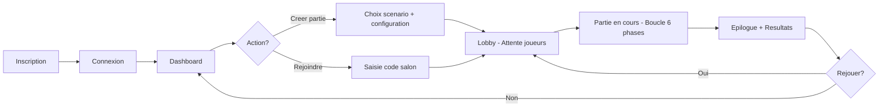

# MYTHOS - Specifications Fonctionnelles

**Version** : 1.0 | **Date** : 11/02/2026 | **Statut** : Draft
**Projet** : Plateforme web de jeux narratifs multijoueurs avec IA Game Master

> On a ecrit ces specs fonctionnelles ensemble. Yassir a valide les parcours utilisateurs cote UX, et Samy a pose les contraintes du Game Master IA. Pour les user stories, on a tout discute en equipe et prio avec MoSCoW — ca a pris plus de temps que prevu parce qu'on n'etait pas d'accord sur ce qui etait "Must" vs "Should" pour le chat en jeu.

---

## 1. Presentation du Projet

MYTHOS est une plateforme de jeux narratifs multijoueurs en temps reel ou une IA fait office de Maitre du Jeu (MJ). Le moteur de jeu repose sur une boucle en 6 phases et des scenarios configurables via des fichiers JSON qu'on appelle **Scenario Packs**.

### 1.1 Boucle de jeu (6 phases)

```
[SETUP] -> [NARRATION] -> [ACTION] -> [RESOLUTION] -> [DISCUSSION] -> [FINALE]
   |           |              |             |               |             |
   |  Config   |  IA narre    |  Joueurs    |  IA resout    |  Joueurs    | Fin de
   |  roles    |  la scene    |  soumettent |  les actions  |  debattent  | partie
   |  params   |              |  actions    |               |  votent     |
   +--------- TOUR (repete N rounds) --------+--------------+-------------+
```

### 1.2 Scenarios MVP

| Critere | TRIBUNAL | DEEP |
|---------|----------|------|
| Theme | Drame judiciaire, roles caches | Survie sous-marine |
| Joueurs | 4-8 | 3-6 |
| Rounds | 5 | 8 |
| Mecanique cle | Roles secrets, vote du verdict | Jauges O2/Energie/Coque/Profondeur |
| Condition fin | Verdict unanime ou round 5 | Surface atteinte ou jauge a 0 |

---

## 2. Acteurs du Systeme

| Acteur | Description |
|--------|-------------|
| **Joueur** | Participant a une partie, soumet des actions, vote |
| **Hote** | Joueur createur de la partie, configure et lance |
| **Admin** | Gestionnaire de la plateforme, moderation |
| **IA MJ** | Intelligence artificielle, narration et resolution |

---

## 3. Diagrammes de Cas d'Utilisation (ASCII)

### 3.1 Joueur

```
                        +---------------------------+
                        |         MYTHOS            |
                        |                           |
  +--------+            |  (Creer un compte)        |
  |        |----->------+  (Se connecter)           |
  | Joueur |----->------+  (Rejoindre une partie)   |
  |        |----->------+  (Soumettre une action)   |
  |        |----->------+  (Voter)                  |
  |        |----->------+  (Envoyer message chat)   |
  |        |----->------+  (Consulter historique)    |
  |        |----->------+  (Quitter une partie)     |
  +--------+            +---------------------------+
```

### 3.2 Hote

```
                        +---------------------------+
                        |         MYTHOS            |
  +--------+            |                           |
  |        |----->------+  (Creer une partie)       |
  |  Hote  |----->------+  (Choisir scenario)       |
  | (herite|----->------+  (Configurer parametres)  |
  | Joueur)|----->------+  (Lancer la partie)       |
  |        |----->------+  (Expulser un joueur)     |
  |        |----->------+  (Mettre en pause)        |
  +--------+            +---------------------------+
```

### 3.3 Admin

```
                        +---------------------------+
                        |         MYTHOS            |
  +--------+            |                           |
  |        |----->------+  (Gerer les utilisateurs) |
  | Admin  |----->------+  (Moderer les parties)    |
  |        |----->------+  (Gerer Scenario Packs)   |
  |        |----->------+  (Consulter statistiques) |
  |        |----->------+  (Configurer IA MJ)       |
  |        |----->------+  (Bannir un utilisateur)  |
  +--------+            +---------------------------+
```

### 3.4 IA MJ

```
                        +---------------------------+
                        |         MYTHOS            |
  +--------+            |                           |
  |        |----->------+  (Generer narration)      |
  | IA MJ  |----->------+  (Resoudre actions)       |
  |        |----->------+  (Attribuer roles)        |
  |        |----->------+  (Mettre a jour jauges)   |
  |        |----->------+  (Evaluer condition fin)  |
  |        |----->------+  (Generer epilogue)       |
  +--------+            +---------------------------+
```

---

## 4. User Flows

### 4.1 Creer une Partie

```
[Accueil] -> [Clic "Creer"] -> [Choix Scenario Pack] -> [Config params]
    -> [Generation code salon] -> [Lobby / Attente joueurs]
    -> [Min joueurs atteint?]
        -> NON: [Attente...]
        -> OUI: [Bouton "Lancer" actif] -> [Clic Lancer]
            -> [IA MJ: Setup] -> [Attribution roles] -> [Phase Narration R1]
```

**Etapes detaillees :**
1. Hote clique "Creer une partie" depuis le dashboard
2. Selection du Scenario Pack (TRIBUNAL ou DEEP)
3. Configuration : nb joueurs, timers, parametres specifiques
4. Systeme genere un code salon unique (6 caracteres)
5. Hote est redirige vers le lobby, code affiche + lien partageable
6. Hote attend le nombre minimum de joueurs
7. Hote clique "Lancer la partie"
8. IA MJ execute la phase Setup (roles, jauges initiales)

### 4.2 Rejoindre une Partie

```
[Accueil] -> [Saisie code salon] -> [Validation code]
    -> INVALIDE: [Erreur "Code introuvable"]
    -> VALIDE: [Partie en cours?]
        -> OUI: [Erreur "Partie deja lancee"]
        -> NON: [Lobby plein?]
            -> OUI: [Erreur "Salon complet"]
            -> NON: [Entree dans le lobby] -> [Attente lancement]
```

### 4.3 Deroulement d'un Tour

```
[NARRATION]                    [ACTION]                  [RESOLUTION]
IA MJ genere le texte    ->   Timer demarre (60s)   ->  IA MJ traite
Joueurs lisent                 Joueurs soumettent        Calcul resultats
                               leurs actions             MAJ jauges (DEEP)

[DISCUSSION]                   [FINALE check]
Timer (90s)              ->    Condition de fin?
Chat ouvert                    -> NON: Tour suivant -> [NARRATION]
Vote (TRIBUNAL)                -> OUI: [EPILOGUE] -> IA genere fin
```

### 4.4 Administration

```
[Login Admin] -> [Dashboard Admin]
    -> [Utilisateurs] -> Lister / Bannir / Modifier role
    -> [Parties] -> Lister actives / Historique / Forcer arret
    -> [Scenarios] -> Lister / Ajouter Pack / Activer-Desactiver
    -> [Stats] -> Joueurs actifs / Parties jouees / Temps moyen
    -> [Config IA] -> Modele / Temperature / Tokens max
```

### 4.5 Diagramme du parcours joueur principal

Le diagramme ci-dessous synthetise le parcours utilisateur principal sur la plateforme MYTHOS, de l'inscription jusqu'au retour sur le dashboard apres une partie. Il met en evidence les deux chemins d'acces a une session de jeu (creation ou rejoindre) et la boucle de rejouabilite.



---

## 5. User Stories

### Legende : P = Priorite (M=Must, S=Should, C=Could, W=Won't) | SP = Story Points

### 5.1 Authentification & Profil

| ID | User Story | Criteres d'acceptation | SP | P |
|----|-----------|----------------------|----|----|
| US-01 | En tant que Joueur, je veux creer un compte afin d'acceder a la plateforme | Email unique, mot de passe 8+ chars, confirmation email | 3 | M |
| US-02 | En tant que Joueur, je veux me connecter afin d'acceder a mes parties | Login email/mdp, session JWT 24h, message erreur clair | 2 | M |
| US-03 | En tant que Joueur, je veux choisir un pseudo afin d'etre identifie en jeu | 3-20 chars, unique par partie, caracteres alphanumeriques | 2 | M |
| US-04 | En tant que Joueur, je veux me connecter via OAuth afin de simplifier l'acces | Google/Discord OAuth2, creation auto du compte | 3 | S |
| US-05 | En tant que Joueur, je veux consulter mon historique afin de revoir mes parties | Liste paginee, filtres par scenario/date, stats personnelles | 3 | S |
| US-06 | En tant que Joueur, je veux reinitialiser mon mot de passe afin de recuperer l'acces | Email de reset, lien valide 1h, nouveau mdp requis | 2 | M |

### 5.2 Gestion de Partie

| ID | User Story | Criteres d'acceptation | SP | P |
|----|-----------|----------------------|----|----|
| US-07 | En tant que Hote, je veux creer une partie afin de jouer avec mes amis | Choix scenario, code 6 chars genere, redirection lobby | 5 | M |
| US-08 | En tant que Hote, je veux configurer les parametres afin d'adapter l'experience | Timer action/discussion modifiable, nb joueurs dans la plage | 3 | M |
| US-09 | En tant que Joueur, je veux rejoindre via code afin d'entrer dans le salon | Saisie 6 chars, validation instantanee, erreurs explicites | 3 | M |
| US-10 | En tant que Hote, je veux lancer la partie afin de demarrer le jeu | Bouton actif si min joueurs, transition vers Setup IA | 3 | M |
| US-11 | En tant que Hote, je veux expulser un joueur afin de gerer le salon | Confirmation requise, joueur notifie, slot libere | 2 | S |
| US-12 | En tant que Hote, je veux mettre en pause afin de gerer un imprévu | Timers suspendus, joueurs notifies, reprise par hote | 3 | S |
| US-13 | En tant que Joueur, je veux voir la liste des joueurs dans le lobby afin de savoir qui est present | Liste temps reel, statut pret/pas pret, avatar | 2 | M |
| US-14 | En tant que Joueur, je veux quitter une partie afin de partir librement | Confirmation, notification aux autres, IA gere absence | 2 | M |
| US-15 | En tant que Joueur, je veux rejoindre via lien afin de simplifier l'acces | URL partageable, redirection auto vers lobby | 2 | S |

### 5.3 Gameplay - Boucle de Jeu

| ID | User Story | Criteres d'acceptation | SP | P |
|----|-----------|----------------------|----|----|
| US-16 | En tant que Joueur, je veux lire la narration de l'IA afin de comprendre la scene | Texte affiche progressivement, indication phase en cours | 5 | M |
| US-17 | En tant que Joueur, je veux soumettre une action afin d'influencer l'histoire | Champ texte libre, soumission avant fin timer, confirmation visuelle | 5 | M |
| US-18 | En tant que Joueur, je veux voir la resolution afin de connaitre les consequences | Resultat par joueur, narration IA, MAJ jauges animee | 5 | M |
| US-19 | En tant que Joueur, je veux discuter avec les autres afin de strategiser | Chat temps reel, timer visible, historique scrollable | 5 | M |
| US-20 | En tant que Joueur, je veux voter (TRIBUNAL) afin de rendre le verdict | Choix parmi options, vote secret, resultats apres cloture | 5 | M |
| US-21 | En tant que Joueur, je veux voir les jauges (DEEP) afin d'evaluer la situation | O2/Energie/Coque/Profondeur affiches, MAJ temps reel, alertes seuils | 3 | M |
| US-22 | En tant que Joueur, je veux voir le timer afin de gerer mon temps | Decompte visible, alerte a 10s, action auto si timeout | 2 | M |
| US-23 | En tant que Joueur, je veux voir mon role secret (TRIBUNAL) afin de jouer mon personnage | Role affiche uniquement au joueur, description, objectifs | 3 | M |
| US-24 | En tant que Joueur, je veux voir l'epilogue afin de connaitre la fin de l'histoire | Texte narratif IA, revele roles (TRIBUNAL), stats finales | 5 | M |
| US-25 | En tant que Joueur, je veux recevoir des notifications afin de suivre les phases | Notification sonore/visuelle changement de phase, tour restant | 2 | S |

### 5.4 Communication

| ID | User Story | Criteres d'acceptation | SP | P |
|----|-----------|----------------------|----|----|
| US-26 | En tant que Joueur, je veux envoyer un message public afin de communiquer | Message 500 chars max, pseudo affiche, horodatage | 3 | M |
| US-27 | En tant que Joueur, je veux envoyer un message prive afin de completer | Choix destinataire, visible uniquement par les 2, icone distinct | 3 | C |
| US-28 | En tant que Joueur, je veux utiliser des emojis de reaction afin de reagir vite | Set limite d'emojis, reaction sur messages, compteur | 2 | C |

### 5.5 Administration

| ID | User Story | Criteres d'acceptation | SP | P |
|----|-----------|----------------------|----|----|
| US-29 | En tant qu'Admin, je veux bannir un utilisateur afin de moderer | Ban temporaire/permanent, motif requis, notification | 3 | M |
| US-30 | En tant qu'Admin, je veux voir les parties en cours afin de superviser | Liste temps reel, nb joueurs, scenario, duree | 3 | M |
| US-31 | En tant qu'Admin, je veux forcer l'arret d'une partie afin de gerer les abus | Arret immediat, joueurs notifies, raison loguee | 2 | S |
| US-32 | En tant qu'Admin, je veux gerer les Scenario Packs afin de controler le contenu | CRUD packs, validation JSON schema, activation/desactivation | 5 | M |
| US-33 | En tant qu'Admin, je veux consulter les statistiques afin de piloter la plateforme | Dashboard KPIs, graphiques, export CSV | 5 | S |
| US-34 | En tant qu'Admin, je veux configurer l'IA MJ afin d'ajuster les reponses | Temperature, modele, tokens max, prompt systeme editable | 3 | S |

### 5.6 IA MJ

| ID | User Story | Criteres d'acceptation | SP | P |
|----|-----------|----------------------|----|----|
| US-35 | En tant qu'IA MJ, je veux generer la narration afin de raconter la scene | Texte coherent, contextuel au scenario, <500 tokens | 8 | M |
| US-36 | En tant qu'IA MJ, je veux resoudre les actions afin de faire avancer l'histoire | Chaque action traitee, consequences logiques, jauges MAJ | 8 | M |
| US-37 | En tant qu'IA MJ, je veux attribuer les roles afin d'initialiser la partie | Roles du pack, distribution aleatoire equilibree | 5 | M |
| US-38 | En tant qu'IA MJ, je veux evaluer la condition de fin afin de terminer la partie | Verification chaque fin de tour, declenchement epilogue | 3 | M |
| US-39 | En tant qu'IA MJ, je veux adapter la difficulte afin de maintenir l'engagement | Analyse jauges, ajustement evenements, tension narrative | 5 | C |
| US-40 | En tant qu'IA MJ, je veux generer l'epilogue afin de conclure l'histoire | Resume coherent, revele secrets, personnalise par joueur | 5 | M |
| US-41 | En tant qu'IA MJ, je veux gerer les joueurs absents afin de ne pas bloquer | Action par defaut apres timeout, narration adaptee | 3 | M |
| US-42 | En tant qu'IA MJ, je veux maintenir la coherence narrative pour assurer l'immersion | Memoire contextuelle par partie, references evenements passes | 5 | S |

---

## 6. Regles Metier

### 6.1 Timers

| Phase | Duree defaut | Min | Max | Timeout |
|-------|-------------|-----|-----|---------|
| Narration | 15s (affichage) | 10s | 30s | Auto-skip |
| Action | 60s | 30s | 120s | Action vide soumise |
| Resolution | 20s (affichage) | 10s | 30s | Auto-skip |
| Discussion | 90s | 30s | 180s | Cloture auto |
| Vote (TRIBUNAL) | 30s | 15s | 60s | Abstention comptee |

### 6.2 Deconnexion

| Regle | Detail |
|-------|--------|
| Deconnexion <2min | Reconnexion auto, etat preserve |
| Deconnexion 2-5min | Place reservee, IA joue a sa place |
| Deconnexion >5min | Joueur retire, IA prend le relais definitivement |
| Hote deconnecte | Transfert role Hote au joueur le plus ancien |

### 6.3 Vote (TRIBUNAL)

- Vote secret : choix visible uniquement apres cloture
- Unanimite requise pour verdict immediat
- Majorite simple sinon, egalite = nouveau tour de discussion
- Chaque joueur vote exactement 1 fois par phase de vote
- Abstention (timeout) = vote neutre, non comptabilise

### 6.4 Roles (TRIBUNAL)

| Role | Nb | Objectif secret |
|------|-----|----------------|
| Avocat defense | 1 | Faire acquitter l'accuse |
| Procureur | 1 | Faire condamner l'accuse |
| Temoin fiable | 1-2 | Reveler la verite |
| Temoin corrompu | 1-2 | Mentir pour un camp |
| Jure | 1-3 | Voter selon conviction |
| Accuse | 1 | Survivre au proces |

Distribution : aleatoire par IA MJ, on s'assure qu'il y ait au moins 1 joueur par camp.

### 6.5 Jauges (DEEP)

| Jauge | Init | Min | Max | Effets |
|-------|------|-----|-----|--------|
| O2 | 100% | 0% | 100% | <20% : actions limitees. 0% : defaite |
| Energie | 100% | 0% | 100% | <15% : systemes defaillants. 0% : derive |
| Coque | 100% | 0% | 100% | <25% : fuites. 0% : implosion = defaite |
| Profondeur | 500m | 0m | 1000m | 0m = victoire (surface). 1000m = ecrasement |

Regle de decroissance par tour : O2 -8%, Energie -5%, Coque -3% (base).
Les actions des joueurs peuvent augmenter ou diminuer les jauges.

### 6.6 Conditions de Fin

| Scenario | Victoire | Defaite | Fin de temps |
|----------|----------|---------|-------------|
| TRIBUNAL | Verdict rendu (unanimite) | - | Round 5 : verdict majorite |
| DEEP | Profondeur = 0m (surface) | O2 ou Coque = 0% | Round 8 : epilogue selon jauges |

---

## 7. Matrice de Tracabilite

> Petit retour : on a d'abord ecrit les user stories sans matrice, et on s'est rendu compte en relisant qu'on avait oublie de couvrir la partie admin correctement. C'est Kays qui a insiste pour faire cette matrice et ca nous a permis de boucher les trous.

### User Stories <-> Fonctionnalites <-> Objectifs

| Objectif | Fonctionnalite | User Stories |
|----------|---------------|-------------|
| O1 - Acces plateforme | Authentification | US-01, US-02, US-04, US-06 |
| O2 - Identite joueur | Profil & pseudo | US-03, US-05 |
| O3 - Creer/rejoindre partie | Gestion salon | US-07, US-08, US-09, US-10, US-13, US-15 |
| O4 - Gestion salon | Controle Hote | US-11, US-12, US-14 |
| O5 - Experience narrative | Boucle de jeu | US-16, US-17, US-18, US-22, US-24, US-25 |
| O6 - Mecanique TRIBUNAL | Vote & roles | US-20, US-23 |
| O7 - Mecanique DEEP | Jauges & survie | US-21 |
| O8 - Communication | Chat & reactions | US-19, US-26, US-27, US-28 |
| O9 - Moderation | Administration | US-29, US-30, US-31 |
| O10 - Contenu | Gestion scenarios | US-32, US-34 |
| O11 - Pilotage | Statistiques | US-33 |
| O12 - IA narrative | Moteur IA MJ | US-35, US-36, US-37, US-38, US-39, US-40, US-41, US-42 |

---

## 8. Wireframes Textuels ASCII

> Les wireframes ASCII c'est Youri qui a eu l'idee, vu que tout le monde n'avait pas acces a Figma en meme temps. Ca nous a permis de se mettre d'accord sur la structure des ecrans avant de passer au design final.

### 8.1 Ecran d'Accueil

```
+================================================================+
|  MYTHOS                                    [Se connecter] [S'inscrire] |
+================================================================+
|                                                                |
|              M Y T H O S                                       |
|        Jeux narratifs multijoueurs                             |
|           avec IA Game Master                                  |
|                                                                |
|    +---------------------+  +---------------------+           |
|    | [Creer une partie]  |  | [Rejoindre]         |           |
|    |                     |  | Code: [______]  [OK]|           |
|    +---------------------+  +---------------------+           |
|                                                                |
|    --- Parties recentes ---                                    |
|    | TRIBUNAL | 5j | il y a 2h | Victoire  |                  |
|    | DEEP     | 4j | hier      | Defaite   |                  |
+================================================================+
```

### 8.2 Lobby

```
+================================================================+
|  MYTHOS > Lobby          Code: ABC123        [Copier] [Lien]  |
+================================================================+
|  Scenario: TRIBUNAL          Joueurs: 5/8                      |
|  Rounds: 5 | Timer action: 60s | Timer discussion: 90s        |
+----------------------------------------------------------------+
|  JOUEURS                    |  CHAT LOBBY                      |
|  +-----------------------+  |  +----------------------------+  |
|  | * Alice (Hote)    [V] |  |  | Alice: Salut tout le monde |  |
|  | * Bob             [V] |  |  | Bob: Pret!                 |  |
|  | * Charlie         [ ] |  |  | > [____________] [Envoyer] |  |
|  | * Diana           [V] |  |  +----------------------------+  |
|  | * Eve             [V] |  |                                  |
|  |   (3 places libres)   |  |                                  |
|  +-----------------------+  |                                  |
|                             |                                  |
|  [Parametres]  [LANCER LA PARTIE]  (Hote uniquement)          |
+================================================================+
```

### 8.3 Ecran de Jeu (Phase Action)

```
+================================================================+
|  MYTHOS > TRIBUNAL    Round 3/5    Phase: ACTION    Timer: 0:42|
+================================================================+
|  NARRATION                         |  INFO JOUEUR               |
|  +-------------------------------+ |  Role: Temoin corrompu     |
|  | Le procureur se leve et       | |  Objectif: Proteger        |
|  | presente une nouvelle piece   | |  l'accuse en mentant       |
|  | a conviction. L'accuse palit. | |  +-----------------------+ |
|  | La tension est palpable dans  | |  | JOUEURS               | |
|  | la salle d'audience...        | |  | * Alice    (a joue)   | |
|  +-------------------------------+ |  | * Bob      (a joue)   | |
|                                    |  | > Charlie  (vous)     | |
|  VOTRE ACTION                      |  | * Diana    (en cours) | |
|  +-------------------------------+ |  | * Eve      (a joue)   | |
|  | [Je temoigne que l'accuse     | |  +-----------------------+ |
|  |  etait avec moi ce soir-la ]  | |                            |
|  +-------------------------------+ |  CHAT                      |
|  [Soumettre mon action]           |  | Bob: Hmm interessant...  |
|                                    |  | > [__________] [Envoyer] |
+================================================================+
```

### 8.4 Ecran de Jeu DEEP (Jauges)

```
+================================================================+
|  MYTHOS > DEEP       Round 5/8    Phase: RESOLUTION  Timer: 0:15|
+================================================================+
|  JAUGES DU SOUS-MARIN                                          |
|  O2       [################----] 78%                           |
|  Energie  [###########---------] 55%   (!!)                    |
|  Coque    [########------------] 40%   (!!!)                   |
|  Profond. [======350m==========] 350m  -> Surface: 0m          |
+----------------------------------------------------------------+
|  RESOLUTION DU TOUR                    |  EQUIPAGE              |
|  +-----------------------------------+|  * Cmdt Alice : reparer |
|  | L'equipe a redirige l'energie     ||  * Ing. Bob  : moteurs  |
|  | vers les moteurs. Le sous-marin   ||  * Dr. Charlie: soins   |
|  | remonte de 50m. Mais une fuite    ||  * Nav. Diana : naviguer |
|  | est detectee : Coque -10%.        ||                          |
|  +-----------------------------------+|                          |
+================================================================+
```

### 8.5 Dashboard Admin

```
+================================================================+
|  MYTHOS Admin                              [Deconnexion]       |
+================================================================+
| [Utilisateurs] [Parties] [Scenarios] [Stats] [Config IA]      |
+----------------------------------------------------------------+
|  TABLEAU DE BORD                                               |
|  +-------------+ +-------------+ +-------------+ +-----------+|
|  | Joueurs     | | Parties     | | Parties     | | Temps     ||
|  | actifs: 142 | | en cours: 23| | total: 1847 | | moy: 35m  ||
|  +-------------+ +-------------+ +-------------+ +-----------+|
|                                                                |
|  PARTIES EN COURS                                              |
|  | ID   | Scenario | Joueurs | Round | Duree | Actions      | |
|  | #201 | TRIBUNAL | 6/8     | 3/5   | 18min | [Voir][Stop] | |
|  | #202 | DEEP     | 4/6     | 5/8   | 22min | [Voir][Stop] | |
|  | #203 | TRIBUNAL | 4/4     | 1/5   | 3min  | [Voir][Stop] | |
+================================================================+
```

---

## 9. Dictionnaire de Donnees

### 9.1 Entite : User

| Attribut | Type | Contrainte | Description |
|----------|------|-----------|-------------|
| id | UUID | PK, auto | Identifiant unique |
| email | VARCHAR(255) | UNIQUE, NOT NULL | Adresse email |
| password_hash | VARCHAR(255) | NOT NULL | Hash bcrypt |
| username | VARCHAR(20) | UNIQUE, NOT NULL | Pseudo affiche |
| role | ENUM | 'player','admin' | Role plateforme |
| oauth_provider | VARCHAR(50) | NULLABLE | Google/Discord |
| oauth_id | VARCHAR(255) | NULLABLE | ID OAuth externe |
| created_at | TIMESTAMP | NOT NULL | Date creation |
| banned_until | TIMESTAMP | NULLABLE | Date fin ban |
| ban_reason | TEXT | NULLABLE | Motif du ban |

### 9.2 Entite : Game

| Attribut | Type | Contrainte | Description |
|----------|------|-----------|-------------|
| id | UUID | PK, auto | Identifiant unique |
| code | CHAR(6) | UNIQUE, NOT NULL | Code salon |
| scenario_pack_id | UUID | FK, NOT NULL | Reference au pack |
| host_id | UUID | FK, NOT NULL | Ref user hote |
| status | ENUM | 'lobby','playing','paused','finished' | Etat partie |
| current_round | INT | DEFAULT 0 | Round actuel |
| current_phase | ENUM | setup/narration/action/resolution/discussion/finale | Phase actuelle |
| max_players | INT | NOT NULL | Max joueurs (du pack) |
| min_players | INT | NOT NULL | Min joueurs (du pack) |
| timer_action | INT | DEFAULT 60 | Secondes timer action |
| timer_discussion | INT | DEFAULT 90 | Secondes timer discussion |
| created_at | TIMESTAMP | NOT NULL | Date creation |
| started_at | TIMESTAMP | NULLABLE | Date lancement |
| finished_at | TIMESTAMP | NULLABLE | Date fin |

### 9.3 Entite : Player (participation)

| Attribut | Type | Contrainte | Description |
|----------|------|-----------|-------------|
| id | UUID | PK, auto | Identifiant unique |
| game_id | UUID | FK, NOT NULL | Ref partie |
| user_id | UUID | FK, NOT NULL | Ref utilisateur |
| role_name | VARCHAR(50) | NULLABLE | Role attribue par IA |
| role_data | JSON | NULLABLE | Objectifs secrets, desc |
| is_connected | BOOLEAN | DEFAULT true | Statut connexion |
| disconnected_at | TIMESTAMP | NULLABLE | Dernier deconnexion |
| joined_at | TIMESTAMP | NOT NULL | Date arrivee |

### 9.4 Entite : ScenarioPack

| Attribut | Type | Contrainte | Description |
|----------|------|-----------|-------------|
| id | UUID | PK, auto | Identifiant unique |
| slug | VARCHAR(50) | UNIQUE, NOT NULL | Identifiant lisible |
| name | VARCHAR(100) | NOT NULL | Nom affiche |
| description | TEXT | NOT NULL | Description du scenario |
| config | JSON | NOT NULL | Configuration complete |
| min_players | INT | NOT NULL | Joueurs minimum |
| max_players | INT | NOT NULL | Joueurs maximum |
| max_rounds | INT | NOT NULL | Nombre de rounds |
| is_active | BOOLEAN | DEFAULT true | Disponible ou non |
| version | VARCHAR(10) | NOT NULL | Version du pack |
| created_at | TIMESTAMP | NOT NULL | Date creation |

### 9.5 Entite : GameRound

| Attribut | Type | Contrainte | Description |
|----------|------|-----------|-------------|
| id | UUID | PK, auto | Identifiant unique |
| game_id | UUID | FK, NOT NULL | Ref partie |
| round_number | INT | NOT NULL | Numero du round |
| narration_text | TEXT | NULLABLE | Texte IA narration |
| resolution_text | TEXT | NULLABLE | Texte IA resolution |
| gauges | JSON | NULLABLE | Etat jauges (DEEP) |
| vote_results | JSON | NULLABLE | Resultats vote (TRIBUNAL) |
| started_at | TIMESTAMP | NOT NULL | Debut du round |
| finished_at | TIMESTAMP | NULLABLE | Fin du round |

### 9.6 Entite : Action

| Attribut | Type | Contrainte | Description |
|----------|------|-----------|-------------|
| id | UUID | PK, auto | Identifiant unique |
| round_id | UUID | FK, NOT NULL | Ref round |
| player_id | UUID | FK, NOT NULL | Ref joueur |
| action_text | TEXT | NOT NULL, max 500 | Texte de l'action |
| resolution_result | TEXT | NULLABLE | Resultat IA |
| submitted_at | TIMESTAMP | NOT NULL | Date soumission |
| is_timeout | BOOLEAN | DEFAULT false | Soumise par timeout |

### 9.7 Entite : ChatMessage

| Attribut | Type | Contrainte | Description |
|----------|------|-----------|-------------|
| id | UUID | PK, auto | Identifiant unique |
| game_id | UUID | FK, NOT NULL | Ref partie |
| player_id | UUID | FK, NOT NULL | Ref joueur |
| recipient_id | UUID | FK, NULLABLE | Ref destinataire (prive) |
| content | TEXT | NOT NULL, max 500 | Contenu message |
| round_number | INT | NOT NULL | Round du message |
| phase | VARCHAR(20) | NOT NULL | Phase du message |
| sent_at | TIMESTAMP | NOT NULL | Date envoi |

### 9.8 Entite : Vote (TRIBUNAL)

| Attribut | Type | Contrainte | Description |
|----------|------|-----------|-------------|
| id | UUID | PK, auto | Identifiant unique |
| round_id | UUID | FK, NOT NULL | Ref round |
| player_id | UUID | FK, NOT NULL | Ref joueur |
| choice | VARCHAR(50) | NOT NULL | Choix du vote |
| is_abstention | BOOLEAN | DEFAULT false | Timeout = abstention |
| voted_at | TIMESTAMP | NOT NULL | Date du vote |

### 9.9 Entite : GaugeSnapshot (DEEP)

| Attribut | Type | Contrainte | Description |
|----------|------|-----------|-------------|
| id | UUID | PK, auto | Identifiant unique |
| round_id | UUID | FK, NOT NULL | Ref round |
| o2 | DECIMAL(5,2) | NOT NULL, 0-100 | Pourcentage oxygene |
| energy | DECIMAL(5,2) | NOT NULL, 0-100 | Pourcentage energie |
| hull | DECIMAL(5,2) | NOT NULL, 0-100 | Pourcentage coque |
| depth | DECIMAL(7,2) | NOT NULL, 0-1000 | Profondeur en metres |

---

## 10. Contraintes Techniques

| Contrainte | Specification |
|-----------|---------------|
| Temps reel | WebSocket pour toutes les MAJ en jeu |
| Latence IA | Reponse narration < 5s, resolution < 8s |
| Concurrence | Support 100 parties simultanees minimum |
| Donnees | Conservation historique parties 12 mois |
| Securite | Roles secrets jamais envoyes aux autres clients |
| Scenario Pack | Validation JSON Schema a l'upload |
| Responsive | Mobile-first, jouable sur smartphone |

---

## 11. Hors Perimetre MVP

- Matchmaking automatique
- Editeur de Scenario Pack in-app
- Systeme de classement / ELO
- Spectateurs en direct
- Monetisation / achats in-app
- Traduction multilingue (FR uniquement MVP)
- Mode hors-ligne

---

*Document genere le 11/02/2026 - MYTHOS v1.0 MVP*
