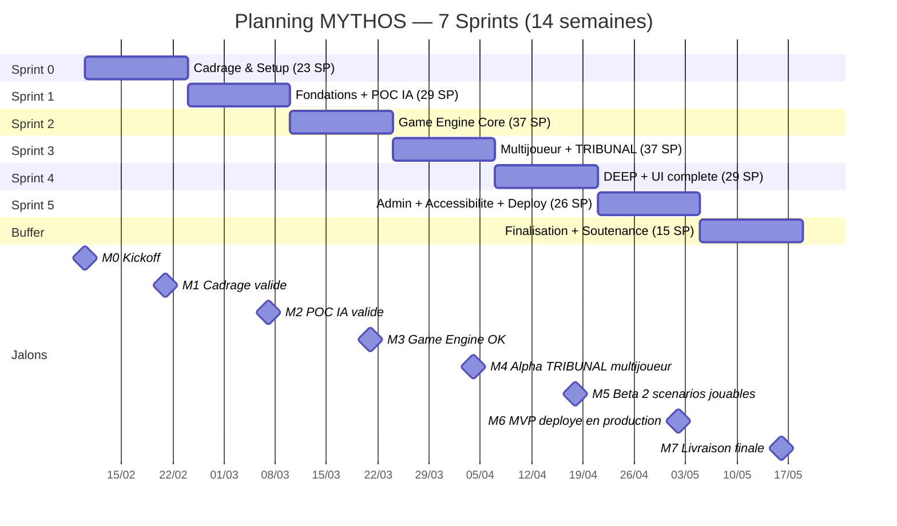

# MYTHOS -- Planning Detaille du Projet

> **Projet** : MYTHOS -- Plateforme de jeux narratifs multijoueur avec IA Maitre du Jeu
> **Version** : 1.0
> **Date** : 12 Fevrier 2026
> **Methodologie** : Scrum (Agile)
> **Duree totale** : 14 semaines (7 sprints de 2 semaines)
> **Equipe** : 4 personnes — Kays ZAHIDI, Samy ZEROUALI, Youri EMMANUEL, Yassir SABBAR
> **Contexte** : Workshop 5A TL -- S1 -- Bloc 1 RNCP38822

On a monte ce planning ensemble pendant notre session de cadrage initiale. Les estimations en story points viennent de nos sessions de Planning Poker (avec pas mal de debats, surtout sur le Game Loop Manager que Samy voulait estimer a 8 SP alors que Kays disait 13 — on a pris 13 et on a bien fait). On a aussi pris en compte les risques qu'on avait identifies.

---

## Table des matieres

1. [Vue d'ensemble du projet](#1-vue-densemble-du-projet)
2. [Diagramme de Gantt](#2-diagramme-de-gantt)
3. [Jalons cles (Milestones)](#3-jalons-cles-milestones)
4. [Chemin critique](#4-chemin-critique)
5. [Detail de chaque sprint](#5-detail-de-chaque-sprint)
6. [Plan de release](#6-plan-de-release)
7. [Buffer et marges de securite](#7-buffer-et-marges-de-securite)
8. [Scenarios de planning](#8-scenarios-de-planning)

---

## 1. Vue d'ensemble du projet

### 1.1 Timeline macro -- 14 semaines

```
FEVRIER 2026                    MARS 2026                       AVRIL 2026                      MAI 2026
Sem 1-2        Sem 3-4         Sem 5-6        Sem 7-8          Sem 9-10       Sem 11-12        Sem 13-14
10/02-21/02    24/02-07/03     10/03-21/03    24/03-04/04      07/04-18/04    21/04-02/05      05/05-16/05
+-----------+  +-----------+  +-----------+  +-----------+    +-----------+  +-----------+    +-----------+
| SPRINT 0  |  | SPRINT 1  |  | SPRINT 2  |  | SPRINT 3  |    | SPRINT 4  |  | SPRINT 5  |    |  BUFFER   |
| Cadrage   |  | Fondations|  | Game      |  | Multi-    |    | DEEP +    |  | Admin +   |    | Finalisa- |
| & Setup   |  | + POC IA  |  | Engine    |  | joueur +  |    | UI        |  | Deploie-  |    | tion      |
|           |  |           |  | Core      |  | TRIBUNAL  |    | complete  |  | ment      |    |           |
+-----------+  +-----------+  +-----------+  +-----------+    +-----------+  +-----------+    +-----------+
    23 SP          29 SP          37 SP          37 SP             29 SP          26 SP            15 SP
   7 tickets     7 tickets      7 tickets      7 tickets         7 tickets      7 tickets        5 tickets

|----- Phase Conception ----|-------- Phase Construction -------------|--- Integration ---|-- Livraison --|
```

### 1.2 Dates cles

| Jalon | Date | Semaine |
|-------|------|---------|
| Demarrage du projet | Lundi 10 fevrier 2026 | S1 |
| Fin du cadrage (Sprint 0) | Vendredi 21 fevrier 2026 | S2 |
| POC IA valide | Vendredi 7 mars 2026 | S4 |
| Game Engine fonctionnel (REST) | Vendredi 21 mars 2026 | S6 |
| TRIBUNAL jouable en multijoueur | Vendredi 4 avril 2026 | S8 |
| DEEP jouable + UI finale | Vendredi 18 avril 2026 | S10 |
| MVP deploye en production | Vendredi 2 mai 2026 | S12 |
| Livraison finale + soutenance | Vendredi 16 mai 2026 | S14 |

### 1.3 Repartition globale de l'effort

| Phase | Sprints | SP | % effort | Description |
|-------|---------|---:|:--------:|-------------|
| Conception | Sprint 0 | 23 | 12% | Cadrage, architecture, maquettes, CI/CD |
| Fondations | Sprint 1 | 29 | 15% | Auth, BDD, POC IA, Scenario Packs |
| Construction | Sprint 2-3 | 74 | 38% | Game Engine, WebSocket, TRIBUNAL jouable |
| Integration | Sprint 4-5 | 55 | 28% | DEEP, UI, admin, deploiement, accessibilite |
| Livraison | Buffer | 15 | 7% | Bugs, docs, video, soutenance |
| **Total** | **7 sprints** | **196** | **100%** | |

---

## 2. Diagramme de Gantt

### 2.0 Diagramme de Gantt Mermaid — Vue macro du projet

Le diagramme ci-dessous presente une vue synthetique du calendrier projet sur les 7 sprints, avec les jalons cles et les grandes phases de livraison.



### 2.1 Gantt par Epic et Sprint

```
                        S0          S1          S2          S3          S4          S5          Buffer
                     10/02-21/02 24/02-07/03 10/03-21/03 24/03-04/04 07/04-18/04 21/04-02/05 05/05-16/05
                     =========== =========== =========== =========== =========== =========== ===========

DOCUMENTATION        ████████████                                                             ████████████
                     S0-01(8SP)                                                               SB-02(3) SB-03(2)

DESIGN (Figma)       ████████████
                     S0-06(5SP)

INFRASTRUCTURE       ████████████                                                 ████████████
                     S0-02(2)                                                     S5-04(3)
                     S0-03(2)                                                     S5-05(2)
                     S0-04(2)
                     S0-05(3)

GESTION PROJET       ██████                                                                   ██████████
                     S0-07(1)                                                                  SB-04(2) SB-05(3)

BACKEND - DATA                   ██████████
                                 S1-01(5)
                                 S1-04(3)

BACKEND - AUTH                   ██████████
                                 S1-02(5)

FRONTEND - AUTH                  ████████
                                 S1-03(3)

BACKEND - IA                     ██████████              ████████████
                                 S1-05(5)                S4-03(5)

GAME DESIGN                      ██████████
                                 S1-07(5)

FRONTEND - IA                    ████████
                                 S1-06(3)

GAME ENGINE                                  ████████████████████████
(Backend)                                    S2-01(3) S2-02(5)
                                             S2-03(3) S2-04(5)
                                             S2-05(3) S2-06(13)

TESTS                                        ████████               ████████████ ██████████   ████████
(Transversal)                                S2-07(5)               S4-04(3)     S5-06(5)     SB-01(5)
                                                        ████████
                                                        S3-07(3)

BACKEND -                                               ██████████████████████
TEMPS REEL                                              S3-01(5) S3-02(5)
                                                        S3-03(8)

FRONTEND -                                              ██████████████████████ ████████████████████████
PAGES                                                   S3-04(3) S3-05(5)     S4-05(3) S4-06(5)
                                                        S3-06(8)              S4-01(3) S4-02(5)

BACKEND -                                                                     ██████████
ROBUSTESSE                                                                    S4-07(5)

BACKEND - ADMIN                                                                            ██████████
                                                                                           S5-01(5)

FRONTEND - ADMIN                                                                           ██████████
                                                                                           S5-02(5)

ACCESSIBILITE                                                                              ██████████
                                                                                           S5-03(5)

NUM. RESPONSABLE                                                                           ████
                                                                                           S5-07(1)
```

### 2.2 Gantt simplifie par sprint (tableau)

| Epic / Domaine | S0 | S1 | S2 | S3 | S4 | S5 | Buffer |
|---|:---:|:---:|:---:|:---:|:---:|:---:|:---:|
| **Documentation** | 8 SP | - | - | - | - | - | 5 SP |
| **Design (Figma)** | 5 SP | - | - | - | - | - | - |
| **Infrastructure** | 9 SP | - | - | - | - | 5 SP | - |
| **Gestion de projet** | 1 SP | - | - | - | - | - | 5 SP |
| **Backend - Data/Auth** | - | 13 SP | - | - | - | - | - |
| **Backend - IA** | - | 5 SP | - | - | 5 SP | - | - |
| **Game Design** | - | 5 SP | - | - | - | - | - |
| **Frontend - Auth/IA** | - | 6 SP | - | - | - | - | - |
| **Game Engine** | - | - | 37 SP | - | - | - | - |
| **Backend - Temps reel** | - | - | - | 18 SP | - | - | - |
| **Frontend - Pages/Game UI** | - | - | - | 16 SP | 16 SP | - | - |
| **Backend - Robustesse** | - | - | - | - | 5 SP | - | - |
| **Admin (Back + Front)** | - | - | - | - | - | 10 SP | - |
| **Accessibilite** | - | - | - | - | - | 5 SP | - |
| **Tests** | - | - | 5 SP | 3 SP | 3 SP | 5 SP | 5 SP |
| **Num. responsable** | - | - | - | - | - | 1 SP | - |
| **Total** | **23** | **29** | **37** | **37** | **29** | **26** | **15** |

### 2.3 Dependances entre epics (diagramme)

```
Documentation ────────────────────────────────────────────────────────> Documentation finale
       |
       v
Infrastructure (repo, CI/CD) ──> Backend Data ──> Game Engine ──> Backend Temps Reel ──> Deploiement
       |                              |                |                |
       v                              v                v                v
Design (Figma) ─────────────> Frontend Auth ──> Frontend Game UI ──> Frontend Polish ──> Accessibilite
                                      |                                    |
                                      v                                    v
                              Backend IA (POC) ──────────────────> IA Streaming
                                      |
                                      v
                              Game Design (Scenario Packs)
```

---

## 3. Jalons cles (Milestones)

### 3.1 Liste des jalons

| # | Jalon | Date | Sprint | Livrables attendus | Critere Go/No-Go |
|---|-------|------|--------|-------------------|------------------|
| M0 | **Kickoff projet** | 10/02/2026 | S0 debut | Equipe constituee, roles attribues, outils configures | Tout le monde present et engage |
| M1 | **Cadrage valide** | 21/02/2026 | S0 fin | CDC v1 valide, maquettes Figma approuvees, repo + CI/CD operationnels, backlog pret | CDC relu par toute l'equipe, CI/CD passe au vert |
| M2 | **Fondations posees + POC IA** | 07/03/2026 | S1 fin | Auth fonctionnelle, BDD complete, POC IA valide (1 flux narratif complet), 2 Scenario Packs rediges | Un user peut s'inscrire ; l'IA genere une scene coherente |
| M3 | **Game Engine fonctionnel** | 21/03/2026 | S2 fin | Moteur de jeu 6 phases complet, partie TRIBUNAL jouable en mode REST (sans WebSocket) | Test d'integration : partie complete de 5 tours via API |
| M4 | **MVP Alpha -- TRIBUNAL multijoueur** | 04/04/2026 | S3 fin | WebSocket, lobby, Game UI, TRIBUNAL jouable en temps reel a 4 joueurs | Test E2E : 4 navigateurs, partie complete sans crash |
| M5 | **MVP Beta -- 2 scenarios jouables** | 18/04/2026 | S4 fin | DEEP jouable avec jauges, UI game finalisee, streaming IA, reconnexion | Test E2E : TRIBUNAL + DEEP jouables bout en bout |
| M6 | **MVP Production** | 02/05/2026 | S5 fin | Admin panel, accessibilite WCAG AA, deploiement prod, tests > couverture cible | App deployee, Lighthouse Accessibility > 90, 0 bug bloquant |
| M7 | **Livraison finale** | 16/05/2026 | Buffer fin | Bugs corriges, docs finales, video demo, supports soutenance prets | Tous les livrables RNCP prets, repetition effectuee |

### 3.2 Jalons sur la timeline

```
10/02      21/02      07/03      21/03      04/04      18/04      02/05      16/05
  |          |          |          |          |          |          |          |
  M0         M1         M2         M3         M4         M5         M6         M7
  |          |          |          |          |          |          |          |
  v          v          v          v          v          v          v          v
Kickoff   Cadrage    POC IA     Game       Alpha      Beta       Prod     Livraison
          valide     valide     Engine     TRIBUNAL   2 scenar.  deployee  finale
                                OK         jouable    jouables
```

### 3.3 Criteres de validation des jalons (Gate Review)

Chaque jalon fait l'objet d'une revue formelle (Gate Review) avec l'equipe et le Product Owner. Le passage au sprint suivant est conditionne par la validation du jalon.

| Jalon | Criteres de passage obligatoires | Criteres souhaitables |
|-------|---|----|
| **M1** | CDC signe, repo OK, CI/CD vert, maquettes partagees | Design system complet, backlog estime |
| **M2** | Auth E2E, POC IA 3 tours coherents, schema Prisma complet | Tests unitaires > 50%, Scenario Packs testes |
| **M3** | Partie REST 5 tours sans erreur, game state persistant | Couverture tests > 60%, architecture documentee |
| **M4** | 4 joueurs simultanes, partie complete sans crash | Latence WS < 200ms, temps IA < 5s |
| **M5** | 2 scenarios jouables, jauges DEEP fonctionnelles | Streaming IA, reconnexion joueur |
| **M6** | Deploiement prod OK, Lighthouse > 90, 0 bug bloquant | Eco-index > 50, monitoring actif |
| **M7** | Tous les livrables RNCP prets | Video demo publiee, repetition chrono OK |

---

## 4. Chemin critique

### 4.1 Identification du chemin critique

Le chemin critique c'est la chaine de taches la plus longue du projet : si on prend du retard sur l'une d'elles, ca decale directement la date de livraison finale. Il n'y a zero marge sur ces taches.

```
CHEMIN CRITIQUE (en gras) :

S0-02 ──> S0-04 ──> S1-01 ──> S1-05 ──> S2-06 ──> S3-03 ──> S3-06 ──> S4-02 ──> S5-04 ──> SB-01
 Repo      NestJS    Schema    POC IA    Game Loop  WS+Game   Game UI   Ecran fin  Deploy    Bugs
 (2SP)     (2SP)     Prisma    (5SP)     Manager    integre   (8SP)     (5SP)      prod      (5SP)
                     (5SP)               (13SP)     (8SP)                           (3SP)
```

**Duree du chemin critique** : 56 SP sur 14 semaines

### 4.2 Detail des taches critiques

| Tache | Sprint | SP | Pourquoi critique | Impact si retard |
|-------|--------|---:|---|---|
| **S0-02** : Init repo GitHub | S0 | 2 | Prealable a tout developpement | Bloque S0-03, S0-04, S0-05, S0-07 |
| **S0-04** : Config NestJS | S0 | 2 | Prealable au backend | Bloque tout le backend (S1-01, S1-02, etc.) |
| **S1-01** : Modele de donnees Prisma | S1 | 5 | Schema BDD = fondation de toute l'application | Bloque auth, CRUD scenarios, POC IA, game engine |
| **S1-05** : POC AI Service | S1 | 5 | Validation technique du concept central | Si echec : remise en question de l'approche IA entiere |
| **S2-06** : Game Loop Manager | S2 | 13 | Composant le plus complexe, orchestre tout le jeu | Bloque toute l'integration multijoueur (Sprint 3) |
| **S3-03** : Connexion Game Loop + WS | S3 | 8 | Integration critique backend temps reel | Bloque la Game UI frontend |
| **S3-06** : Game UI principale | S3 | 8 | Interface de jeu = coeur de l'experience | Bloque DEEP UI, ecran de fin, polish |
| **S4-02** : Ecran de fin de partie | S4 | 5 | Indispensable pour une partie complete | Bloque le test E2E et le deploiement |
| **S5-04** : Deploiement production | S5 | 3 | Pas de MVP sans deploiement | Bloque les tests finaux et la demo |
| **SB-01** : Correction bugs restants | Buffer | 5 | Qualite finale du livrable | Impact direct sur la note et la demo |

### 4.3 Taches quasi-critiques (flottement < 1 sprint)

Ces taches ne sont pas sur le chemin critique strict mais ont une marge tres faible :

| Tache | Flottement | Risque |
|-------|-----------|--------|
| **S1-02** : Auth backend | ~3 jours | Bloque le frontend auth et le WebSocket auth |
| **S2-02** : Game State Manager | ~2 jours | Bloque Choice Engine, Resource Manager |
| **S3-01** : WebSocket Gateway | ~2 jours | Bloque Session Manager et integration WS |
| **S5-03** : Audit accessibilite | ~3 jours | Bloque le deploiement prod si score < 90 |

### 4.4 Strategies de protection du chemin critique

| Strategie | Application |
|-----------|-------------|
| **Priorisation absolue** | Les taches du chemin critique sont toujours traitees en premier dans le sprint |
| **Binomage** | Les taches a 8+ SP sont travaillees en binome (ex: Game Loop = Backend + IA) |
| **Daily focus** | Au daily standup, les taches critiques sont les premieres abordees |
| **Escalade immediate** | Tout blocage sur une tache critique declenche une reunion de deblocage sous 2h |
| **Prototypage anticipe** | Le POC IA (S1) est volontairement place tres tot pour detecter les problemes |
| **Buffer dedie** | 2 semaines de buffer en fin de projet absorbent le retard cumule |

---

## 5. Detail de chaque sprint

---

### Sprint 0 -- Cadrage & Setup

**Dates** : 10 fevrier -- 21 fevrier 2026 (Semaines 1-2)

#### Objectif du sprint (Sprint Goal)

> Poser toutes les bases du projet (documentation, infrastructure, architecture, maquettes) pour que l'equipe puisse coder des le Sprint 1 sans aucun blocage technique ou organisationnel.

#### User Stories selectionnees

| ID | Titre | SP | Priorite | Assigne |
|----|-------|----|----------|---------|
| S0-01 | Rediger le cahier des charges v1 | 8 | must-have | Toute l'equipe |
| S0-02 | Initialiser le repository GitHub | 2 | must-have | Samy |
| S0-03 | Configurer le projet Next.js (Frontend) | 2 | must-have | Samy + Youri |
| S0-04 | Configurer le projet NestJS (Backend) | 2 | must-have | Samy |
| S0-05 | Configurer CI/CD avec GitHub Actions | 3 | must-have | Yassir |
| S0-06 | Creer les maquettes UI/UX (Figma) | 5 | must-have | Yassir |
| S0-07 | Configurer GitHub Projects (Kanban) | 1 | must-have | Samy |
| **Total** | | **23 SP** | | |

#### Capacite de l'equipe

| Membre | Role | Heures dispo/sem | Heures totales (2 sem) | Justification |
|--------|------|:---:|:---:|---|
| Kays | PO / Architecte | 18h | 36h | Cours les lundis et mardis matin (-4h/sem) |
| Samy | Scrum Master / Frontend | 16h | 32h | Cours lundi + mercredi (-6h/sem), ceremonie SM (-2h/sem) |
| Youri | Dev Frontend | 18h | 36h | Cours les lundis et jeudis matin (-4h/sem) |
| Samy | Dev Backend / IA / Temps reel | 18h | 36h | Cours les lundis et vendredis matin (-4h/sem) |
| Yassir | UX/UI / DevOps | 16h | 32h | Cours lundi + mardi (-6h/sem), preparation projet IA parallele |
| **Total equipe** | | **86h/sem** | **172h** | |

#### Charge prevue vs capacite

| Metrique | Valeur |
|----------|--------|
| SP planifies | 23 SP |
| Capacite brute | 172h |
| Facteur de focus (Sprint 0 = cadrage) | 0,70 |
| Capacite effective | **120h** |
| Ratio SP/heure | ~5,2h / SP |
| **Verdict** | Charge compatible avec la capacite. Marge de ~15% |

#### Risques specifiques au sprint

| Risque | Probabilite | Impact | Mitigation |
|--------|:-----------:|:------:|------------|
| Retard sur le CDC (document tres long) | Moyenne | Moyen | Repartition par section entre les membres, deadline intermediaire au jour 5 |
| Desaccord sur l'architecture | Faible | Eleve | Session d'architecture dediee de 2h au jour 2, PO tranche |
| Maquettes Figma insuffisantes | Moyenne | Moyen | Focus sur les ecrans critiques (Game UI, lobby), le reste en wireframe |
| Probleme de configuration CI/CD | Faible | Faible | Template GitHub Actions standard, debug en binome |

#### Livrables du sprint

- [ ] Cahier des charges v1 signe (PDF)
- [ ] Repository GitHub structure (monorepo ou multi-repo)
- [ ] Projet Next.js fonctionnel (`localhost:3000`)
- [ ] Projet NestJS fonctionnel (`localhost:3001/api/health` -> 200)
- [ ] Pipeline CI/CD : lint + tests sur chaque PR
- [ ] Maquettes Figma : 9 ecrans (wireframes haute fidelite)
- [ ] Board GitHub Projects configure avec backlog Sprint 0 + Sprint 1

#### Critere de succes du sprint (Definition of Done Sprint 0)

- Cahier des charges v1 valide par tous les membres
- `git clone` + `npm install` + `npm run dev` fonctionne pour front ET back
- CI/CD passe au vert sur une PR de test
- Maquettes Figma accessibles par tous, feedback collecte
- Tous les tickets Sprint 0 en statut "Done" dans GitHub Projects

#### Dependances

| Dependance entrante | Dependance sortante |
|---|---|
| Aucune (sprint de demarrage) | S0-02 -> S1-01, S1-02, S1-04 |
| | S0-03 -> S1-03, S1-06 |
| | S0-04 -> S1-01, S1-02, S1-04, S1-05 |
| | S0-06 -> S3-04, S3-05, S3-06 |

---

### Sprint 1 -- Fondations + POC IA

**Dates** : 24 fevrier -- 7 mars 2026 (Semaines 3-4)

#### Objectif du sprint (Sprint Goal)

> Mettre en place l'authentification, le modele de donnees complet, et realiser un POC du flux IA (prompt -> generation -> affichage) pour valider la faisabilite technique du Game Master IA.

#### User Stories selectionnees

| ID | Titre | SP | Priorite | Assigne |
|----|-------|----|----------|---------|
| S1-01 | Modele de donnees complet (Prisma) | 5 | must-have | Samy |
| S1-02 | Authentification (Register + Login) | 5 | must-have | Samy |
| S1-03 | Pages Auth frontend | 3 | must-have | Samy + Youri |
| S1-04 | API CRUD Scenarios | 3 | must-have | Samy |
| S1-05 | POC AI Service (appel API Anthropic) | 5 | must-have / spike | Samy |
| S1-06 | Page de test IA (frontend) | 3 | must-have / spike | Youri + Samy |
| S1-07 | Scenario Packs TRIBUNAL et DEEP (JSON) | 5 | must-have | Kays + Samy |
| **Total** | | **29 SP** | | |

#### Capacite de l'equipe

| Membre | Heures dispo/sem | Heures totales (2 sem) | Taches principales |
|--------|:---:|:---:|---|
| Kays (PO) | 18h | 36h | S1-07 (Scenario Packs), review CDC, support equipe |
| Samy (SM) | 16h | 32h | Ceremonies, support frontend, monitoring avancement |
| Youri (Frontend) | 18h | 36h | S1-03, S1-06 |
| Samy (Backend/IA) | 18h | 36h | S1-01, S1-02, S1-04, S1-05 |
| Yassir (UX/DevOps) | 16h | 32h | S1-06 (support), S1-07 (support) |
| **Total** | **86h/sem** | **172h** | |

#### Charge prevue vs capacite

| Metrique | Valeur |
|----------|--------|
| SP planifies | 29 SP |
| Capacite brute | 172h |
| Facteur de focus (Sprint 1 = montee en charge) | 0,75 |
| Capacite effective | **129h** |
| Ratio SP/heure | ~4,4h / SP |
| **Verdict** | Charge compatible. Le POC IA est le risque principal (spike time-boxe a 3 jours max). |

#### Risques specifiques au sprint

| Risque | Probabilite | Impact | Mitigation |
|--------|:-----------:|:------:|------------|
| POC IA echoue (latence, incoherence) | Moyenne | Critique | Spike time-boxe a 3 jours, fallback OpenAI, prompts pre-testes |
| Schema Prisma incomplet / mal concu | Faible | Eleve | Review par PO + architecte avant migration, inspirations existantes |
| Integration Auth front/back laborieuse | Moyenne | Moyen | Contrat d'API defini ensemble (Swagger/types partages) |
| Couts API IA trop eleves pour les tests | Faible | Moyen | Utilisation de Claude Haiku pour les tests, cache des reponses |

#### Livrables du sprint

- [ ] Schema Prisma complet + migration + seeds (2 scenarios, users test)
- [ ] Auth fonctionnelle : register, login, JWT Guard
- [ ] Pages `/register` et `/login` connectees au backend
- [ ] API `GET /api/scenarios` et `GET /api/scenarios/:slug`
- [ ] AI Service : methode `generateNarration()` fonctionnelle
- [ ] Page `/poc-ai` : demo complete du flux IA
- [ ] Fichiers JSON `tribunal.json` et `deep.json` complets et testes

#### Critere de succes du sprint (Definition of Done Sprint 1)

- Un utilisateur peut s'inscrire et se connecter (E2E)
- L'AI Service genere 3 tours narratifs consecutifs et coherents pour TRIBUNAL
- Les 2 Scenario Packs sont valides en JSON Schema
- Tests unitaires Auth > 80% couverture
- Temps de reponse IA < 5s mesure et logue

#### Dependances

| Dependance entrante | Dependance sortante |
|---|---|
| S0-02 (repo), S0-03 (Next.js), S0-04 (NestJS) | S1-01 -> S2-01, S2-02 |
| | S1-02 -> S3-01 (WS auth) |
| | S1-05 -> S2-06 (Game Loop), S1-07 |
| | S1-07 -> S2-01 (Pack Loader) |

---

### Sprint 2 -- Game Engine Core

**Dates** : 10 mars -- 21 mars 2026 (Semaines 5-6)

#### Objectif du sprint (Sprint Goal)

> Implementer le moteur de jeu universel : boucle de jeu en 6 phases, Game State Manager, Choice Engine, Scenario Pack Loader. Le moteur doit etre capable de faire tourner une partie complete en mode "simulation" (sans WebSocket).

#### User Stories selectionnees

| ID | Titre | SP | Priorite | Assigne |
|----|-------|----|----------|---------|
| S2-01 | Scenario Pack Loader | 3 | must-have | Samy |
| S2-02 | Game State Manager | 5 | must-have | Samy |
| S2-03 | Role Manager | 3 | must-have | Samy |
| S2-04 | Choice Engine | 5 | must-have | Samy |
| S2-05 | Resource Manager | 3 | must-have | Samy |
| S2-06 | Game Loop Manager | 13 | must-have | Samy + Kays |
| S2-07 | Tests d'integration Game Engine | 5 | must-have | Samy |
| **Total** | | **37 SP** | | |

#### Capacite de l'equipe

| Membre | Heures dispo/sem | Heures totales (2 sem) | Taches principales |
|--------|:---:|:---:|---|
| Kays (PO) | 18h | 36h | Review architecture, tests Scenario Packs, support |
| Samy (SM) | 16h | 32h | Ceremonies, support Game Engine, documentation |
| Youri (Frontend) | 18h | 36h | Preparation composants UI (en avance sur S3), refacto auth |
| Samy (Backend/IA) | 20h | 40h | S2-01, S2-02, S2-03, S2-04, S2-05, S2-06 (lead), S2-07 |
| Yassir (UX/DevOps) | 18h | 36h | S2-06 (support), optimisation prompts, documentation |
| **Total** | **90h/sem** | **180h** | |

**Note** : Capacite augmentee car sprint technique intense, moins de cours cette semaine (vacances partielles).

#### Charge prevue vs capacite

| Metrique | Valeur |
|----------|--------|
| SP planifies | 37 SP (sprint le plus charge) |
| Capacite brute | 180h |
| Facteur de focus | 0,80 |
| Capacite effective | **144h** |
| Ratio SP/heure | ~3,9h / SP |
| **Verdict** | Sprint tendu. Le Game Loop Manager (13 SP) necessite un binomage Backend + IA. Le frontend avance en parallele sur la preparation des composants UI. |

#### Risques specifiques au sprint

| Risque | Probabilite | Impact | Mitigation |
|--------|:-----------:|:------:|------------|
| Game Loop Manager trop complexe (13 SP) | Elevee | Critique | Binomage obligatoire, decoupe en sous-taches daily, review continue |
| Integration des services insuffisante | Moyenne | Eleve | Tests d'integration des le jour 3, pas d'attente fin de sprint |
| Game State Manager : problemes Redis | Faible | Moyen | Docker local Redis, fallback en memoire pour les tests |
| Sous-estimation des 37 SP | Moyenne | Eleve | Les 5 SP de tests (S2-07) peuvent etre repousses au Sprint 3 si necessaire |

#### Livrables du sprint

- [ ] Scenario Pack Loader fonctionnel (charge et valide TRIBUNAL + DEEP)
- [ ] Game State Manager avec Redis (CRUD, TTL, historique)
- [ ] Role Manager avec distribution aleatoire validee
- [ ] Choice Engine (modes : individual, vote, designated)
- [ ] Resource Manager (jauges, decay, end conditions)
- [ ] Game Loop Manager : partie TRIBUNAL complete en 5 tours via API REST
- [ ] Suite de tests d'integration (couverture Game Engine > 70%)

#### Critere de succes du sprint (Definition of Done Sprint 2)

- Partie complete de TRIBUNAL jouable via API REST (5 tours, 4 joueurs simules)
- Partie complete de DEEP jouable via API REST (jauges fonctionnelles)
- Tous les services du Game Engine testables independamment
- Tests d'integration passent en CI (mock de l'API IA)

#### Dependances

| Dependance entrante | Dependance sortante |
|---|---|
| S1-01 (schema Prisma), S1-05 (AI Service), S1-07 (Scenario Packs) | S2-06 -> S3-02, S3-03 (integration WS) |
| | S2-02 -> S3-03 (game state via WS) |
| | S2-05 -> S4-01 (jauges frontend) |

---

### Sprint 3 -- Multijoueur + Scenario TRIBUNAL

**Dates** : 24 mars -- 4 avril 2026 (Semaines 7-8)

#### Objectif du sprint (Sprint Goal)

> Ajouter le temps reel (WebSocket), le systeme de sessions/lobby, et rendre le scenario TRIBUNAL jouable de bout en bout en multijoueur avec 4 joueurs simultanes.

#### User Stories selectionnees

| ID | Titre | SP | Priorite | Assigne |
|----|-------|----|----------|---------|
| S3-01 | WebSocket Gateway (NestJS + Socket.io) | 5 | must-have | Samy |
| S3-02 | Session Manager (creation + lobby) | 5 | must-have | Samy |
| S3-03 | Connecter Game Loop au WebSocket | 8 | must-have | Samy + Kays |
| S3-04 | Frontend -- Page catalogue scenarios | 3 | must-have | Samy + Youri |
| S3-05 | Frontend -- Page lobby | 5 | must-have | Samy + Youri |
| S3-06 | Frontend -- Game UI (narration + choix + discussion) | 8 | must-have | Youri |
| S3-07 | Test E2E -- Partie complete TRIBUNAL | 3 | must-have | Toute l'equipe |
| **Total** | | **37 SP** | | |

#### Capacite de l'equipe

| Membre | Heures dispo/sem | Heures totales (2 sem) | Taches principales |
|--------|:---:|:---:|---|
| Kays (PO) | 18h | 36h | Validation UX, tests manuels TRIBUNAL, review |
| Samy (SM) | 16h | 32h | Ceremonies, support frontend lobby, monitoring |
| Youri (Frontend) | 20h | 40h | S3-04, S3-05, S3-06 (charge lourde frontend) |
| Samy (Backend/IA) | 20h | 40h | S3-01, S3-02, S3-03 (lead), S3-07 |
| Yassir (UX/DevOps) | 18h | 36h | S3-03 (support WS), S3-07, documentation |
| **Total** | **92h/sem** | **184h** | |

**Note** : Semaine 7 = pas de vacances scolaires, disponibilite normale. Semaine 8 debut des vacances de Paques -> disponibilite legerement accrue pour certains.

#### Charge prevue vs capacite

| Metrique | Valeur |
|----------|--------|
| SP planifies | 37 SP (sprint a haute integration) |
| Capacite brute | 184h |
| Facteur de focus | 0,80 |
| Capacite effective | **147h** |
| Ratio SP/heure | ~4,0h / SP |
| **Verdict** | Sprint d'integration intense. Frontend et Backend doivent travailler en parallele strict. Le test E2E (S3-07) le dernier jour valide l'integration. |

#### Risques specifiques au sprint

| Risque | Probabilite | Impact | Mitigation |
|--------|:-----------:|:------:|------------|
| Desynchronisation WS entre joueurs | Elevee | Critique | Tests multi-clients automatises, etat serveur autoritaire |
| Game UI trop complexe (8 SP) | Moyenne | Eleve | Focus sur les 3 composants critiques, design minimal fonctionnel |
| Integration Game Loop + WS buguee | Moyenne | Critique | Tests d'integration WS des le jour 2, pas d'attente fin sprint |
| Latence perceptible en temps reel | Faible | Moyen | Optimisation Socket.io rooms, compression des messages |

#### Livrables du sprint

- [ ] WebSocket Gateway avec auth JWT et rooms
- [ ] Session Manager : creation, code unique, lobby, lancement
- [ ] Game Loop connecte au WebSocket (toutes les phases en temps reel)
- [ ] Page catalogue des scenarios (`/`)
- [ ] Page lobby (`/session/:code`) avec chat et liste joueurs
- [ ] Game UI (`/game/:id`) : narration, choix, discussion, progression
- [ ] Test E2E : partie TRIBUNAL 4 joueurs sans crash

#### Critere de succes du sprint (Definition of Done Sprint 3)

- 4 navigateurs ouverts simultanement jouent une partie TRIBUNAL complete
- Toutes les phases se deroulent correctement en temps reel
- Roles secrets correctement distribues et affiches
- Chat de lobby et de discussion fonctionnels
- 0 crash, 0 erreur console, temps IA < 5s

#### Dependances

| Dependance entrante | Dependance sortante |
|---|---|
| S2-06 (Game Loop), S1-02 (Auth JWT) | S3-03 -> S4-03 (streaming IA) |
| S0-06 (Maquettes Figma) | S3-06 -> S4-01, S4-02, S4-05, S4-06 |
| | S3-01 -> S4-07 (reconnexion) |

---

### Sprint 4 -- Scenario DEEP + UI complete

**Dates** : 7 avril -- 18 avril 2026 (Semaines 9-10)

#### Objectif du sprint (Sprint Goal)

> Rendre le scenario DEEP jouable (avec jauges de ressources), finaliser l'UI game complete, ajouter l'ecran de fin et le streaming IA. A la fin de ce sprint, les deux scenarios MVP sont jouables de bout en bout.

#### User Stories selectionnees

| ID | Titre | SP | Priorite | Assigne |
|----|-------|----|----------|---------|
| S4-01 | Composant jauges de ressources | 3 | must-have | Samy + Youri |
| S4-02 | Ecran de fin de partie | 5 | must-have | Youri |
| S4-03 | Streaming IA (reponse progressive) | 5 | should-have | Samy |
| S4-04 | Test E2E -- Partie complete DEEP | 3 | must-have | Toute l'equipe |
| S4-05 | Historique narratif (timeline) | 3 | should-have | Youri |
| S4-06 | Polish UI Game -- Responsive + Animations | 5 | must-have | Youri + Yassir |
| S4-07 | Gestion de la reconnexion joueur | 5 | should-have | Samy |
| **Total** | | **29 SP** | | |

#### Capacite de l'equipe

| Membre | Heures dispo/sem | Heures totales (2 sem) | Taches principales |
|--------|:---:|:---:|---|
| Kays (PO) | 16h | 32h | Tests DEEP, validation UX ecran fin, review |
| Samy (SM) | 16h | 32h | Ceremonies, polish UI support, preparations S5 |
| Youri (Frontend) | 20h | 40h | S4-01, S4-02, S4-05, S4-06 (charge front lourde) |
| Samy (Backend/IA) | 16h | 32h | S4-03, S4-07, support integration DEEP, bug fixing |
| Yassir (UX/DevOps) | 18h | 36h | S4-06 (UX polish), optimisation prompts DEEP, prep S5 |
| **Total** | **86h/sem** | **172h** | |

**Note** : Semaine 9-10 = vacances de Paques pour certains. Disponibilite reduite pour PO et Backend (projets paralleles). Le frontend est en charge maximale.

#### Charge prevue vs capacite

| Metrique | Valeur |
|----------|--------|
| SP planifies | 29 SP |
| Capacite brute | 172h |
| Facteur de focus | 0,80 |
| Capacite effective | **138h** |
| Ratio SP/heure | ~4,8h / SP |
| **Verdict** | Sprint equilibre. Risque concentre sur le frontend (16 SP). Le streaming IA (S4-03) et la reconnexion (S4-07) sont "should-have" et peuvent etre depriorises. |

#### Risques specifiques au sprint

| Risque | Probabilite | Impact | Mitigation |
|--------|:-----------:|:------:|------------|
| Jauges DEEP mal integrees avec le backend | Moyenne | Moyen | Tests d'integration precoces, API Resource Manager deja validee en S2 |
| Streaming IA difficile a implementer | Moyenne | Faible | "Should-have" : peut etre reporte au buffer si trop complexe |
| Surcharge du frontend (16 SP) | Elevee | Moyen | SM/PO en support, prioriser jauges + ecran fin, historique optionnel |
| Vacances Paques : membres absents | Moyenne | Moyen | Planning des conges anticipe, taches assignees avant le depart |

#### Livrables du sprint

- [ ] Composant `ResourceGauges` avec animations et accessibilite
- [ ] Ecran de fin : climax, revelations roles, resume, boutons rejouer
- [ ] Streaming IA fonctionnel (narration progressive via WS)
- [ ] Test E2E DEEP : partie complete avec jauges et conditions de fin
- [ ] Historique narratif (timeline des tours)
- [ ] UI Game responsive mobile + animations de transition
- [ ] Reconnexion joueur fonctionnelle

#### Critere de succes du sprint (Definition of Done Sprint 4)

- DEEP jouable de bout en bout avec jauges (victoire + defaite testees)
- TRIBUNAL toujours fonctionnel (non-regression)
- Ecran de fin complet pour les 2 scenarios
- UI responsive sur mobile (320px+)
- Streaming IA visible (narration progressive)

#### Dependances

| Dependance entrante | Dependance sortante |
|---|---|
| S2-05 (Resource Manager), S3-06 (Game UI) | S4-02 -> S5-04 (deploiement necessite partie complete) |
| S3-01 (WS Gateway), S3-03 (WS + Game Loop) | S4-06 -> S5-03 (accessibilite sur UI finalisee) |

---

### Sprint 5 -- Admin + Accessibilite + Deploiement

**Dates** : 21 avril -- 2 mai 2026 (Semaines 11-12)

#### Objectif du sprint (Sprint Goal)

> Ajouter le panel d'administration, s'assurer de l'accessibilite WCAG AA, deployer le MVP en production, et ecrire les tests finaux. A la fin de ce sprint, le MVP est en ligne et utilisable.

#### User Stories selectionnees

| ID | Titre | SP | Priorite | Assigne |
|----|-------|----|----------|---------|
| S5-01 | API Admin (stats + gestion) | 5 | should-have | Samy |
| S5-02 | Panel d'administration frontend | 5 | should-have | Samy + Youri |
| S5-03 | Audit et corrections d'accessibilite | 5 | must-have | Yassir + Youri |
| S5-04 | Deploiement production | 3 | must-have | Yassir |
| S5-05 | Monitoring et health check | 2 | should-have | Yassir |
| S5-06 | Tests finaux (couverture cible) | 5 | must-have | Toute l'equipe |
| S5-07 | Mesurer l'eco-index | 1 | must-have | Yassir |
| **Total** | | **26 SP** | | |

#### Capacite de l'equipe

| Membre | Heures dispo/sem | Heures totales (2 sem) | Taches principales |
|--------|:---:|:---:|---|
| Kays (PO) | 16h | 32h | Validation admin, review finale, preparation livrables |
| Samy (SM) | 18h | 36h | Ceremonies, coordination deploiement, S5-06 (tests front) |
| Youri (Frontend) | 18h | 36h | S5-02, S5-03, S5-06 (tests front) |
| Samy (Backend/IA) | 18h | 36h | S5-01, S5-06 (tests back), optimisation couts IA |
| Yassir (UX/DevOps) | 16h | 32h | S5-04, S5-05, S5-07, documentation |
| **Total** | **86h/sem** | **172h** | |

#### Charge prevue vs capacite

| Metrique | Valeur |
|----------|--------|
| SP planifies | 26 SP |
| Capacite brute | 172h |
| Facteur de focus | 0,80 |
| Capacite effective | **138h** |
| Ratio SP/heure | ~5,3h / SP |
| **Verdict** | Sprint confortable. Marge suffisante pour absorber les corrections de bugs decouverts pendant les tests. |

#### Risques specifiques au sprint

| Risque | Probabilite | Impact | Mitigation |
|--------|:-----------:|:------:|------------|
| Score Lighthouse < 90 (accessibilite) | Moyenne | Eleve | Audit Lighthouse des le jour 1, corrections iteratives |
| Deploiement prod echoue | Faible | Critique | Deploiement progressif (staging d'abord), rollback automatique |
| Variables d'env mal configurees en prod | Moyenne | Moyen | Checklist de deploiement, test `/api/health` immediat |
| Couverture tests insuffisante | Moyenne | Moyen | Focus sur les chemins critiques, pas besoin de tout couvrir |

#### Livrables du sprint

- [ ] API Admin : stats, sessions, users, ban
- [ ] Page `/admin` : dashboard, tableaux, gestion
- [ ] Rapport d'audit accessibilite (PDF) + corrections appliquees
- [ ] MVP deploye : front (Vercel) + back (Railway) + BDD + Redis
- [ ] Monitoring : UptimeRobot, logs structures, dashboard couts IA
- [ ] Tests : backend > 60%, frontend > 40%, E2E flux complet
- [ ] Rapport eco-index (GreenIT Analysis) sur toutes les pages

#### Critere de succes du sprint (Definition of Done Sprint 5)

- Application accessible sur une URL publique HTTPS
- Lighthouse Accessibility > 90 sur toutes les pages
- Panel admin fonctionnel et protege
- Health check `/api/health` -> 200 en production
- Partie complete jouable sur la production (test de validation)
- Eco-index >= 50 sur toutes les pages

#### Dependances

| Dependance entrante | Dependance sortante |
|---|---|
| S4-06 (UI finalisee), S1-02 (Auth pour admin) | S5-04 -> SB-01 (bugs trouves en prod) |
| | S5-04 -> SB-04 (video de demo sur prod) |
| | S5-06 -> SB-02 (docs finales referent les tests) |

---

### Sprint Buffer -- Finalisation

**Dates** : 5 mai -- 16 mai 2026 (Semaines 13-14)

#### Objectif du sprint (Sprint Goal)

> Corriger les derniers bugs, finaliser la documentation, preparer la soutenance, tourner la video de demo. A la fin de ce sprint, tous les livrables RNCP sont prets.

#### User Stories selectionnees

| ID | Titre | SP | Priorite | Assigne |
|----|-------|----|----------|---------|
| SB-01 | Corriger les bugs restants | 5 | must-have | Toute l'equipe |
| SB-02 | Documentation technique finale | 3 | must-have | Toute l'equipe |
| SB-03 | Annexe retour d'experience | 2 | must-have | Toute l'equipe (individuel) |
| SB-04 | Video de demonstration | 2 | must-have | Yassir + Kays |
| SB-05 | Preparer la soutenance | 3 | must-have | Toute l'equipe |
| **Total** | | **15 SP** | | |

#### Capacite de l'equipe

| Membre | Heures dispo/sem | Heures totales (2 sem) | Taches principales |
|--------|:---:|:---:|---|
| Kays (PO) | 18h | 36h | SB-04 (video), SB-05 (slides), SB-01, SB-03 |
| Samy (SM) | 18h | 36h | SB-05 (slides), SB-01, SB-03, coordination |
| Youri (Frontend) | 18h | 36h | SB-01 (bugs front), SB-02, SB-03 |
| Samy (Backend/IA) | 18h | 36h | SB-01 (bugs back/IA), SB-02, SB-03 |
| Yassir (UX/DevOps) | 18h | 36h | SB-01 (bugs UX), SB-02, SB-03, SB-04 (video support) |
| **Total** | **90h/sem** | **180h** | |

#### Charge prevue vs capacite

| Metrique | Valeur |
|----------|--------|
| SP planifies | 15 SP |
| Capacite brute | 180h |
| Facteur de focus | 0,70 (preparation soutenance = multi-taches) |
| Capacite effective | **126h** |
| Ratio SP/heure | ~8,4h / SP |
| **Verdict** | Sprint tres confortable. La marge importante (>50%) absorbe les bugs non anticipes et le temps de preparation de soutenance. |

#### Risques specifiques au sprint

| Risque | Probabilite | Impact | Mitigation |
|--------|:-----------:|:------:|------------|
| Trop de bugs bloquants decouverts | Faible | Eleve | Priorisation stricte : bloquants > majeurs > mineurs, bugs mineurs = "limites connues" |
| Video de demo echouee (bug en live) | Moyenne | Moyen | Script de demo pre-teste, enregistrement en plusieurs prises |
| Retard sur les docs individuelles (SB-03) | Moyenne | Moyen | Deadline intermediaire au jour 7, template fourni |
| Stress de la soutenance | Elevee | Faible | Repetition en groupe avec chrono, feedback croise |

#### Livrables du sprint

- [ ] 0 bug bloquant, 0 bug majeur ouvert
- [ ] README complet (setup, migrations, lancement)
- [ ] Documentation API REST + WebSocket
- [ ] Documentation Scenario Pack (comment en creer un nouveau)
- [ ] Annexe retour d'experience (1 par membre, 2-3 pages PDF)
- [ ] Video de demo (3-5 min, 1080p, sous-titres)
- [ ] Slides soutenance collective (10 min)
- [ ] Chaque membre pret pour l'evaluation RNCP individuelle (20 min)

#### Critere de succes du sprint (Definition of Done Buffer)

- Tous les livrables RNCP sont prets et accessibles
- La video de demo est publiee (YouTube)
- Chaque membre a redige son retour d'experience
- Une repetition chronometree de la soutenance a ete effectuee
- L'application est stable en production (0 downtime pendant la demo)

#### Dependances

| Dependance entrante | Dependance sortante |
|---|---|
| Tous les sprints precedents | Soutenance (fin de projet) |
| S5-04 (prod deployee) pour la video | |
| S5-06 (tests) pour la documentation | |

---

## 6. Plan de release

### 6.1 Strategie de release

On suit une strategie de **release incrementale** : chaque sprint livre un increment fonctionnel potentiellement deployable. La release officielle (MVP) part en production au Sprint 5.

```
Sprint 0 ──> Sprint 1 ──> Sprint 2 ──> Sprint 3 ──> Sprint 4 ──> Sprint 5 ──> Buffer
   |            |            |            |            |            |            |
   v            v            v            v            v            v            v
 Infra       Dev local    Dev local    Staging      Staging       PROD        PROD
 only        back only    engine API   alpha        beta          v1.0        v1.0.x
```

### 6.2 Disponibilite des fonctionnalites par release

| Fonctionnalite | Sprint disponible | Environnement | Version |
|---|:---:|---|---|
| Infrastructure (repo, CI/CD) | S0 | Dev local | v0.1 |
| Maquettes UI/UX | S0 | Figma | v0.1 |
| Authentification (register/login) | S1 | Dev local | v0.2 |
| API CRUD Scenarios | S1 | Dev local | v0.2 |
| POC flux IA (page test) | S1 | Dev local | v0.2 |
| Scenario Packs JSON (TRIBUNAL + DEEP) | S1 | Dev local | v0.2 |
| Game Engine complet (6 phases, REST) | S2 | Dev local | v0.3 |
| Game State Manager (Redis) | S2 | Dev local | v0.3 |
| Choice Engine (vote, individual, designated) | S2 | Dev local | v0.3 |
| Resource Manager (jauges) | S2 | Dev local | v0.3 |
| WebSocket temps reel | S3 | Staging | v0.4-alpha |
| Lobby + sessions | S3 | Staging | v0.4-alpha |
| TRIBUNAL jouable multijoueur | S3 | Staging | v0.4-alpha |
| Page catalogue scenarios | S3 | Staging | v0.4-alpha |
| Game UI (narration, choix, discussion) | S3 | Staging | v0.4-alpha |
| Jauges de ressources (DEEP UI) | S4 | Staging | v0.5-beta |
| DEEP jouable multijoueur | S4 | Staging | v0.5-beta |
| Ecran de fin de partie | S4 | Staging | v0.5-beta |
| Streaming IA | S4 | Staging | v0.5-beta |
| Historique narratif | S4 | Staging | v0.5-beta |
| UI responsive + animations | S4 | Staging | v0.5-beta |
| Reconnexion joueur | S4 | Staging | v0.5-beta |
| Panel d'administration | S5 | Production | v1.0 |
| Accessibilite WCAG AA | S5 | Production | v1.0 |
| Monitoring + health check | S5 | Production | v1.0 |
| Tests complets | S5 | Production | v1.0 |
| Eco-index mesure | S5 | Production | v1.0 |
| Documentation finale | Buffer | Production | v1.0.1 |
| Video demo | Buffer | YouTube | v1.0.1 |

### 6.3 Calendrier de release

| Release | Date | Contenu | Environnement |
|---------|------|---------|---------------|
| **v0.1** | 21/02/2026 | Infra, CI/CD, maquettes | Dev local |
| **v0.2** | 07/03/2026 | Auth, BDD, POC IA, Scenarios | Dev local |
| **v0.3** | 21/03/2026 | Game Engine complet (REST) | Dev local |
| **v0.4-alpha** | 04/04/2026 | Multijoueur, TRIBUNAL jouable | Staging (Vercel preview + Railway staging) |
| **v0.5-beta** | 18/04/2026 | 2 scenarios, UI finale, streaming | Staging |
| **v1.0** | 02/05/2026 | MVP Production | Production (URL publique) |
| **v1.0.1** | 16/05/2026 | Bugfixes, docs, soutenance | Production |

---

## 7. Buffer et marges de securite

### 7.1 Buffer integre au planning

> Honnêtement, le buffer de 2 semaines c'est Kays qui a insiste pour le mettre. Au debut on trouvait ca exagere, mais vu comment le Sprint 2 et 3 sont charges, on est contents de l'avoir.

| Type de buffer | Duree | Justification |
|---|---|---|
| **Sprint Buffer (Sem 13-14)** | 2 semaines | Sprint dedie a la finalisation, absorbe tout retard cumule des sprints precedents |
| **Marge intra-sprint** | ~15-20% par sprint | Facteur de focus de 0,70-0,80 laisse une marge de 20-30% de la capacite brute |
| **Tickets "should-have"** | ~20% des SP | S4-03 (streaming), S4-05 (historique), S4-07 (reconnexion) sont deprioritisables |
| **Test E2E en fin de sprint** | 1 jour par sprint | Chaque sprint se termine par une journee de test/correction, pas de dev le dernier jour |

### 7.2 Detail des marges par sprint

| Sprint | SP planifies | Capacite effective (h) | Marge estimee | Action si marge consommee |
|--------|:-----------:|:-----:|:---:|---|
| Sprint 0 | 23 | 120h | +15% | Reporter polish maquettes |
| Sprint 1 | 29 | 129h | +12% | Time-boxer le POC IA a 3j |
| Sprint 2 | 37 | 144h | +8% | Reporter S2-07 (tests) au S3 |
| Sprint 3 | 37 | 147h | +10% | Simplifier la Game UI (pas d'animations) |
| Sprint 4 | 29 | 138h | +18% | Reporter streaming IA et historique |
| Sprint 5 | 26 | 138h | +25% | Admin panel en version simplifiee |
| Buffer | 15 | 126h | +55% | Absorbe les retards, bugs non prevus |

### 7.3 Strategies de degagement de marge

Si un sprint est en retard, voici les leviers par ordre de priorite :

1. **Deprioritiser les "should-have"** : Reporter les tickets non critiques au sprint suivant
2. **Simplifier le livrable** : Livrer une version minimale (ex: pas d'animations, UI basique)
3. **Reaffecter les ressources** : Deplacer un dev sur la tache critique en binome
4. **Etendre les heures** : +2-3h/personne/semaine (exceptionnel, 1 sprint max)
5. **Utiliser le buffer** : Le sprint 13-14 absorbe le retard cumule (derniere option)

---

## 8. Scenarios de planning

### 8.1 Scenario nominal (probabilite : 60%)

**Hypothese** : Tout se deroule comme prevu. Pas de retard majeur, pas de perte de membre, couts API sous controle.

```
Timeline nominale :

S0 ──> S1 ──> S2 ──> S3 ──> S4 ──> S5 ──> Buffer ──> Soutenance
10/02  24/02  10/03  24/03  07/04  21/04  05/05      16/05

Resultat : MVP deploye le 02/05, 2 semaines de marge pour finaliser.
```

| Indicateur | Valeur attendue |
|---|---|
| Date de deploiement prod | 02/05/2026 |
| Fonctionnalites livrees | 100% must-have + 80% should-have |
| Budget consomme | ~120-150EUR |
| Qualite | Tests > couverture cible, Lighthouse > 90, 0 bug bloquant |
| Preparation soutenance | 2 semaines completes |

**Actions** : Suivre le plan tel quel. Sprint Reviews regulieres pour ajuster.

---

### 8.2 Scenario degrade -- Retard de 2 semaines (probabilite : 30%)

**Hypothese** : Un retard de 2 semaines s'accumule en cours de projet. Causes possibles :
- Game Engine (Sprint 2) plus complexe que prevu (+1 semaine)
- Integration WebSocket (Sprint 3) buguee (+3-4 jours)
- Accessibilite demande plus de corrections (+3-4 jours)

```
Timeline degradee :

S0 ──> S1 ──> S2 (deborde) ──> S3 (deborde) ──> S4 ──> S5 ──> Buffer ──> Soutenance
10/02  24/02  10/03            24/03               14/04  28/04  12/05      16/05
                    +1 sem                +3-4j            +3-4j

Resultat : Le buffer est entierement consomme. Deploiement prod le 12/05 au lieu du 02/05.
```

#### Plan d'action pour le scenario degrade

| Semaine | Action |
|---|---|
| S6 (debordement S2) | Reporter S2-07 (tests integration) au S3. Game Loop Manager en mode simplifie (4 phases au lieu de 6). |
| S8 (debordement S3) | Reporter S3-07 (test E2E) au S4. Game UI sans animations. Chat de discussion desactive (discussion orale). |
| S10 | Sprint 4 allege : reporter S4-03 (streaming IA), S4-05 (historique), S4-07 (reconnexion). Focus sur DEEP + ecran de fin uniquement. |
| S12 | Sprint 5 allege : admin panel reporte (ou version ultra-basique : stats en endpoint JSON seulement). Deploiement direct. |
| S13-14 | Buffer utilise pour : deploiement + tests finaux + corrections accessibilite + documentation. Soutenance preparee en 3 jours seulement. |

#### Fonctionnalites sacrifiees

| Fonctionnalite | Statut | Justification |
|---|---|---|
| Streaming IA | REPORTE | "Should-have", l'IA fonctionne en mode non-stream |
| Historique narratif | REPORTE | "Should-have", les joueurs suivent en temps reel |
| Reconnexion joueur | REPORTE | "Should-have", partie abandonee si deconnexion |
| Panel admin complet | SIMPLIFIE | Dashboard basic (endpoint JSON + page statique) |
| Animations transitions | SIMPLIFIEES | Transitions instantanees, pas d'animations |
| Chat discussion | REPORTE si necessaire | Discussion orale en complement |

#### Impact

| Indicateur | Valeur degradee |
|---|---|
| Date de deploiement prod | 12/05/2026 (retard 10 jours) |
| Fonctionnalites livrees | 100% must-have + 30% should-have |
| Budget consomme | ~100-130EUR (moins de tests IA) |
| Preparation soutenance | 4 jours (au lieu de 2 semaines) |
| Risque soutenance | Moyen (moins de temps de preparation, mais MVP fonctionnel) |

---

### 8.3 Scenario critique -- Perte d'un membre (probabilite : 10%)

**Hypothese** : Un membre de l'equipe quitte le projet ou devient indisponible (maladie longue, abandon, surcharge academique) a partir de la semaine 5 (debut Sprint 2). L'equipe passe de 5 a 4 personnes.

#### Analyse d'impact selon le membre perdu

| Membre perdu | Impact | Criticite |
|---|---|:---:|
| **PO / Architecte** | Perte de vision produit, decisions architecture ralenties | ELEVE |
| **Scrum Master / Frontend** | Double impact : coordination + capacite frontend | ELEVE |
| **Dev Frontend** | Capacite frontend reduite de 50%, UI retardee | CRITIQUE |
| **Dev Backend** | Game Engine et API retardes, chemin critique impacte | CRITIQUE |
| **Dev IA / Fullstack** | IA non optimisee, WebSocket retarde | ELEVE |

#### Plan de contingence general (quel que soit le membre)

```
Timeline critique :

S0 ──> S1 ──> S2 (4 pers) ──> S3 (4 pers) ──> S4 (4 pers) ──> S5 (4 pers) ──> Buffer
10/02  24/02  10/03            24/03           07/04           21/04           05/05

Capacite reduite de ~20% a partir de S2.
Velocite cible reduite : 37 SP -> 30 SP par sprint.
```

#### Actions immediates (J+0 a J+3)

1. **Reunion d'urgence** : Evaluation de l'impact, redistribution des taches
2. **Reassignation du role** : Le role du membre absent est redistribue parmi les restants
3. **Repriorisation du backlog** : Les "should-have" deviennent "won't-have", les "could-have" sont supprimes
4. **Reduction du perimetre MVP** :

| Element | Statut nominal | Statut critique |
|---|---|---|
| TRIBUNAL jouable | MAINTENU | MAINTENU (priorite absolue) |
| DEEP jouable | MAINTENU | SIMPLIFIE (jauges basiques, pas de conditions de fin complexes) |
| Admin panel | Should-have | SUPPRIME |
| Streaming IA | Should-have | SUPPRIME |
| Reconnexion joueur | Should-have | SUPPRIME |
| Historique narratif | Should-have | SUPPRIME |
| UI animations | Must-have | SIMPLIFIE (transitions basiques) |
| Accessibilite | Must-have | MAINTENU (exigence RNCP) |

#### Redistribution selon le membre perdu

**Si perte du Dev Backend** (le plus critique -- chemin critique impacte) :
- Dev IA prend en charge 50% du backend (modules critiques : Game Engine, API)
- PO/Architecte code les endpoints simples (CRUD, admin)
- SM prend en charge la CI/CD et le deploiement
- Reduction Sprint 2 : Game Loop simplifie (4 phases au lieu de 6)

**Si perte du Dev Frontend** :
- SM prend en charge le frontend (competences React)
- PO fait la review UX et les tests manuels
- UI minimaliste : composants Shadcn/UI out-of-the-box, pas de custom
- Reduction : pas d'animations, pas d'historique, ecran de fin simplifie

**Si perte du Dev IA** :
- Dev Backend prend en charge l'AI Service (appels API Anthropic)
- Prompts simplifies (moins de personnalisation par scenario)
- Pas de streaming IA, pas de reconnexion WS
- PO/Architecte assure le prompt engineering

**Si perte du PO/Architecte** :
- SM prend le role de PO
- Les decisions architecture sont prises collectivement en Sprint Planning
- L'equipe technique est autonome sur les choix techniques

**Si perte du SM** :
- PO cumule les roles PO + SM
- Ceremonies allegees (Sprint Planning + Review, pas de retro formelle)
- Daily async maintenu via Discord

#### Impact du scenario critique

| Indicateur | Valeur critique |
|---|---|
| Date de deploiement prod | 02/05/2026 (inchange grace aux sacrifices) |
| Fonctionnalites livrees | 85% must-have + 0% should-have |
| TRIBUNAL | Jouable (possiblement avec bugs mineurs) |
| DEEP | Jouable en mode simplifie (jauges basiques) |
| Admin | Absent ou endpoint JSON uniquement |
| Qualite | Tests reduits (backend > 40%, frontend > 20%) |
| Budget | ~80-100EUR (moins de tests, moins d'appels IA) |
| Preparation soutenance | 2 semaines (le buffer est preserve) |

---

### 8.4 Matrice de synthese des scenarios

| Critere | Nominal | Degrade (-2 sem) | Critique (-1 membre) |
|---|:---:|:---:|:---:|
| **Probabilite** | 60% | 30% | 10% |
| **Date prod** | 02/05 | 12/05 | 02/05 |
| **Must-have livres** | 100% | 100% | 85% |
| **Should-have livres** | 80% | 30% | 0% |
| **Budget** | 120-150EUR | 100-130EUR | 80-100EUR |
| **Qualite tests** | Cibles atteintes | Cibles -20% | Cibles -50% |
| **Buffer restant** | 2 semaines | 0 jours | 2 semaines |
| **Prep soutenance** | 2 semaines | 4 jours | 2 semaines |
| **Risque global** | Faible | Moyen | Eleve |

---

## Annexe A -- Calendrier detaille (semaine par semaine)

| Semaine | Dates | Sprint | Evenement special | Focus |
|:---:|---|---|---|---|
| S1 | 10/02 - 14/02 | Sprint 0 | Kickoff projet (lun 10) | CDC, repo, architecture |
| S2 | 17/02 - 21/02 | Sprint 0 | Sprint Review S0 (ven 21) | Maquettes, CI/CD, backlog |
| S3 | 24/02 - 28/02 | Sprint 1 | Sprint Planning S1 (lun 24) | Schema BDD, Auth backend |
| S4 | 03/03 - 07/03 | Sprint 1 | Sprint Review S1 (ven 7) | POC IA, Scenario Packs |
| S5 | 10/03 - 14/03 | Sprint 2 | Sprint Planning S2 (lun 10) | Game Engine services |
| S6 | 17/03 - 21/03 | Sprint 2 | Sprint Review S2 (ven 21) | Game Loop Manager, tests |
| S7 | 24/03 - 28/03 | Sprint 3 | Sprint Planning S3 (lun 24) | WebSocket, Session Manager |
| S8 | 31/03 - 04/04 | Sprint 3 | Sprint Review S3 (ven 4) | Game UI, test E2E TRIBUNAL |
| S9 | 07/04 - 11/04 | Sprint 4 | Sprint Planning S4 (lun 7) | Jauges DEEP, ecran de fin |
| S10 | 14/04 - 18/04 | Sprint 4 | Sprint Review S4 (ven 18) | Polish UI, streaming IA |
| S11 | 21/04 - 25/04 | Sprint 5 | Sprint Planning S5 (lun 21) | Admin, accessibilite |
| S12 | 28/04 - 02/05 | Sprint 5 | **Deploiement prod** (jeu 30 ou ven 1), Sprint Review S5 (ven 2) | Deploiement, tests finaux |
| S13 | 05/05 - 09/05 | Buffer | Sprint Planning Buffer (lun 5), **Jour ferie 8 mai** | Bugs, documentation |
| S14 | 12/05 - 16/05 | Buffer | **Livraison finale** (ven 16) | Video, soutenance, repetition |

**Jours feries a considerer** :
- Vendredi 8 mai 2026 (Victoire 1945) -- en plein Buffer, impact mineur
- Jeudi 14 mai 2026 (Ascension) -- en plein Buffer, equipe a adapter
- Lundi 25 mai 2026 (Lundi de Pentecote) -- apres la livraison, pas d'impact

---

## Annexe B -- Ceremonies Scrum planifiees

| Ceremonie | Jour | Heure | Duree | Lieu |
|---|---|---|---|---|
| Sprint Planning | Lundi debut de sprint | 10h00 | 1h00 | Discord (vocal) |
| Daily Standup (async) | Chaque jour ouvre | Avant 10h00 | 5 min (ecrit) | Discord #daily |
| Sprint Review | Vendredi fin de sprint | 14h00 | 30 min | Discord (vocal + partage ecran) |
| Retrospective | Vendredi fin de sprint | 14h30 | 30 min | Discord (vocal) |
| Refinement (si necessaire) | Mercredi mi-sprint | 14h00 | 30 min | Discord (vocal) |

**Template Daily Standup (Discord)** :
```
**Date** : [JJ/MM]
**Nom** : [Prenom]
1. Hier : [ce que j'ai fait]
2. Aujourd'hui : [ce que je vais faire]
3. Blocages : [aucun / description du blocage]
```

---

## Annexe C -- Definition of Done (DoD) globale

Chaque ticket est considere "Done" quand :

1. Le code est ecrit et fonctionnel
2. Les tests unitaires sont ecrits et passent (couverture du ticket > 60%)
3. Le code a ete review par au moins 1 autre membre (PR approuvee)
4. La PR est mergee dans `develop`
5. La fonctionnalite est testee manuellement sur l'environnement de dev
6. La documentation est mise a jour si necessaire (README, API docs)
7. Les criteres d'acceptation du ticket sont tous valides
8. Le ticket est deplace en "Done" dans GitHub Projects

---

## Annexe D -- Definition of Ready (DoR)

Un ticket est "Ready" pour etre developpe quand :

1. La description est claire et complete
2. Les criteres d'acceptation sont definis et mesurables
3. Les dependances sont identifiees et resolues (ou en cours de resolution)
4. Les maquettes sont disponibles (si ticket UI/UX)
5. Le ticket est estime en Story Points par l'equipe
6. Le ticket est assigne a un (ou deux) membre(s)
7. Le Product Owner a valide la priorite et le contenu

---

*Document genere le 12/02/2026. Derniere mise a jour : 12/02/2026.*
*Responsable : Scrum Master / Product Owner*
*Prochaine revue : Sprint Review Sprint 0 (21/02/2026)*
