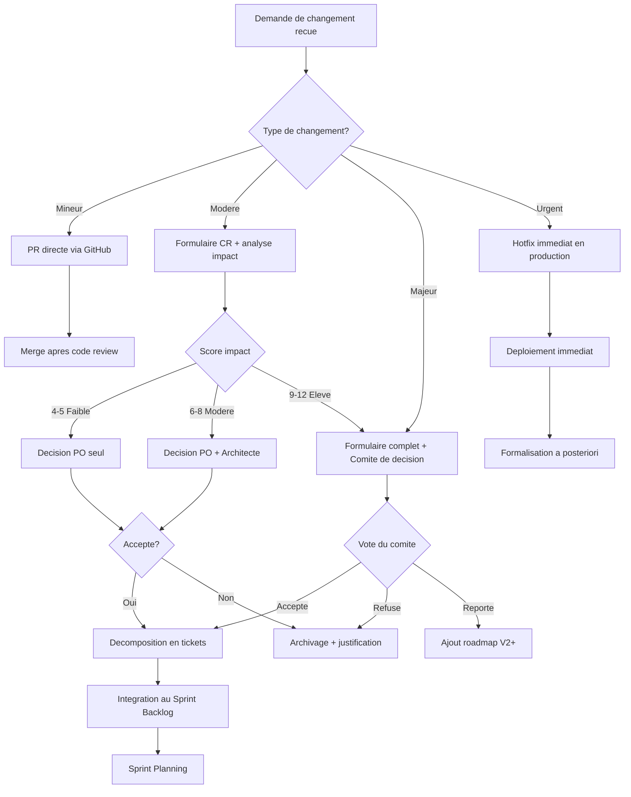

# Plan de Gestion du Changement et Conformite -- MYTHOS

## Plateforme de jeux narratifs multijoueur avec IA Maitre du Jeu

> **Projet** : MYTHOS
> **Version** : 1.0
> **Date** : 13 Fevrier 2026
> **Equipe** : 4 personnes (Scrum) — Kays ZAHIDI, Samy ZEROUALI, Youri EMMANUEL, Yassir SABBAR
> **Referentiel** : RNCP38822 -- Bloc 1
> **Duree** : 14 semaines

La gestion du changement et la conformite sont au coeur de notre demarche qualite. Ce document a ete co-redige par Kays (aspects techniques et RGPD), Yassir (accessibilite WCAG et GreenIT) et Samy (processus de changement et qualite code). On s'est appuyes sur les referentiels ANSSI, RGAA et les recommandations du collectif GreenIT. Pour etre honnetes, au debut on n'avait pas de processus formel pour les change requests -- c'est apres le Sprint 1, quand on a eu un desaccord sur un changement de scope, qu'on s'est dit qu'il fallait poser un vrai cadre.

---

## Table des matieres

1. [Processus de gestion du changement](#1-processus-de-gestion-du-changement)
2. [Plan de gestion de la qualite](#2-plan-de-gestion-de-la-qualite)
3. [Conformite informatique durable (GreenIT)](#3-conformite-informatique-durable-greenit)
4. [Conformite accessibilite (WCAG 2.1 AA)](#4-conformite-accessibilite-wcag-21-aa)
5. [Conformite RGPD](#5-conformite-rgpd)

---

## 1. Processus de gestion du changement

### 1.1 Philosophie

Dans un projet Agile Scrum de 14 semaines, les changements sont inevitables et meme souhaitables. Mais un changement non maitrise peut compromettre le calendrier, le budget ou la qualite du MVP. Notre processus de gestion du changement fait en sorte que chaque modification soit evaluee, decidee et tracee serieusement.

**Principes directeurs** :
- Tout changement est le bienvenu, mais il doit etre formalise
- L'impact est toujours evalue AVANT la decision
- Kays (Product Owner) a le dernier mot sur le perimetre fonctionnel
- Kays (Architecte) a le dernier mot sur les choix techniques
- Chaque changement est trace dans le registre

### 1.2 Types de changement

| Type | Description | Exemples | Processus |
|------|-------------|----------|-----------|
| **Mineur** | Changement technique sans impact fonctionnel | Refactoring, mise a jour de dependance, correction de typo | Directement via PR, pas de formulaire |
| **Modere** | Ajout/modification de fonctionnalite dans le perimetre MVP | Nouvelle User Story, modification d'un Scenario Pack, changement d'UI | Formulaire de changement + validation Kays (PO) |
| **Majeur** | Changement de perimetre, de technologie ou d'architecture | Ajout d'un 3eme scenario, changement de LLM provider, refonte de l'architecture | Formulaire complet + Comite de decision |
| **Urgent** | Correction critique en production | Bug bloquant, faille de securite, API down | Hotfix immediat + formalisation posteriori |

### 1.3 Formulaire de demande de changement

Chaque demande de changement Modere ou Majeur est formalisee via une issue GitHub avec le label `change-request` et le template suivant :

```markdown
# Demande de Changement – MYTHOS

## Informations generales

| Champ | Valeur |
|-------|--------|
| **ID du changement** | CR-XXX |
| **Date de la demande** | JJ/MM/AAAA |
| **Demandeur** | Nom + role |
| **Sprint en cours** | Sprint X |
| **Type de changement** | Mineur / Modere / Majeur / Urgent |
| **Priorite** | Critique / Haute / Moyenne / Basse |

## Description du changement

### Situation actuelle
<!-- Decrivez le comportement ou l'etat actuel -->

### Changement propose
<!-- Decrivez precisement ce que vous souhaitez modifier -->

### Justification
<!-- Pourquoi ce changement est-il necessaire ? Quel probleme resout-il ? -->

## Analyse d'impact

### Impact technique
- [ ] Modification du schema de donnees (migration Prisma)
- [ ] Modification de l'API (nouveaux endpoints, changement de contrat)
- [ ] Modification du Game Engine (boucle de jeu, phases)
- [ ] Modification de l'integration IA (prompts, parsing)
- [ ] Modification de l'infrastructure (CI/CD, deploiement)
- [ ] Modification des WebSocket (evenements, protocole)
- [ ] Aucun impact technique significatif

**Detail de l'impact technique** :
<!-- Fichiers/modules impactes, effort de developpement estime -->

### Impact planning
- **Effort estime** : ___ story points (___ heures-personne)
- **Sprint(s) impacte(s)** : Sprint ___
- **Retard potentiel sur le sprint** : ___ jours
- **Tickets a reporter** : #___, #___
- **Retard potentiel sur la date de livraison finale** : Oui / Non

### Impact budget
- **Cout supplementaire estime** : ___ EUR
- **Impact sur les couts API IA** : Oui / Non (detail : ___)
- **Impact sur les couts d'hebergement** : Oui / Non (detail : ___)

### Impact qualite
- **Tests impactes** : ___ tests a modifier / ajouter
- **Risque de regression** : Faible / Moyen / Eleve
- **Impact sur l'accessibilite** : Oui / Non
- **Impact sur la performance** : Oui / Non
- **Impact sur la securite** : Oui / Non

### Impact sur les autres tickets
<!-- Quels tickets existants sont impactes ? Dependencies crees ? -->

## Alternatives envisagees

| Alternative | Avantages | Inconvenients |
|-------------|-----------|---------------|
| Ne rien faire | ... | ... |
| Alternative A | ... | ... |
| Alternative B | ... | ... |

## Recommandation

<!-- Quelle est votre recommandation ? Accepter / Reporter / Refuser ? Pourquoi ? -->

## Decision

| Champ | Valeur |
|-------|--------|
| **Decision** | Accepte / Refuse / Reporte |
| **Date de decision** | JJ/MM/AAAA |
| **Decideur(s)** | Nom(s) |
| **Conditions** | (si applicable) |
| **Sprint d'implementation** | Sprint ___ |

## Suivi

| Date | Action | Responsable | Statut |
|------|--------|-------------|--------|
| | | | |
```

### 1.4 Processus d'evaluation d'impact

```
┌─────────────────────────────────────────────────────────────────────────┐
│              PROCESSUS D'EVALUATION D'IMPACT                            │
│                                                                         │
│  ┌─────────────────┐                                                    │
│  │ Demande recue   │                                                    │
│  │ (Issue GitHub   │                                                    │
│  │  + label CR)    │                                                    │
│  └────────┬────────┘                                                    │
│           │                                                             │
│           ▼                                                             │
│  ┌─────────────────────────────────────────────────────────┐            │
│  │           ANALYSE D'IMPACT (responsable : Kays)        │            │
│  │                                                         │            │
│  │  1. IMPACT TECHNIQUE                                    │            │
│  │     ┗━ Quels modules/fichiers sont impactes ?           │            │
│  │     ┗━ Faut-il une migration de BDD ?                   │            │
│  │     ┗━ Y a-t-il un risque d'incompatibilite ?           │            │
│  │     ┗━ Faut-il modifier les tests existants ?           │            │
│  │                                                         │            │
│  │  2. IMPACT PLANNING                                     │            │
│  │     ┗━ Combien de story points ?                        │            │
│  │     ┗━ Quels tickets du sprint en cours sont impactes ? │            │
│  │     ┗━ Faut-il reporter des tickets ?                   │            │
│  │     ┗━ Le changement tient-il dans le sprint buffer ?   │            │
│  │                                                         │            │
│  │  3. IMPACT BUDGET                                       │            │
│  │     ┗━ Couts supplementaires (API IA, hebergement) ?    │            │
│  │     ┗━ Le budget total est-il depasse ?                 │            │
│  │                                                         │            │
│  │  4. IMPACT QUALITE                                      │            │
│  │     ┗━ Risque de regression ?                           │            │
│  │     ┗━ Impact sur la dette technique ?                  │            │
│  │     ┗━ Impact sur l'accessibilite / securite ?          │            │
│  └─────────────────────────┬───────────────────────────────┘            │
│                            │                                            │
│                            ▼                                            │
│  ┌─────────────────────────────────────────────────────────┐            │
│  │              SYNTHESE D'IMPACT                          │            │
│  │                                                         │            │
│  │  Score d'impact = somme ponderee des 4 dimensions       │            │
│  │                                                         │            │
│  │  ┌────────────┬───────────┬───────────┬────────────┐    │            │
│  │  │ Dimension  │  Faible   │  Moyen    │   Eleve    │    │            │
│  │  │            │  (1 pt)   │  (2 pts)  │  (3 pts)   │    │            │
│  │  ├────────────┼───────────┼───────────┼────────────┤    │            │
│  │  │ Technique  │ 1 module  │ 2-3       │ Architecture│   │            │
│  │  │            │ impacte   │ modules   │ impactee    │   │            │
│  │  ├────────────┼───────────┼───────────┼────────────┤    │            │
│  │  │ Planning   │ < 3 SP    │ 3-8 SP    │ > 8 SP     │   │            │
│  │  │            │           │           │ ou retard   │   │            │
│  │  ├────────────┼───────────┼───────────┼────────────┤    │            │
│  │  │ Budget     │ 0 EUR     │ < 50 EUR  │ > 50 EUR   │   │            │
│  │  ├────────────┼───────────┼───────────┼────────────┤    │            │
│  │  │ Qualite    │ Pas de    │ Tests a   │ Risque de  │   │            │
│  │  │            │ regression│ modifier  │ regression │   │            │
│  │  └────────────┴───────────┴───────────┴────────────┘    │            │
│  │                                                         │            │
│  │  Score 4-5 : Impact faible → Decision Kays (PO) seul    │            │
│  │  Score 6-8 : Impact modere → Decision Kays (PO + Archi) │            │
│  │  Score 9-12 : Impact eleve → Comite de decision complet │            │
│  └─────────────────────────────────────────────────────────┘            │
└─────────────────────────────────────────────────────────────────────────┘
```

### 1.5 Comite de decision

#### Composition

| Membre | Role dans le comite | Voix |
|--------|--------------------|----- |
| **Kays (PO/Architecte)** | President du comite, decide du perimetre | Voix decisive (perimetre) |
| **Kays (Architecte)** | Evalue la faisabilite technique | Voix decisive (technique) |
| **Samy (SM/Frontend)** | Evalue l'impact sur le planning et le processus | Voix consultative |
| **Developpeur concerne (Youri, Samy ou Yassir)** | Apporte l'expertise technique detaillee | Voix consultative |

#### Criteres d'acceptation

Un changement est **accepte** si :
- Le score d'impact est maitrisable (plan de mitigation defini)
- L'effort supplementaire tient dans la capacite restante du sprint (ou du buffer)
- Le rapport benefice / cout est positif
- Le risque de regression est acceptable
- Le budget total n'est pas depasse de plus de 20%

Un changement est **refuse** si :
- Il met en peril la livraison du MVP
- Il implique un changement d'architecture majeur apres le Sprint 2
- Le rapport benefice / cout est negatif
- Aucun plan de mitigation credible n'est identifie

Un changement est **reporte** si :
- Le benefice est reel mais le timing est mauvais (sprint en cours surcharge)
- Il peut etre integre dans un sprint futur sans perte de valeur
- Il est classe dans la roadmap V2+

#### Processus de decision

```
1. Samy (Scrum Master) presente la demande de changement en Sprint Planning
   (ou en reunion exceptionnelle si urgent)

2. Kays (Architecte) presente l'analyse d'impact

3. Discussion ouverte (time-boxee a 15 minutes)

4. Vote :
   - Kays (PO) : Accepte / Refuse / Reporte (decisive sur le perimetre)
   - Kays (Architecte) : Faisable / Non faisable (decisive sur la technique)
   - Samy (SM) : Recommandation planning
   - Youri, Samy, Yassir : Recommandation technique

5. Decision documentee dans l'issue GitHub + registre des changements

6. Si accepte : le changement est decompose en tickets et integre au backlog
```

### 1.6 Synthese visuelle du processus de changement

Le diagramme ci-dessous resume le flux de traitement d'une demande de changement, de sa reception jusqu'a son integration ou son archivage. Il met en evidence les differents chemins selon le type de changement et le score d'impact.



### 1.7 Registre des changements

Le registre est maintenu dans un fichier centralise (`docs/CHANGE_LOG.md`) et dans les issues GitHub.

#### Template du registre

| ID | Date demande | Demandeur | Description | Type | Score impact | Decision | Date decision | Sprint impl. | Statut |
|----|-------------|-----------|-------------|------|:---:|-----------|---------------|:---:|--------|
| CR-001 | 15/02/2026 | Samy (IA) | Passer de Claude Sonnet a Claude Opus pour la narration | Majeur | 8 | Refuse | 16/02/2026 | - | Clos |
| CR-002 | 22/02/2026 | Kays (PO) | Ajouter un mode spectateur au lobby | Modere | 6 | Reporte | 23/02/2026 | V2 | Clos |
| CR-003 | 01/03/2026 | Youri (Frontend) | Remplacer Zustand par Jotai pour le state management | Modere | 7 | Refuse | 02/03/2026 | - | Clos |
| CR-004 | 08/03/2026 | Samy (Backend) | Ajouter un cache Redis sur les prompts IA recurrents | Modere | 5 | Accepte | 08/03/2026 | Sprint 3 | Termine |
| CR-005 | 15/03/2026 | Kays (PO) | Reduire le nombre de tours de DEEP de 8 a 6 | Mineur | 4 | Accepte | 15/03/2026 | Sprint 4 | Termine |
| CR-006 | 22/03/2026 | Yassir (DevOps) | Ajouter des tests E2E avec Playwright | Modere | 6 | Accepte | 23/03/2026 | Sprint 5 | En cours |

#### Exemple detaille : CR-004

```
DEMANDE DE CHANGEMENT CR-004
═══════════════════════════════

Date        : 08/03/2026
Demandeur   : Samy (Backend)
Sprint      : Sprint 3
Type        : Modere

SITUATION ACTUELLE :
Chaque appel IA pour la phase SETUP (contexte initial) genere un appel
API Anthropic complet. Or, le contexte initial d'un scenario est tres
similaire d'une partie a l'autre (meme prompt systeme, meme structure).
Le cout est de ~0.02 EUR par appel SETUP, soit ~0.02 * 20 parties/jour
= 0.40 EUR/jour inutilement.

CHANGEMENT PROPOSE :
Mettre en cache dans Redis les reponses IA pour la phase SETUP pendant
1 heure. Si un meme scenario est lance dans l'heure, reutiliser la
reponse cached (avec variation aleatoire des noms de PNJ).

IMPACT :
- Technique : 1 module impacte (AI Service) → Faible (1)
- Planning : 3 SP → Moyen (2)
- Budget : Economies de ~12 EUR/mois → Faible (1)
- Qualite : Pas de regression (nouveaux tests ajoutes) → Faible (1)
- Score total : 5 (Faible)

DECISION : Accepte par Kays (PO) + Kays (Architecte) le 08/03/2026
IMPLEMENTATION : Sprint 3, ticket S3-EXTRA-01
STATUT : Termine et deploye le 18/03/2026
```

### 1.8 Communication du changement

| Audience | Canal | Timing | Contenu |
|----------|-------|--------|---------|
| Equipe de developpement | Discord #change-requests | Immediate | Notification de la demande + lien issue |
| Equipe complete | Sprint Planning | Debut de sprint | Presentation des CR en attente + decision |
| Equipe complete | Sprint Review | Fin de sprint | Bilan des CR traites dans le sprint |
| Encadrant academique | Rapport hebdomadaire | Hebdomadaire | Resume des changements acceptes et de leur impact |
| Client fictif | Email de synthese | Bi-hebdomadaire | Changements impactant le perimetre ou le planning |

---

## 2. Plan de gestion de la qualite

### 2.1 Politique qualite MYTHOS

La qualite du projet MYTHOS repose sur quatre piliers. En pratique, Samy a insiste pour qu'on etablisse les standards de code des le Sprint 0, avant meme d'ecrire la premiere ligne -- ca a evite pas mal de debats inutiles en code review par la suite :

```
┌─────────────────────────────────────────────────────────────────┐
│                   PILIERS QUALITE MYTHOS                        │
│                                                                 │
│  ┌──────────────┐  ┌──────────────┐  ┌──────────────┐          │
│  │  CODE        │  │  PROCESSUS   │  │  PRODUIT     │          │
│  │  QUALITY     │  │  QUALITY     │  │  QUALITY     │          │
│  │              │  │              │  │              │          │
│  │ Conventions  │  │ Code review  │  │ Tests auto   │          │
│  │ TypeScript   │  │ obligatoire  │  │ (unit, E2E)  │          │
│  │ ESLint strict│  │              │  │              │          │
│  │ Prettier     │  │ PR template  │  │ Lighthouse   │          │
│  │ Pas de "any" │  │              │  │ > 90         │          │
│  │              │  │ Conventional │  │              │          │
│  │ Structure    │  │ Commits      │  │ Latence IA   │          │
│  │ fichiers     │  │              │  │ < 5s         │          │
│  │ coherente    │  │ DoD + DoR    │  │              │          │
│  │              │  │              │  │ 0 bug        │          │
│  │ SOLID + DRY  │  │ Retrospective│  │ critique     │          │
│  └──────────────┘  └──────────────┘  └──────────────┘          │
│                                                                 │
│  ┌──────────────────────────────────────────────────────┐      │
│  │                 CONFORMITE QUALITY                    │      │
│  │                                                      │      │
│  │  RGPD complet  │  WCAG 2.1 AA  │  GreenIT > 50     │      │
│  │  ANSSI respect │  RGAA conforme │  Eco-index mesure │      │
│  └──────────────────────────────────────────────────────┘      │
└─────────────────────────────────────────────────────────────────┘
```

### 2.2 Standards de code

#### 2.2.1 Conventions TypeScript

| Regle | Convention | Exemple |
|-------|-----------|---------|
| **Nommage des fichiers** | kebab-case | `game-loop-manager.service.ts` |
| **Nommage des classes** | PascalCase | `GameLoopManagerService` |
| **Nommage des fonctions** | camelCase | `startActionPhase()` |
| **Nommage des variables** | camelCase | `currentRound`, `gameState` |
| **Nommage des constantes** | UPPER_SNAKE_CASE | `MAX_PLAYERS`, `DEFAULT_TIMER` |
| **Nommage des interfaces** | PascalCase (pas de prefix I) | `GameState`, `ScenarioPack` |
| **Nommage des enums** | PascalCase (membres PascalCase) | `Phase.Narration`, `PlayerStatus.Alive` |
| **Nommage des types** | PascalCase | `PlayerChoice`, `AiResponse` |
| **Exports** | Named exports (pas de default) | `export class GameEngine {}` |
| **Imports** | Absolus depuis la racine du module | `import { GameState } from '@/types'` |
| **Types stricts** | Jamais de `any` ; utiliser `unknown` si necessaire | `data: unknown` au lieu de `data: any` |
| **Null safety** | Strict null checks actif | `player?.role?.name` |
| **Immutabilite** | Preferer `const` et `readonly` | `readonly gameState: GameState` |

#### 2.2.2 Configuration ESLint

```json
{
  "extends": [
    "eslint:recommended",
    "plugin:@typescript-eslint/recommended",
    "plugin:@typescript-eslint/recommended-requiring-type-checking",
    "prettier"
  ],
  "rules": {
    "@typescript-eslint/no-explicit-any": "error",
    "@typescript-eslint/no-unused-vars": ["error", { "argsIgnorePattern": "^_" }],
    "@typescript-eslint/explicit-function-return-type": "warn",
    "@typescript-eslint/no-floating-promises": "error",
    "@typescript-eslint/strict-boolean-expressions": "warn",
    "no-console": ["warn", { "allow": ["warn", "error"] }],
    "prefer-const": "error",
    "no-var": "error",
    "eqeqeq": ["error", "always"],
    "curly": ["error", "all"],
    "max-lines-per-function": ["warn", { "max": 50, "skipBlankLines": true, "skipComments": true }],
    "max-depth": ["warn", 3],
    "complexity": ["warn", 10]
  }
}
```

#### 2.2.3 Structure des fichiers (Backend NestJS)

```
src/modules/game/
├── game.module.ts               ← Declaration du module NestJS
├── game.controller.ts           ← Endpoints REST (si applicable)
├── game.gateway.ts              ← WebSocket Gateway
├── services/
│   ├── game-loop-manager.service.ts    ← Orchestration de la boucle de jeu
│   ├── game-state-manager.service.ts   ← Gestion du state Redis
│   ├── choice-engine.service.ts        ← Moteur de choix
│   ├── resource-manager.service.ts     ← Gestion des jauges
│   └── role-manager.service.ts         ← Distribution des roles
├── dto/
│   ├── create-session.dto.ts           ← Validation des entrees
│   └── submit-choice.dto.ts
├── interfaces/
│   ├── game-state.interface.ts         ← Typage du game state
│   ├── scenario-pack.interface.ts      ← Typage du Scenario Pack
│   └── ai-response.interface.ts        ← Typage des reponses IA
├── guards/
│   └── session-member.guard.ts         ← Verifie que le joueur est dans la session
├── __tests__/
│   ├── game-loop-manager.service.spec.ts
│   ├── choice-engine.service.spec.ts
│   └── game.e2e-spec.ts
└── constants/
    └── game.constants.ts               ← Constantes du module
```

#### 2.2.4 Structure des fichiers (Frontend Next.js)

```
app/
├── layout.tsx                   ← Layout racine
├── page.tsx                     ← Page d'accueil (catalogue)
├── (auth)/
│   ├── login/page.tsx           ← Page de connexion
│   └── register/page.tsx        ← Page d'inscription
├── scenarios/
│   └── [slug]/page.tsx          ← Detail d'un scenario
├── session/
│   └── [code]/
│       ├── page.tsx             ← Lobby
│       └── game/page.tsx        ← Interface de jeu
└── admin/
    └── page.tsx                 ← Panel d'administration

components/
├── ui/                          ← Composants generiques (Button, Card, Modal, Input)
├── game/
│   ├── NarrationPanel.tsx       ← Affichage de la narration
│   ├── ChoicePanel.tsx          ← Affichage des options de choix
│   ├── DiscussionPanel.tsx      ← Chat de discussion
│   ├── ResourceGauges.tsx       ← Jauges de ressources (DEEP)
│   ├── PrivateInfoPanel.tsx     ← Infos privees du joueur
│   ├── PhaseIndicator.tsx       ← Indicateur de phase
│   ├── TimerDisplay.tsx         ← Compte a rebours
│   └── EndScreen.tsx            ← Ecran de fin
├── lobby/
│   ├── PlayerList.tsx           ← Liste des joueurs dans le lobby
│   ├── LobbyChat.tsx            ← Chat du lobby
│   └── InviteCode.tsx           ← Code d'invitation
└── layout/
    ├── Header.tsx
    ├── Footer.tsx
    └── Navigation.tsx
```

### 2.3 Processus de code review

#### 2.3.1 Regles generales

| Regle | Detail |
|-------|--------|
| **Obligation** | Toute PR doit etre reviewee par au moins 1 membre avant merge |
| **Delai** | Le reviewer doit reagir dans les 24h (au minimum un commentaire) |
| **Taille** | Une PR ne devrait pas depasser 400 lignes de code modifiees |
| **Focus** | Une PR = une fonctionnalite ou un fix (pas de PR "fourre-tout") |
| **Auto-review** | L'auteur re-lit sa propre PR avant de la soumettre |
| **Tone** | Bienveillant et constructif ; les commentaires sont des suggestions |

#### 2.3.2 Checklist de code review

Le reviewer passe en revue les points suivants :

**Architecture et design**
- [ ] Le code respecte l'architecture du module (separation of concerns)
- [ ] Les responsabilites sont bien reparties (un service = une responsabilite)
- [ ] Le code ne duplique pas de logique existante (DRY)
- [ ] Les interfaces et types sont bien definis
- [ ] Le code est facilement testable (injection de dependances)

**Qualite du code**
- [ ] Les noms de variables/fonctions/classes sont explicites et coherents
- [ ] Le code est lisible sans commentaire excessif (self-documenting)
- [ ] Pas de `any`, pas de `@ts-ignore` injustifie
- [ ] Les fonctions sont courtes (< 50 lignes)
- [ ] La complexite cyclomatique est raisonnable (< 10)
- [ ] Les constantes magiques sont extraites dans des constantes nommees

**Gestion des erreurs**
- [ ] Les erreurs sont gerees explicitement (try/catch, error handling NestJS)
- [ ] Les messages d'erreur sont clairs et utiles
- [ ] Les cas limites sont geres (listes vides, valeurs null, timeout)
- [ ] Les erreurs ne sont pas silencieusement ignorees

**Securite**
- [ ] Les entrees utilisateur sont validees (DTO, class-validator)
- [ ] Pas d'injection SQL (usage de Prisma ORM)
- [ ] Pas de donnees sensibles dans les logs
- [ ] Les endpoints sont proteges par les guards appropries

**Tests**
- [ ] Les tests unitaires couvrent les cas nominaux et les cas d'erreur
- [ ] Les mocks sont utilises pour les dependances externes (API IA, Redis)
- [ ] Les tests sont lisibles et bien nommes (describe/it pattern)
- [ ] La couverture de la fonctionnalite est suffisante

**Performance**
- [ ] Pas de requete N+1 (Prisma includes utilises)
- [ ] Les operations lourdes sont asynchrones
- [ ] Le cache Redis est utilise quand pertinent
- [ ] Les imports inutiles sont supprimes (tree-shaking)

**Accessibilite (si frontend)**
- [ ] HTML semantique utilise (pas de div pour tout)
- [ ] Attributs ARIA presents sur les elements interactifs
- [ ] Labels sur les champs de formulaire
- [ ] Navigation clavier fonctionnelle
- [ ] Contrastes suffisants

#### 2.3.3 Workflow de review

```
1. L'auteur ouvre la PR avec le template rempli
2. L'auteur s'auto-assigne et assigne un reviewer
3. La CI tourne automatiquement (lint + tests + build)
4. Le reviewer lit la PR dans les 24h
5. Le reviewer laisse ses commentaires :
   - "Approved" : la PR est bonne, prete a merger
   - "Changes requested" : des modifications sont necessaires
   - "Comment" : questions ou suggestions non-bloquantes
6. L'auteur repond aux commentaires et pousse les corrections
7. Le reviewer re-valide
8. La PR est mergee (squash merge vers develop)
9. La branche source est supprimee automatiquement
```

### 2.4 Strategie de tests par couche

```
┌─────────────────────────────────────────────────────────────────────┐
│                  PYRAMIDE DE TESTS MYTHOS                           │
│                                                                     │
│                        ┌───────┐                                    │
│                       /  E2E   \          5-10 tests                │
│                      / Playwright\        Flux complets             │
│                     /  (critique) \       (register → jouer → fin)  │
│                    /───────────────\                                 │
│                   /   INTEGRATION   \     20-30 tests               │
│                  /  (API + WebSocket) \   Modules connectes         │
│                 /     + Services      \  (Game Engine + IA + Redis) │
│                /───────────────────────\                             │
│               /       UNITAIRE          \  100+ tests               │
│              /  (Services, Utils, Comps)  \ Fonctions isolees       │
│             /   Mocks des dependances     \ (Choice Engine, etc.)   │
│            /─────────────────────────────────\                       │
│                                                                     │
│  COUVERTURE CIBLE :                                                 │
│  Backend : > 60%                                                    │
│  Frontend : > 40%                                                   │
│  Game Engine : > 70%                                                │
│  AI Service : > 50% (mocks des appels API)                          │
└─────────────────────────────────────────────────────────────────────┘
```

#### 2.4.1 Tests unitaires

| Couche | Outils | Cible couverture | Ce qu'on teste |
|--------|--------|:---:|----------------|
| Backend Services | Jest + ts-jest | > 60% | Logique metier de chaque service en isolation |
| Game Engine | Jest | > 70% | Game Loop, Choice Engine, Resource Manager, Role Manager |
| AI Service | Jest + mocks | > 50% | Construction des prompts, parsing des reponses, gestion d'erreur |
| Frontend Components | Vitest + React Testing Library | > 40% | Rendu des composants, interactions, etats |
| Frontend Stores | Vitest | > 60% | Actions Zustand, mutations d'etat |
| Utils / Helpers | Jest ou Vitest | > 80% | Fonctions utilitaires (formatage, validation, calcul) |

**Conventions de test** :

```typescript
// Convention de nommage : <fichier>.spec.ts
// Structure : describe / it / expect

describe('ChoiceEngineService', () => {
  describe('submitChoice', () => {
    it('should record a player choice in vote mode', async () => {
      // Arrange
      const session = createMockSession({ actionMode: 'vote' });
      const choice = { playerId: 'p1', choiceId: 'opt_1' };

      // Act
      await service.submitChoice(session.id, choice);

      // Assert
      const results = await service.getResults(session.id);
      expect(results.choices).toContainEqual(expect.objectContaining(choice));
    });

    it('should reject choice after timer expires', async () => {
      // ...
    });

    it('should resolve tie with random selection', async () => {
      // ...
    });
  });
});
```

#### 2.4.2 Tests d'integration

| Scenario de test | Modules impliques | Base de donnees | Redis |
|------------------|-------------------|:---:|:---:|
| Flux d'authentification complet | Auth + User | Oui (test DB) | Non |
| Creation et chargement d'un Scenario Pack | Scenario + DB | Oui | Non |
| Partie complete TRIBUNAL (5 tours simules) | Game Engine + AI (mock) + State | Non | Oui (test) |
| Partie complete DEEP (avec jauges) | Game Engine + Resources + AI (mock) | Non | Oui (test) |
| Connexion WebSocket + evenements | Gateway + Session + Auth | Oui | Oui |
| Reconnexion joueur apres deconnexion | Gateway + State + Session | Non | Oui |

**Les appels IA sont TOUJOURS mockes dans les tests d'integration** (pour la vitesse et le cout).

#### 2.4.3 Tests End-to-End (E2E)

| Test E2E | Description | Duree estimee |
|----------|-------------|:---:|
| `register-login.spec.ts` | Inscription → Connexion → Redirection accueil | 30s |
| `create-join-session.spec.ts` | Creer session → Copier code → Rejoindre (2 onglets) | 45s |
| `play-tribunal-complete.spec.ts` | Partie complete TRIBUNAL avec 4 joueurs simules | 3-5 min |
| `play-deep-complete.spec.ts` | Partie complete DEEP avec jauges | 3-5 min |
| `admin-panel.spec.ts` | Connexion admin → Dashboard → Stats | 30s |
| `accessibility-check.spec.ts` | Navigation clavier sur tous les ecrans | 1 min |

**Outils E2E** : Playwright (multi-navigateur, multi-onglet natif)

### 2.5 Criteres de qualite mesurables

| KPI Qualite | Cible | Outil de mesure | Frequence | Alerte si |
|-------------|-------|-----------------|-----------|-----------|
| Couverture tests backend | > 60% | Jest --coverage | Chaque PR | < 55% |
| Couverture tests frontend | > 40% | Vitest --coverage | Chaque PR | < 35% |
| Couverture Game Engine | > 70% | Jest --coverage | Chaque PR | < 65% |
| Bugs critiques ouverts | 0 | GitHub Issues | Quotidien | > 0 |
| Bugs majeurs ouverts | < 3 | GitHub Issues | Par sprint | > 5 |
| Lighthouse Performance | > 80 | Lighthouse CI | Deploiement | < 70 |
| Lighthouse Accessibility | > 90 | Lighthouse CI | Deploiement | < 85 |
| Lighthouse Best Practices | > 90 | Lighthouse CI | Deploiement | < 85 |
| Lighthouse SEO | > 80 | Lighthouse CI | Deploiement | < 70 |
| Temps de reponse API (P95) | < 500ms | Logs Railway | Continu | > 1s |
| Temps de reponse IA (P95) | < 5s | Logs applicatifs | Continu | > 8s |
| Taux d'erreur IA | < 5% | Logs AI Service | Continu | > 10% |
| Taux de completion de partie | > 70% | Stats applicatives | Hebdomadaire | < 50% |
| WAVE errors | 0 | WAVE extension | Par sprint | > 0 |
| npm audit (high/critical) | 0 | CI pipeline | Chaque PR | > 0 |
| Eco-index | > 50 | GreenIT Analysis | Par sprint | < 40 |
| Poids moyen des pages | < 1 Mo | Lighthouse | Deploiement | > 1.5 Mo |
| Uptime | > 95% | UptimeRobot | Continu | < 95% |

---

## 3. Conformite informatique durable (GreenIT)

### 3.1 Referentiel GreenIT applique au projet

Le referentiel des 115 bonnes pratiques GreenIT est passe en revue ci-dessous. Chaque bonne pratique applicable au projet MYTHOS est cochee et detaillee.

#### Conception

- [x] **BP01 -- Eliminer les fonctionnalites non essentielles** : Le MVP est strictement delimite par la methode MoSCoW. Les fonctionnalites "Won't Have" (mode spectateur, replay, voice chat) sont exclues. Chaque sprint livre uniquement les "Must Have".
- [x] **BP02 -- Quantifier precisement le besoin** : Les Scenario Packs definissent precisement le nombre de tours, les timers, le nombre de joueurs. Pas de "fonctionnalite ouverte" non bornee.
- [x] **BP03 -- Fluidifier le processus** : La boucle de jeu en 6 phases est optimisee pour minimiser les allers-retours serveur. Un seul appel IA par phase de narration/resolution.
- [x] **BP04 -- Preferer la saisie assistee a l'autocompletion** : Les choix de jeu sont presentes sous forme de boutons (pas de champ texte libre), reduisant le traitement cote serveur.
- [x] **BP05 -- Favoriser un design simple, adapte au web** : Design mobile-first avec TailwindCSS utility-first. Pas d'animations lourdes, pas de videos autoplayed.
- [ ] BP06 -- Creer un service worker : Non applicable au MVP (hors PWA).
- [x] **BP07 -- Favoriser les pages statiques** : Les pages d'accueil, catalogue et detail scenario sont generees en SSG (Static Site Generation) via Next.js. Seules les pages dynamiques (lobby, game UI) sont en SSR/CSR.
- [x] **BP08 -- Eviter les carrousels** : Aucun carrousel dans le design. Le catalogue est une grille simple de cartes.

#### Templating

- [x] **BP09 -- Utiliser le cache HTTP** : Next.js gere les headers Cache-Control automatiquement pour les assets statiques. Vercel CDN met en cache les pages SSG.
- [x] **BP10 -- Limiter le nombre de requetes HTTP** : Bundle splitting Next.js natif, code splitting par page. Un seul fichier CSS (TailwindCSS purge). Socket.io remplace le polling.
- [x] **BP11 -- Stocker les donnees dans le cache du navigateur** : Le token JWT est stocke en localStorage. Le state de jeu est gere cote client par Zustand (pas de refetch inutile).
- [x] **BP12 -- Eviter les redirections** : Routage client-side via Next.js App Router. Pas de redirections serveur sauf pour la protection des routes (middleware).
- [x] **BP13 -- Utiliser la compression des reponses HTTP** : Vercel compresse automatiquement en gzip/brotli. Railway compresse les reponses API.

#### CSS

- [x] **BP14 -- Preferer le CSS aux images** : Les jauges de ressources (DEEP) sont des barres CSS (div + width dynamique), pas des images. Les indicateurs de phase sont du CSS pur.
- [x] **BP15 -- Ecrire des selecteurs CSS efficaces** : TailwindCSS genere des classes utilitaires atomiques, les plus efficaces en termes de performance CSS.
- [x] **BP16 -- Grouper les declarations CSS similaires** : TailwindCSS purge les classes inutilisees au build. Le bundle CSS final est minimal.
- [x] **BP17 -- Utiliser les shorthand CSS** : TailwindCSS utilise nativement les shorthand properties.
- [x] **BP18 -- Fournir une CSS print** : Non critique pour un jeu en ligne, mais un `@media print` minimal est prevu pour les ecrans de fin (resume de partie imprimable).

#### JavaScript

- [x] **BP19 -- Limiter l'usage du JavaScript** : Le HTML semantique est utilise au maximum. Les animations sont en CSS (transitions, keyframes) et non en JS. JavaScript est reserve a la logique applicative.
- [x] **BP20 -- Eviter d'utiliser des frameworks/bibliotheques si une solution native existe** : Pas de jQuery, pas de Lodash. Les API natives (fetch, WebSocket, Intl) sont utilisees. Socket.io est le seul "framework" pour le temps reel (justifie par les rooms et la reconnexion auto).
- [x] **BP21 -- Ne pas faire de modification du DOM quand il n'est pas visible** : React gere le virtual DOM et ne met a jour que les elements visibles. Les evenements WebSocket en arriere-plan mettent a jour le store Zustand sans toucher au DOM.
- [x] **BP22 -- Utiliser la delegation d'evenements** : React gere nativement la delegation d'evenements au niveau de la racine de l'application.
- [x] **BP23 -- Privilegier les transformations CSS aux animations JavaScript** : Les animations de phase, le timer, les transitions de jauges sont en CSS transitions/animations.

#### Images et medias

- [x] **BP24 -- Utiliser le lazy loading des images** : Next.js `<Image>` component avec lazy loading natif. Les images de scenarios ne sont chargees que quand visibles.
- [x] **BP25 -- Optimiser les images** : Next.js Image Optimization (conversion WebP automatique, redimensionnement). Les images sont compressees au build.
- [x] **BP26 -- Eviter d'utiliser des images bitmap pour l'interface** : Les icones sont en SVG inline ou via une bibliotheque d'icones (lucide-react). Pas de PNG/JPG pour les elements d'interface.
- [ ] BP27 -- Utiliser le format WebP : Gere automatiquement par Next.js Image component.
- [x] **BP28 -- Pas de video/audio en autoplay** : Aucune video ni audio dans le MVP. La narration est textuelle (compatible avec l'eco-conception ET l'accessibilite).

#### Hebergement

- [x] **BP29 -- Choisir un hebergeur "vert"** : Vercel utilise des energies renouvelables pour ses datacenters (AWS us-east-1 + CDN edge). Le choix de la region CDG1 (Paris) minimise la distance pour les utilisateurs europeens.
- [x] **BP30 -- Utiliser un CDN** : Vercel inclut un CDN edge network mondial pour les assets statiques et les pages SSG.
- [x] **BP31 -- Utiliser la mise en cache serveur** : Redis (Upstash) est utilise pour cacher les reponses IA recurrentes, le game state, et les donnees de session. TTL adapte a chaque type de donnee.

#### Backend

- [x] **BP32 -- Mettre en cache les donnees souvent consultees** : Scenario Packs caches en Redis (TTL 1h). Reponses IA de setup cachees (TTL 1h). Game state en Redis (acces ultra-rapide).
- [x] **BP33 -- Minimiser les requetes BDD** : Prisma `include` et `select` utilises pour eviter les N+1 queries. Les requetes sont optimisees avec des index.
- [x] **BP34 -- Privilegier les requetes paginées** : Tous les endpoints de listing (scenarios, sessions admin, users) sont pagines (limit + offset).
- [x] **BP35 -- Ne recuperer que les donnees necessaires** : Prisma `select` est utilise pour ne recuperer que les champs necessaires. L'API ne retourne jamais de donnees inutiles.

#### IA specifique (bonnes pratiques ajoutees pour MYTHOS)

- [x] **BP-CUSTOM-01 -- Strategie duale LLM** : Claude Haiku pour les phases simples (setup, validation), Claude Sonnet pour la narration et la resolution. Reduction estimee de 60% des couts IA et de l'empreinte energetique.
- [x] **BP-CUSTOM-02 -- Prompts optimises** : Les prompts sont concis, structures et instruisent l'IA a repondre en JSON compact. Pas de tokens gaspilles en instructions redondantes.
- [x] **BP-CUSTOM-03 -- Cache des reponses IA** : Les contextes initiaux de scenarios sont caches (meme prompt = meme structure de reponse). Gain : ~30% d'appels IA en moins sur les parties repetees.
- [x] **BP-CUSTOM-04 -- Limitation des appels IA par session** : Maximum 2 appels IA par tour (narration + resolution). Pas d'appel IA pendant la phase discussion ou action.
- [x] **BP-CUSTOM-05 -- Historique resume** : Au lieu d'envoyer l'historique complet a l'IA, un resume condense est envoye (reduction de 40% des tokens input).

### 3.2 Strategie d'eco-conception detaillee

#### 3.2.1 Optimisation des appels IA

L'IA Maitre du Jeu est le composant le plus couteux en termes d'impact environnemental (energie des GPU dans les datacenters). La strategie MYTHOS vise a minimiser cet impact tout en maintenant la qualite narrative.

```
┌──────────────────────────────────────────────────────────────────┐
│            STRATEGIE D'OPTIMISATION IA                           │
│                                                                  │
│  AVANT OPTIMISATION (naif) :                                     │
│  ┗━ 1 partie = ~15 appels IA (setup + 5 tours * 2 + finale)     │
│  ┗━ Modele : Sonnet pour tout → ~0.15 USD / partie              │
│  ┗━ Tokens : ~30K input + 10K output                             │
│                                                                  │
│  APRES OPTIMISATION :                                            │
│  ┗━ 1 partie = ~10 appels IA (cache setup + resume historique)   │
│  ┗━ Modele : Haiku (setup) + Sonnet (narration/resolution)       │
│  ┗━ Tokens : ~18K input + 8K output                              │
│  ┗━ Cout : ~0.06 USD / partie                                    │
│  ┗━ Reduction : -60% cout, -40% tokens, -33% appels              │
│                                                                  │
│  MESURES CONCRETES :                                             │
│  1. Cache Redis des contextes initiaux (TTL 1h)                  │
│  2. Resume condense de l'historique (pas l'integralite)          │
│  3. Haiku pour les phases simples (setup, validation)            │
│  4. Max tokens limite (2048 par appel)                           │
│  5. Pas d'appel IA gratuit (chaque appel = besoin reel)          │
│  6. Monitoring du nombre de tokens par session                   │
└──────────────────────────────────────────────────────────────────┘
```

#### 3.2.2 Optimisation frontend

| Technique | Implementation | Impact |
|-----------|---------------|--------|
| **Lazy loading** | Next.js dynamic imports pour les composants lourds (EndScreen, AdminPanel) | Reduction du bundle initial de 30% |
| **Code splitting** | App Router de Next.js split automatiquement par page | Chaque page ne charge que son code |
| **Image optimization** | Next.js `<Image>` avec conversion WebP automatique | Reduction du poids des images de 50% |
| **CSS purge** | TailwindCSS purge les classes inutilisees au build | CSS final < 20 Ko |
| **Tree shaking** | Webpack (Next.js) elimine le code mort | Bundle final minimal |
| **Compression** | Vercel compresse en Brotli/gzip automatiquement | Reduction de 70% du transfert |
| **Prefetching intelligent** | Next.js prefetch les liens visibles (catalogue → detail) | Navigation instantanee |
| **Pas de polyfills inutiles** | Cibler ES2020+ (navigateurs modernes) | Pas de code superflu |

#### 3.2.3 Optimisation backend

| Technique | Implementation | Impact |
|-----------|---------------|--------|
| **Redis pour le game state** | State en memoire (pas en BDD) pendant la partie | 0 requete PostgreSQL pendant le jeu |
| **Connection pooling** | Prisma connection pool (max 10 connexions) | Reutilisation des connexions DB |
| **Pagination systématique** | Tous les endpoints de listing sont pagines | Pas de SELECT * sans LIMIT |
| **Index BDD** | Index sur session.code, user.email, scenario.slug | Requetes en O(log n) |
| **Compression WebSocket** | Socket.io compression activee | Messages WS plus legers |
| **TTL Redis** | Game state expire apres 2h (parties abandonnees) | Nettoyage automatique |

#### 3.2.4 Choix d'hebergement responsable

| Service | Fournisseur | Region | Engagement vert |
|---------|-------------|--------|-----------------|
| Frontend | Vercel | CDG1 (Paris) + Edge global | AWS utilise 100% energies renouvelables dans certaines regions ; Vercel optimise la distribution CDN pour minimiser les transferts longue distance |
| Backend | Railway | US-West (default) | Railway utilise Google Cloud Platform qui est neutre en carbone depuis 2007 et engage a fonctionner avec 100% energies renouvelables |
| Redis | Upstash | eu-west-1 (Ireland) | AWS Ireland alimente par un mix d'energies renouvelables ; Upstash est serverless (pas de serveur idle) |
| IA | Anthropic | US datacenters | Anthropic utilise des datacenters AWS et GCP avec engagements verts ; la strategie duale Haiku/Sonnet reduit la charge GPU |

### 3.3 Mesures concretes et KPI environnementaux

#### 3.3.1 KPI environnementaux

| KPI | Cible | Outil de mesure | Frequence |
|-----|-------|-----------------|-----------|
| **Eco-index des pages** | > 50 (sur 100) | GreenIT Analysis (extension navigateur) | Chaque sprint |
| **Poids moyen des pages** | < 1 Mo | Chrome DevTools / Lighthouse | Chaque deploiement |
| **Nombre de requetes HTTP par page** | < 30 | Chrome DevTools | Chaque deploiement |
| **Nombre d'appels IA par partie** | < 12 | Logs applicatifs | Continu |
| **Tokens IA moyens par partie** | < 25K (input + output) | Logs AI Service | Hebdomadaire |
| **Cout IA moyen par partie** | < 0.10 USD | Dashboard Anthropic | Hebdomadaire |
| **Bundle JS frontend** | < 300 Ko (gzipped) | next build output | Chaque build |
| **Bundle CSS frontend** | < 30 Ko (gzipped) | next build output | Chaque build |
| **Temps de chargement LCP** | < 2.5s | Lighthouse | Chaque deploiement |
| **Requetes BDD par partie** | < 20 (hors game state) | Prisma query logging | Hebdomadaire |

#### 3.3.2 Plan de mesure

| Sprint | Action | Responsable |
|--------|--------|-------------|
| Sprint 2 | Premiere mesure GreenIT sur les pages existantes | Youri (Frontend) |
| Sprint 3 | Mesure du nombre d'appels IA par partie (TRIBUNAL) | Samy (IA) |
| Sprint 4 | Implementation du cache IA + mesure de la reduction | Samy (Backend) |
| Sprint 5 | Audit GreenIT complet sur toutes les pages en production | Yassir (DevOps) |
| Sprint 5 | Rapport d'eco-conception pour le dossier RNCP | Toute l'equipe |
| Buffer | Optimisations finales si eco-index < 50 | Youri (Frontend) |

---

## 4. Conformite accessibilite (WCAG 2.1 AA)

### 4.1 Plan d'audit WCAG 2.1 AA

L'audit d'accessibilite de MYTHOS couvre les 4 principes WCAG et leurs criteres applicables au projet. Chaque critere est evalue sur chaque page/ecran de l'application.

#### 4.1.1 Principe 1 -- Perceptible

Les informations et composants de l'interface doivent etre presentes de maniere a ce que les utilisateurs puissent les percevoir.

| Critere WCAG | Niveau | Applicable | Statut | Implementation MYTHOS |
|-------------|:---:|:---:|:---:|----------------------|
| **1.1.1** Contenu non textuel | A | Oui | Prevu | Attribut `alt` sur toutes les images (cards scenarios, logos). SVG avec `aria-label`. |
| **1.2.1** Contenu audio/video pre-enregistre | A | Non | N/A | Pas de contenu audio/video dans le MVP. |
| **1.2.2** Sous-titres | A | Non | N/A | Pas de contenu audio/video. |
| **1.2.3** Audio-description | A | Non | N/A | Pas de contenu video. |
| **1.2.4** Sous-titres en direct | AA | Non | N/A | Pas de contenu audio/video en direct. |
| **1.2.5** Audio-description pre-enregistree | AA | Non | N/A | Pas de contenu video. |
| **1.3.1** Information et relations | A | Oui | Prevu | HTML semantique (`<main>`, `<nav>`, `<article>`, `<section>`). Titres hierarchiques (`h1`→`h6`). Listes pour les menus. Tableaux avec `<th>` pour les stats admin. |
| **1.3.2** Ordre significatif | A | Oui | Prevu | L'ordre du DOM suit l'ordre visuel. Pas de CSS `order` qui casse la logique de lecture. |
| **1.3.3** Caracteristiques sensorielles | A | Oui | Prevu | Les jauges (DEEP) ont des labels textuels en plus des barres colorees. Les phases de jeu sont identifiees par texte + couleur + icone. |
| **1.3.4** Orientation | AA | Oui | Prevu | L'application fonctionne en portrait et paysage. Pas de verrouillage d'orientation. |
| **1.3.5** Identifier la finalite de la saisie | AA | Oui | Prevu | Attributs `autocomplete` sur les champs de formulaire (email, username, password). |
| **1.4.1** Utilisation de la couleur | A | Oui | Prevu | Les jauges de ressources utilisent couleur + label textuel + pourcentage. Les messages d'erreur ont un texte + une icone (pas juste du rouge). Les roles ne sont pas distingues par la couleur seule. |
| **1.4.2** Controle du son | A | Non | N/A | Pas de son dans le MVP. |
| **1.4.3** Contraste (minimum) | AA | Oui | Prevu | Ratio minimum 4.5:1 pour le texte normal, 3:1 pour le texte large. Le theme sombre est concu avec des contrastes suffisants (texte clair sur fond sombre). Verification avec l'outil Colour Contrast Analyser. |
| **1.4.4** Redimensionnement du texte | AA | Oui | Prevu | L'application reste fonctionnelle avec un zoom a 200%. Les tailles de police utilisent `rem` (pas `px`). |
| **1.4.5** Images de texte | AA | Oui | Prevu | Pas d'images de texte. Tout le texte est en HTML (y compris les titres de scenarios). |
| **1.4.10** Reflow | AA | Oui | Prevu | Design responsive mobile-first. Pas de scroll horizontal a 320px de large. |
| **1.4.11** Contraste des elements non textuels | AA | Oui | Prevu | Les boutons, champs de formulaire et jauges ont un contraste >= 3:1 avec le fond. |
| **1.4.12** Espacement du texte | AA | Oui | Prevu | L'application reste fonctionnelle si l'utilisateur modifie l'espacement du texte (line-height, letter-spacing). |
| **1.4.13** Contenu au survol ou au focus | AA | Oui | Prevu | Les tooltips et popups sont accessibles au clavier et peuvent etre fermes avec Echap. |

#### 4.1.2 Principe 2 -- Utilisable

Les composants de l'interface et la navigation doivent etre utilisables.

| Critere WCAG | Niveau | Applicable | Statut | Implementation MYTHOS |
|-------------|:---:|:---:|:---:|----------------------|
| **2.1.1** Clavier | A | Oui | Prevu | Toutes les actions sont accessibles au clavier : navigation par Tab, selection par Entree/Espace, fermeture par Echap. Les boutons de choix en jeu sont navigables au clavier. |
| **2.1.2** Pas de piege au clavier | A | Oui | Prevu | Aucun element ne capture le focus de maniere indefinie. Les modales sont fermables par Echap. Le chat est quittable par Tab. |
| **2.1.4** Raccourcis clavier | A | Oui | Prevu | Pas de raccourcis clavier qui interferent avec les technologies d'assistance. Si des raccourcis sont ajoutes, ils sont desactivables. |
| **2.2.1** Reglage du delai | A | Oui | **Critique** | **Les timers de jeu (phase action, phase discussion) sont extensibles.** Option dans le lobby : "Timers prolonges" (x2 la duree). L'hote peut activer cette option pour les joueurs en situation de handicap. |
| **2.2.2** Mettre en pause, arreter, masquer | A | Oui | Prevu | Le streaming de la narration IA peut etre mis en pause (bouton "Pause"). Les animations CSS respectent `prefers-reduced-motion`. |
| **2.3.1** Pas plus de 3 flashs | A | Oui | Prevu | Aucune animation ne clignote plus de 3 fois par seconde. Les transitions sont douces (ease-in-out). |
| **2.4.1** Contourner des blocs | A | Oui | Prevu | Lien "Skip to main content" en haut de chaque page. Les zones de jeu sont identifiees par des landmarks ARIA. |
| **2.4.2** Titre de page | A | Oui | Prevu | Chaque page a un `<title>` unique et descriptif : "MYTHOS - Catalogue", "MYTHOS - Lobby - TRIBUNAL", "MYTHOS - Partie en cours". |
| **2.4.3** Parcours du focus | A | Oui | Prevu | L'ordre de tabulation suit la logique visuelle. Le focus est deplace vers le contenu pertinent lors des changements de phase (narration → focus sur le texte). |
| **2.4.4** Fonction du lien | A | Oui | Prevu | Tous les liens ont un texte descriptif (pas de "cliquez ici"). Les boutons ont des labels explicites. |
| **2.4.5** Acces multiples | AA | Oui | Prevu | Navigation principale (header) + navigation par pages + acces direct par URL (code de session). |
| **2.4.6** En-tetes et etiquettes | AA | Oui | Prevu | Hierarchie de titres coherente. Chaque section de la game UI a un titre (h2 : "Narration", "Vos choix", "Discussion"). |
| **2.4.7** Visibilite du focus | AA | Oui | Prevu | Indicateur de focus visible (outline) sur tous les elements interactifs. Style personnalise cohérent avec le theme sombre. |
| **2.5.1** Gestes de pointage | A | Oui | Prevu | Toutes les actions sont realisables par un clic simple (pas de swipe, pinch, drag obligatoire). |
| **2.5.2** Annulation du pointage | A | Oui | Prevu | Les actions sont declenchees au relachement (mouseup/touchend), pas a l'appui. Les choix de jeu necessitent une confirmation. |
| **2.5.3** Etiquette dans le nom | A | Oui | Prevu | Les labels visibles des boutons correspondent a leur nom accessible. |
| **2.5.4** Declenchement par le mouvement | A | Non | N/A | Pas de fonctionnalite declenchee par le mouvement de l'appareil. |

#### 4.1.3 Principe 3 -- Comprehensible

Les informations et le fonctionnement de l'interface doivent etre comprehensibles.

| Critere WCAG | Niveau | Applicable | Statut | Implementation MYTHOS |
|-------------|:---:|:---:|:---:|----------------------|
| **3.1.1** Langue de la page | A | Oui | Prevu | Attribut `lang="fr"` sur la balise `<html>`. |
| **3.1.2** Langue d'un passage | AA | Oui | Prevu | Si la narration IA contient des passages en anglais (noms propres), l'attribut `lang="en"` est utilise sur le passage. |
| **3.2.1** Au focus | A | Oui | Prevu | Aucun changement de contexte automatique quand un element recoit le focus. |
| **3.2.2** A la saisie | A | Oui | Prevu | Les formulaires ne sont pas soumis automatiquement a la saisie. Un bouton explicite est toujours requis. |
| **3.2.3** Navigation coherente | AA | Oui | Prevu | Le header et la navigation sont identiques sur toutes les pages. La Game UI a une disposition coherente entre les phases. |
| **3.2.4** Identification coherente | AA | Oui | Prevu | Les memes composants ont les memes labels partout (ex: "Rejoindre" pour toutes les sessions, "Lancer la partie" toujours au meme endroit). |
| **3.3.1** Identification des erreurs | A | Oui | Prevu | Les erreurs de formulaire sont identifiees par un message textuel clair (pas juste une bordure rouge). |
| **3.3.2** Etiquettes ou instructions | A | Oui | Prevu | Chaque champ de formulaire a un label associe. Les regles de jeu sont accessibles a tout moment. |
| **3.3.3** Suggestion de correction | AA | Oui | Prevu | "L'email est deja utilise. Essayez de vous connecter." / "Le mot de passe doit contenir au moins 8 caracteres." |
| **3.3.4** Prevention des erreurs | AA | Oui | Prevu | Confirmation avant les actions irreversibles (quitter une partie en cours, lancer la partie). |

#### 4.1.4 Principe 4 -- Robuste

Le contenu doit etre suffisamment robuste pour etre interprete de maniere fiable par une large variete d'agents utilisateurs, y compris les technologies d'assistance.

| Critere WCAG | Niveau | Applicable | Statut | Implementation MYTHOS |
|-------------|:---:|:---:|:---:|----------------------|
| **4.1.1** Analyse syntaxique | A | Oui | Prevu | HTML valide (pas de balises non fermees, pas d'ID dupliques). Verifie par le linter ESLint (plugin jsx-a11y). |
| **4.1.2** Nom, role, valeur | A | Oui | Prevu | Attributs ARIA sur tous les composants custom (boutons de choix, jauges, timer). `role`, `aria-label`, `aria-live`, `aria-valuenow` (pour les jauges). |
| **4.1.3** Messages d'etat | AA | Oui | **Critique** | **Les changements de phase, la narration IA et les resultats de tour sont annonces via `aria-live="polite"`.** Le timer utilise `aria-live="assertive"` quand il reste moins de 10 secondes. Les messages prives utilisent `role="alert"`. |

### 4.2 Adaptations specifiques pour les personnes en situation de handicap

#### 4.2.1 Adaptations pour les deficiences visuelles

| Adaptation | Detail | Implementation |
|-----------|--------|----------------|
| **Compatibilite lecteur d'ecran** | La narration IA est en texte brut structure. Les changements de phase sont annonces. Les choix sont listes avec leur description. | `aria-live` regions, labels descriptifs, HTML semantique |
| **Navigation clavier complete** | Tout le flux de jeu est jouable au clavier : lire la narration (scroll), choisir une option (Tab + Entree), envoyer un message chat (Tab vers le champ, Entree pour envoyer), marquer "Pret" (bouton accessible). | `tabindex`, focus management, keyboard event handlers |
| **Contraste eleve** | Theme sombre concu avec des ratios de contraste >= 4.5:1 pour le texte et >= 3:1 pour les elements d'interface. Option "contraste renforce" prevue (V2). | Variables CSS, theme tokens, verification automatisee |
| **Jauges accessibles** | Chaque jauge a un label textuel en plus de la barre visuelle. Format : "Oxygene : 45 sur 100 (45%)". L'attribut `aria-valuenow` est mis a jour dynamiquement. | `role="progressbar"`, `aria-valuenow`, `aria-valuemin`, `aria-valuemax`, `aria-label` |
| **Zoom 200%** | L'interface reste fonctionnelle et lisible a 200% de zoom. Pas de contenu tronque ou inaccessible. | Unites relatives (`rem`, `%`), design responsive |

#### 4.2.2 Adaptations pour les deficiences motrices

| Adaptation | Detail | Implementation |
|-----------|--------|----------------|
| **Timers extensibles** | L'hote peut activer "Timers prolonges" dans les options du lobby. Les timers sont multiplies par 2 (ex: 60s → 120s pour la phase action). | Option dans le lobby, stockee dans la config de session, envoyee au Game Engine |
| **Cibles de clic larges** | Tous les boutons interactifs ont une taille minimum de 44x44 pixels (recommandation WCAG). Les cartes de scenarios et les boutons de choix sont larges. | `min-height: 44px`, `min-width: 44px`, `padding` genereux |
| **Pas d'action par mouvement** | Aucune fonctionnalite ne requiert un geste complexe (swipe, drag, pinch). Tout est faisable par clic simple. | Boutons standards, pas de drag-and-drop |
| **Confirmation des choix** | Un choix de jeu n'est pas soumis au simple clic. Le joueur clique sur l'option, voit une confirmation, puis valide. Cela evite les clics accidentels. | Modal/popup de confirmation ou bouton "Confirmer" |

#### 4.2.3 Adaptations pour les deficiences cognitives

| Adaptation | Detail | Implementation |
|-----------|--------|----------------|
| **Langage clair** | La narration IA utilise un langage accessible (le prompt systeme l'exige). Les menus et boutons utilisent des termes simples. | Instructions dans le prompt IA : "utilise un langage clair et accessible" |
| **Feedback visuel clair** | Chaque action du joueur a un feedback immediat (animation, message de confirmation). L'etat de la partie est toujours visible (tour, phase, timer). | Composants de feedback, etats visuels clairs |
| **Historique consultable** | Le joueur peut consulter l'historique des tours a tout moment pour se rememorer les evenements. | Bouton "Historique" dans la Game UI, panel scrollable |
| **Regles accessibles** | Les regles du scenario sont consultables a tout moment pendant la partie (bouton "Regles" dans la Game UI). | Modal/panel avec les regles du scenario courant |

### 4.3 Planning des tests d'accessibilite

| Sprint | Action | Outil | Responsable | Livrable |
|--------|--------|-------|-------------|----------|
| Sprint 0 | Definir les guidelines d'accessibilite dans le design system | Figma | Yassir (UX/DevOps) | Charte a11y dans le design system |
| Sprint 2 | Audit Lighthouse Accessibility sur les premieres pages (accueil, auth) | Lighthouse | Youri (Frontend) | Score >= 90, corrections si necessaire |
| Sprint 3 | Audit WAVE sur les pages de lobby et catalogue | WAVE | Yassir (UX/DevOps) | 0 erreur WAVE |
| Sprint 4 | Test navigation clavier sur la Game UI complete | Manuel | Youri (Frontend) + Yassir (UX/DevOps) | Tous les flux jouables au clavier |
| Sprint 4 | Test lecteur d'ecran (VoiceOver macOS) sur le flux de jeu | VoiceOver | Yassir (UX/DevOps) | Flux complet lisible au lecteur d'ecran |
| Sprint 5 | Audit WCAG complet (tous les criteres) | axe DevTools + Manuel | Yassir (UX/DevOps) + Youri (Frontend) | Rapport d'audit PDF pour le dossier RNCP |
| Sprint 5 | Tests avec utilisateurs en situation de handicap (si possible) | Sessions de test | Yassir (UX/DevOps) | Retours integres au backlog |
| Sprint 5 | Verification finale Lighthouse > 90 sur toutes les pages en production | Lighthouse | Yassir (DevOps) | Captures d'ecran des scores |
| Buffer | Corrections finales si criteres non atteints | - | Toute l'equipe | Score final documente |

---

## 5. Conformite RGPD

### 5.1 Registre de traitement detaille (Article 30)

Conformement a l'article 30 du RGPD, le registre de traitement ci-dessous documente l'ensemble des traitements de donnees personnelles effectues par la plateforme MYTHOS.

#### Responsable de traitement

| Champ | Valeur |
|-------|--------|
| **Raison sociale** | Mythos Interactive SAS (entite fictive) |
| **Adresse** | [Adresse du siege social] |
| **Representant** | Kays (Product Owner) |
| **DPO** | Non designe (entreprise < 250 salaries, traitement non systematique a grande echelle) |
| **Contact RGPD** | rgpd@mythos.game |

#### Traitements de donnees personnelles

**Traitement T1 : Gestion des comptes utilisateurs**

| Champ | Detail |
|-------|--------|
| **Finalite** | Permettre l'inscription, l'authentification et la gestion du profil joueur |
| **Base legale** | Execution du contrat (CGU acceptees a l'inscription) -- Art. 6.1.b |
| **Categories de personnes** | Joueurs inscrits sur la plateforme |
| **Categories de donnees** | Pseudonyme, adresse email, mot de passe (hashe bcrypt), date d'inscription |
| **Source des donnees** | Saisie directe par la personne concernee |
| **Destinataires** | Equipe technique MYTHOS (acces restreint via roles) |
| **Transfert hors UE** | Non (hebergement Railway EU + Vercel CDG1) |
| **Duree de conservation** | Duree du compte + 3 mois apres suppression (periode de grace) |
| **Mesures de securite** | Hashage bcrypt (salt rounds 10), HTTPS obligatoire, JWT avec expiration 24h, rate limiting sur l'endpoint login |

**Traitement T2 : Gestion des sessions de jeu**

| Champ | Detail |
|-------|--------|
| **Finalite** | Permettre le deroulement des parties multijoueur (creation, participation, historique) |
| **Base legale** | Execution du contrat -- Art. 6.1.b |
| **Categories de personnes** | Joueurs participant a une session |
| **Categories de donnees** | Identifiant de session, role attribue (dans le jeu), choix effectues, messages de chat en jeu, timestamps |
| **Source des donnees** | Actions du joueur pendant la partie |
| **Destinataires** | Equipe technique MYTHOS, autres joueurs de la meme session (donnees publiques du jeu uniquement) |
| **Transfert hors UE** | Non |
| **Duree de conservation** | Donnees de session en cours : duree de la partie (Redis, TTL 2h). Historique : 6 mois apres la partie (PostgreSQL) |
| **Mesures de securite** | Donnees de session isolees par room WebSocket, authentification JWT sur WebSocket, game state epiphemere dans Redis |

**Traitement T3 : Generation narrative par IA**

| Champ | Detail |
|-------|--------|
| **Finalite** | Generer la narration et les choix de jeu via l'IA Maitre du Jeu |
| **Base legale** | Execution du contrat -- Art. 6.1.b |
| **Categories de personnes** | Joueurs participant a une session |
| **Categories de donnees** | Pseudonyme du joueur, role dans le jeu, choix effectues, messages de chat (integres au contexte IA) |
| **Source des donnees** | Actions du joueur, state de la partie |
| **Destinataires** | API Anthropic (sous-traitant, voir section 5.5) |
| **Transfert hors UE** | Oui -- vers les Etats-Unis (serveurs Anthropic). Encadre par les clauses contractuelles types (CCT) d'Anthropic. |
| **Duree de conservation** | Anthropic : retention des prompts pendant 30 jours max (selon leur politique de donnees). Cote MYTHOS : les prompts ne sont pas stockes apres la partie. |
| **Mesures de securite** | Donnees minimales envoyees (pseudonyme uniquement, pas d'email ni de vrai nom). Pas de donnees personnelles sensibles dans les prompts. Cle API securisee en variable d'environnement. |

**Traitement T4 : Statistiques d'utilisation**

| Champ | Detail |
|-------|--------|
| **Finalite** | Mesurer l'utilisation de la plateforme, ameliorer le produit |
| **Base legale** | Interet legitime -- Art. 6.1.f (statistiques agregees et anonymisees) |
| **Categories de personnes** | Tous les joueurs |
| **Categories de donnees** | Nombre de parties jouees, duree des sessions, scenarios joues, taux de completion (donnees agregees, non nominatives) |
| **Source des donnees** | Logs applicatifs |
| **Destinataires** | Equipe technique MYTHOS (dashboard admin) |
| **Transfert hors UE** | Non |
| **Duree de conservation** | Donnees agregees : 12 mois. Logs bruts : 3 mois. |
| **Mesures de securite** | Acces restreint (role admin), donnees agregees non re-identifiables |

**Traitement T5 : Logs techniques et securite**

| Champ | Detail |
|-------|--------|
| **Finalite** | Assurer la securite de la plateforme, detecter les anomalies, debugger |
| **Base legale** | Interet legitime -- Art. 6.1.f |
| **Categories de personnes** | Tous les utilisateurs |
| **Categories de donnees** | Adresse IP (hashee), user-agent, timestamps des actions, erreurs applicatives |
| **Source des donnees** | Logs serveur NestJS, logs Railway |
| **Destinataires** | Equipe technique MYTHOS |
| **Transfert hors UE** | Non |
| **Duree de conservation** | 3 mois (rotation automatique) |
| **Mesures de securite** | IP hashees, acces restreint aux logs, rotation automatique |

#### Tableau recapitulatif du registre

| ID | Traitement | Base legale | Donnees | Conservation | Transfert hors UE | Sous-traitant |
|:---:|-----------|-------------|---------|:---:|:---:|:---:|
| T1 | Comptes utilisateurs | Contrat | Pseudo, email, mdp | Duree compte + 3 mois | Non | - |
| T2 | Sessions de jeu | Contrat | Role, choix, chat | 2h (Redis) / 6 mois (DB) | Non | - |
| T3 | Generation narrative IA | Contrat | Pseudo, role, choix | 30j (Anthropic) | Oui (US) | Anthropic |
| T4 | Statistiques | Interet legitime | Donnees agregees | 12 mois | Non | - |
| T5 | Logs techniques | Interet legitime | IP hashee, timestamps | 3 mois | Non | Railway |

### 5.2 Analyse d'impact relative a la protection des donnees (AIPD) simplifiee

L'AIPD est realisee pour le traitement T3 (Generation narrative par IA), identifie comme le traitement le plus sensible car il implique un transfert de donnees vers un sous-traitant hors UE.

#### 5.2.1 Description du traitement

| Element | Detail |
|---------|--------|
| **Nature** | Envoi de donnees contextuelles de jeu a l'API Anthropic pour generer la narration |
| **Portee** | Chaque session de jeu (2-8 joueurs, 10-15 appels IA par partie) |
| **Contexte** | Plateforme de jeu en ligne, utilisation ludique, pas de donnees sensibles |
| **Finalite** | Fonctionnement du Game Master IA, coeur du produit |

#### 5.2.2 Evaluation de la necessite

| Critere | Evaluation |
|---------|-----------|
| **Proportionnalite** | Les donnees envoyees sont minimales (pseudonyme de jeu, pas de vrai nom ni email). Seules les donnees necessaires a la generation sont transmises. |
| **Necessite** | Le traitement est indispensable au fonctionnement du produit. Sans l'API IA, le Game Master ne peut pas fonctionner. |
| **Alternatives evaluees** | LLM local (Llama 3) : qualite insuffisante et cout GPU prohibitif pour le MVP. API europeenne (Mistral) : qualite narrative inferieure sur les tests. |

#### 5.2.3 Evaluation des risques

| Risque | Probabilite | Gravite | Niveau | Mesures de mitigation |
|--------|:---:|:---:|:---:|----------------------|
| Identification d'un joueur via les prompts IA | Faible | Faible | Faible | Seul le pseudonyme est envoye (pas d'email, pas d'IP). Les prompts sont ephemeres. |
| Fuite de donnees chez Anthropic | Tres faible | Moyen | Faible | Anthropic est certifie SOC2. Clauses contractuelles types. Politique de retention limitee (30j). |
| Utilisation des donnees pour entrainer le modele IA | Faible | Moyen | Moyen | L'API Anthropic (payante) ne reutilise pas les donnees des clients pour l'entrainement (selon leurs conditions). A verifier contractuellement. |
| Contenu genere inapproprie revelant des infos joueur | Tres faible | Faible | Faible | Le prompt systeme instruit l'IA de ne JAMAIS reveler d'infos personnelles. Guardrails dans les prompts. |

#### 5.2.4 Mesures de protection

| Mesure | Detail | Statut |
|--------|--------|:---:|
| Minimisation des donnees | Seuls le pseudonyme et les actions de jeu sont envoyes a l'IA | Implemente |
| Chiffrement en transit | HTTPS/TLS pour tous les appels API Anthropic | Implemente |
| Clauses contractuelles types | Anthropic fournit des CCT conformes au RGPD | A verifier |
| Retention limitee | Les prompts ne sont pas stockes cote MYTHOS apres la partie | Implemente |
| Droit a l'oubli | Le joueur peut supprimer son compte, ce qui anonymise ses donnees de jeu | Prevu Sprint 5 |
| Audit periodique | Verification trimestrielle de la politique de donnees d'Anthropic | Planifie |

#### 5.2.5 Conclusion de l'AIPD

Le traitement T3 presente un **risque faible a modere** pour les droits et libertes des personnes concernees. Les donnees transmises sont minimales (pseudonyme de jeu uniquement), le traitement est necessaire au fonctionnement du produit, et des mesures de protection adequates sont mises en place. Le risque residuel est acceptable.

### 5.3 Politique de confidentialite (Draft)

```
POLITIQUE DE CONFIDENTIALITE -- MYTHOS
Derniere mise a jour : [Date]

1. QUI SOMMES-NOUS ?

MYTHOS est une plateforme de jeux narratifs multijoueur avec IA Maitre
du Jeu, editee par Mythos Interactive SAS.

Contact RGPD : rgpd@mythos.game


2. QUELLES DONNEES COLLECTONS-NOUS ?

Nous collectons uniquement les donnees necessaires au fonctionnement
de la plateforme :

- Votre pseudonyme (choisi par vous)
- Votre adresse email (pour la connexion)
- Votre mot de passe (stocke sous forme hashee, illisible)
- Vos actions en jeu (choix, messages de chat)
- Des statistiques d'utilisation anonymisees

Nous ne collectons PAS :
- Votre nom reel
- Votre adresse postale
- Votre numero de telephone
- Votre geolocalisation
- Vos donnees de paiement (pas de paiement dans le MVP)


3. POURQUOI COLLECTONS-NOUS CES DONNEES ?

- Pour vous permettre de creer un compte et de vous connecter
- Pour vous permettre de jouer a des parties multijoueur
- Pour generer la narration du jeu via l'IA Maitre du Jeu
- Pour ameliorer la plateforme (statistiques anonymisees)


4. PARTAGE DES DONNEES

Vos donnees de jeu (pseudonyme et actions) sont transmises a l'API
Anthropic (editeur du modele Claude) pour generer la narration.
Anthropic est notre sous-traitant au sens du RGPD. Anthropic est
base aux Etats-Unis. Ce transfert est encadre par les clauses
contractuelles types de la Commission europeenne.

Anthropic ne reutilise PAS vos donnees pour entrainer ses modeles
d'IA (politique API commerciale).

Nous ne vendons JAMAIS vos donnees a des tiers.


5. DUREE DE CONSERVATION

- Donnees de compte : tant que votre compte est actif + 3 mois
  apres suppression
- Donnees de partie en cours : pendant la duree de la partie (max 2h)
- Historique des parties : 6 mois apres la partie
- Logs techniques : 3 mois
- Statistiques anonymisees : 12 mois


6. VOS DROITS

Conformement au RGPD, vous disposez des droits suivants :

- Droit d'acces : obtenir une copie de vos donnees personnelles
- Droit de rectification : corriger vos donnees (pseudo, email)
- Droit a l'effacement : supprimer votre compte et vos donnees
- Droit a la portabilite : recuperer vos donnees dans un format
  structure (JSON)
- Droit d'opposition : vous opposer au traitement de statistiques
- Droit a la limitation : demander la limitation du traitement

Pour exercer vos droits, contactez-nous a : rgpd@mythos.game
Nous repondrons dans un delai maximum de 30 jours.

Si vous estimez que vos droits ne sont pas respectes, vous pouvez
introduire une reclamation aupres de la CNIL (www.cnil.fr).


7. SECURITE

Vos donnees sont protegees par :
- Chiffrement des mots de passe (bcrypt)
- Communications chiffrees (HTTPS/TLS)
- Tokens d'authentification a duree limitee (JWT, 24h)
- Acces restreint aux donnees (role-based access control)
- Hebergement sur des infrastructures securisees (Vercel, Railway)


8. COOKIES

MYTHOS utilise uniquement des cookies techniques necessaires au
fonctionnement de la plateforme :
- Token d'authentification (localStorage, pas un cookie)
- Aucun cookie tiers
- Aucun cookie de tracking
- Aucun cookie publicitaire

Aucun bandeau de consentement n'est donc necessaire pour les cookies
(pas de cookies non essentiels). Si des cookies analytiques sont
ajoutes a l'avenir, un bandeau de consentement sera mis en place.


9. MODIFICATIONS

Cette politique peut etre mise a jour. En cas de modification
substantielle, nous vous informerons par email ou par notification
sur la plateforme.


10. CONTACT

Pour toute question relative a la protection de vos donnees :
Email : rgpd@mythos.game
```

### 5.4 Procedure de gestion des droits des personnes

#### 5.4.1 Flux de traitement des demandes

```
┌─────────────────────────────────────────────────────────────────────────┐
│          PROCEDURE DE GESTION DES DROITS RGPD                           │
│                                                                         │
│  ┌──────────────────┐                                                   │
│  │ Demande recue    │ ← Email a rgpd@mythos.game                       │
│  │ (J+0)            │   OU formulaire dans les parametres du compte     │
│  └────────┬─────────┘                                                   │
│           │                                                             │
│           ▼                                                             │
│  ┌──────────────────────┐                                               │
│  │ Verification         │ ← Verifier l'identite du demandeur            │
│  │ d'identite (J+0-1)  │   (correspondance email du compte)            │
│  └────────┬─────────────┘                                               │
│           │                                                             │
│           ▼                                                             │
│  ┌──────────────────────┐                                               │
│  │ Accuse de reception  │ ← Email automatique : "Votre demande a ete   │
│  │ (J+1 max)            │   recue. Nous la traiterons sous 30 jours."  │
│  └────────┬─────────────┘                                               │
│           │                                                             │
│           ▼                                                             │
│  ┌──────────────────────┐                                               │
│  │ Traitement           │ ← Selon le type de droit (voir ci-dessous)   │
│  │ (J+1 a J+25)        │                                               │
│  └────────┬─────────────┘                                               │
│           │                                                             │
│           ▼                                                             │
│  ┌──────────────────────┐                                               │
│  │ Reponse au demandeur │ ← Email avec le resultat de la demande       │
│  │ (J+30 max)           │                                               │
│  └────────┬─────────────┘                                               │
│           │                                                             │
│           ▼                                                             │
│  ┌──────────────────────┐                                               │
│  │ Archivage            │ ← La demande est archivee dans le registre   │
│  │                      │   des droits exerces (duree : 3 ans)          │
│  └──────────────────────┘                                               │
│                                                                         │
│  DELAI LEGAL : 30 jours maximum (extensible a 60j si complexe)         │
└─────────────────────────────────────────────────────────────────────────┘
```

#### 5.4.2 Implementation par type de droit

**Droit d'acces (Article 15)**

| Etape | Action | Implementation technique |
|-------|--------|-------------------------|
| 1 | L'utilisateur demande l'acces a ses donnees | Bouton "Demander mes donnees" dans les parametres du compte |
| 2 | Le systeme compile les donnees | Endpoint `GET /api/users/me/data-export` |
| 3 | Les donnees sont envoyees en JSON | Email avec fichier JSON attache ou telechargement direct |

Donnees fournies :
- Profil utilisateur (pseudo, email, date d'inscription)
- Historique des parties (dates, scenarios, roles, resultats)
- Messages de chat (si encore conserves)
- Statistiques du joueur

**Droit de rectification (Article 16)**

| Etape | Action | Implementation technique |
|-------|--------|-------------------------|
| 1 | L'utilisateur modifie ses informations | Page "Mon profil" : modification du pseudo et de l'email |
| 2 | Le systeme met a jour les donnees | Endpoint `PATCH /api/users/me` avec validation |
| 3 | Confirmation | Email de confirmation si changement d'email |

**Droit a l'effacement / Droit a l'oubli (Article 17)**

| Etape | Action | Implementation technique |
|-------|--------|-------------------------|
| 1 | L'utilisateur demande la suppression de son compte | Bouton "Supprimer mon compte" dans les parametres (double confirmation) |
| 2 | Le compte est desactive immediatement | Statut du compte passe a `DELETED`, deconnexion forcee |
| 3 | Periode de grace de 30 jours | Le compte peut etre reactave pendant 30 jours |
| 4 | Suppression definitive apres 30 jours | Job CRON : suppression des donnees personnelles, anonymisation de l'historique (`DELETE user` + `UPDATE players SET user_id = 'anonymous'`) |
| 5 | Demande a Anthropic | Si applicable, demande de suppression des donnees traitees (selon la politique d'Anthropic) |

**Droit a la portabilite (Article 20)**

| Etape | Action | Implementation technique |
|-------|--------|-------------------------|
| 1 | L'utilisateur demande l'export de ses donnees | Bouton "Exporter mes donnees" dans les parametres |
| 2 | Export genere en JSON structure | Endpoint `GET /api/users/me/data-export?format=json` |
| 3 | Telechargement ou envoi par email | Fichier JSON telechargeble directement |

Format de l'export :

```json
{
  "export_date": "2026-03-15T14:30:00Z",
  "user": {
    "username": "MonPseudo",
    "email": "mon@email.com",
    "created_at": "2026-02-01T10:00:00Z"
  },
  "game_history": [
    {
      "session_id": "abc123",
      "scenario": "TRIBUNAL",
      "role": "Avocat de la defense",
      "date": "2026-03-10T20:00:00Z",
      "duration_minutes": 22,
      "result": "victoire",
      "choices": [
        { "round": 1, "choice": "Interroger le temoin" },
        { "round": 2, "choice": "Presenter la preuve" }
      ]
    }
  ],
  "total_games_played": 15,
  "account_age_days": 42
}
```

**Droit d'opposition (Article 21)**

| Contexte | Traitement concerne | Action |
|----------|--------------------|----- --|
| Statistiques anonymisees | T4 : Stats d'utilisation | L'utilisateur peut desactiver la collecte de stats dans ses parametres. Flag `analytics_opt_out: true` dans la BDD. |
| Generation IA | T3 : Generation narrative | Pas d'opposition possible car le traitement est necessaire a l'execution du contrat (le jeu ne fonctionne pas sans IA). Clairement indique dans les CGU. |

### 5.5 Gestion des sous-traitants

#### 5.5.1 Liste des sous-traitants

| Sous-traitant | Service utilise | Donnees traitees | Localisation | Base legale transfert |
|--------------|----------------|-----------------|:---:|----------------------|
| **Anthropic** | API Claude (generation IA) | Pseudonymes, roles de jeu, choix, contexte narratif | Etats-Unis | Clauses contractuelles types (CCT) |
| **Vercel** | Hebergement frontend | Adresses IP (logs CDN), cookies techniques | UE (CDG1) + Edge global | Donnees minimales, traitement en UE |
| **Railway** | Hebergement backend + PostgreSQL | Toutes les donnees applicatives (comptes, sessions) | Etats-Unis | CCT de Google Cloud (infrastructure Railway) |
| **Upstash** | Redis (cache, game state) | Game state temporaire (pseudonymes, actions) | UE (Ireland) | Traitement en UE |

#### 5.5.2 Clauses types pour les sous-traitants

Chaque sous-traitant doit fournir ou adherer aux clauses suivantes (conformement a l'article 28 du RGPD) :

```
CLAUSES TYPES DE SOUS-TRAITANCE RGPD
(Resume des obligations)

1. OBJET ET DUREE
   Le sous-traitant traite les donnees personnelles uniquement pour
   le compte et selon les instructions du responsable de traitement
   (Mythos Interactive), pour la duree du contrat de service.

2. NATURE ET FINALITE DU TRAITEMENT
   [Defini pour chaque sous-traitant selon le tableau ci-dessus]

3. OBLIGATIONS DU SOUS-TRAITANT
   a) Ne traiter les donnees que sur instruction documentee du
      responsable de traitement
   b) S'assurer que les personnes autorisees a traiter les donnees
      sont soumises a une obligation de confidentialite
   c) Prendre toutes les mesures de securite requises (Art. 32)
   d) Ne pas faire appel a un autre sous-traitant sans autorisation
      prealable ecrite
   e) Aider le responsable de traitement a repondre aux demandes
      d'exercice des droits
   f) Aider le responsable de traitement a respecter les obligations
      de securite, notification de violations, AIPD
   g) Au choix du responsable de traitement, supprimer ou restituer
      les donnees au terme de la prestation
   h) Mettre a disposition du responsable de traitement toutes les
      informations necessaires pour demontrer le respect des
      obligations et permettre la realisation d'audits

4. TRANSFERTS HORS UE
   [Si applicable] Le sous-traitant garantit que les transferts de
   donnees hors de l'Espace economique europeen sont encadres par
   les clauses contractuelles types de la Commission europeenne
   (Decision 2021/914).

5. NOTIFICATION DES VIOLATIONS
   Le sous-traitant notifie le responsable de traitement dans les
   meilleurs delais (et au plus tard 48h) apres avoir eu connaissance
   d'une violation de donnees personnelles.

6. AUDIT
   Le sous-traitant autorise et contribue aux audits realises par
   le responsable de traitement ou un auditeur mandate par celui-ci.
```

#### 5.5.3 Evaluation des sous-traitants

| Sous-traitant | Certification securite | Politique de donnees | Engagement RGPD | Evaluation |
|--------------|:---:|:---:|:---:|:---:|
| **Anthropic** | SOC2 Type II | Les donnees API commerciale ne sont pas utilisees pour l'entrainement. Retention 30j max. | DPA (Data Processing Addendum) disponible. CCT incluses. | Conforme |
| **Vercel** | SOC2 Type II, ISO 27001 | Logs CDN minimaux. Pas de traitement des donnees applicatives. | DPA disponible. Hebergement UE (CDG1). | Conforme |
| **Railway** | SOC2 | Infrastructure GCP. Donnees chiffrees au repos et en transit. | DPA disponible. CCT via GCP. | Conforme |
| **Upstash** | SOC2 | Donnees chiffrees. Region UE. Serverless (pas de persistence longue). | DPA disponible. Traitement en UE. | Conforme |

#### 5.5.4 Actions RGPD par sprint

| Sprint | Action RGPD | Responsable | Livrable |
|--------|-------------|-------------|----------|
| Sprint 0 | Definir la politique de minimisation des donnees | Kays (PO) + Kays (Architecte) | Liste des donnees collectees (registre v1) |
| Sprint 1 | Implementer le hashage des mots de passe (bcrypt) | Samy (Backend) | Code + tests |
| Sprint 1 | Rediger la politique de confidentialite (draft) | Kays (PO) | Document Markdown |
| Sprint 2 | Implementer la page "Politique de confidentialite" | Youri (Frontend) | Page accessible |
| Sprint 3 | Verifier les DPA des sous-traitants (Anthropic, Vercel, Railway) | Kays (PO) | Checklist de conformite |
| Sprint 4 | Implementer l'export des donnees (portabilite) | Samy (Backend) | Endpoint API + bouton frontend |
| Sprint 5 | Implementer la suppression de compte (droit a l'oubli) | Samy (Backend) | Endpoint API + bouton frontend |
| Sprint 5 | Finaliser le registre de traitement Article 30 | Kays (PO) + Kays (Architecte) | Document PDF pour le dossier RNCP |
| Sprint 5 | Realiser l'AIPD simplifiee pour le traitement T3 | Kays (PO) | Document PDF |
| Buffer | Revue finale de conformite RGPD | Toute l'equipe | Checklist de conformite validee |

---

## Annexe A : Matrice de tracabilite conformite

| Exigence reglementaire | Section du document | Sprint d'implementation | Verification |
|------------------------|:---:|:---:|:---:|
| RGPD Art. 5 -- Principes de traitement | 5.1 | Sprint 0 | Registre de traitement |
| RGPD Art. 6 -- Licéite du traitement | 5.1 | Sprint 0 | Bases legales documentees |
| RGPD Art. 12-22 -- Droits des personnes | 5.4 | Sprint 4-5 | Endpoints implementes |
| RGPD Art. 25 -- Privacy by design | 5.1-5.4 | Transversal | Architecture minimisation |
| RGPD Art. 28 -- Sous-traitant | 5.5 | Sprint 3 | DPA verifies |
| RGPD Art. 30 -- Registre de traitement | 5.1 | Sprint 0-5 | Registre PDF |
| RGPD Art. 32 -- Securite du traitement | 5.1, 2.2 | Transversal | Mesures techniques |
| RGPD Art. 33-34 -- Notification de violation | 5.5 | Sprint 3 | Procedure definie |
| RGPD Art. 35 -- AIPD | 5.2 | Sprint 5 | Document AIPD |
| WCAG 2.1 AA | 4.1-4.3 | Sprint 2-5 | Audit Lighthouse + WAVE |
| RGAA 4.1 | 4.1 | Sprint 5 | Rapport d'audit |
| GreenIT -- 115 BP | 3.1 | Transversal | Checklist + Eco-index |
| ANSSI -- Hygiene securite | 2.2, 2.4 | Transversal | npm audit + headers securite |

---

## Annexe B : Glossaire conformite

| Terme | Definition |
|-------|-----------|
| **RGPD** | Reglement General sur la Protection des Donnees (UE 2016/679) |
| **CNIL** | Commission Nationale de l'Informatique et des Libertes (autorite francaise de protection des donnees) |
| **DPO** | Delegue a la Protection des Donnees |
| **DPA** | Data Processing Addendum (avenant de traitement des donnees) |
| **CCT** | Clauses Contractuelles Types (mecanisme de transfert hors UE) |
| **AIPD** | Analyse d'Impact relative a la Protection des Donnees |
| **WCAG** | Web Content Accessibility Guidelines (directives d'accessibilite) |
| **RGAA** | Referentiel General d'Amelioration de l'Accessibilite (referentiel francais) |
| **GreenIT** | Demarche de numerique responsable visant a reduire l'impact environnemental du numerique |
| **Eco-index** | Score mesurant l'impact environnemental d'une page web (0 a 100) |
| **ANSSI** | Agence Nationale de la Securite des Systemes d'Information |
| **SOC2** | Service Organization Control 2 (certification de securite) |
| **Privacy by design** | Integration de la protection des donnees des la conception |
| **Minimisation** | Principe RGPD de ne collecter que les donnees strictement necessaires |

---

> **Document maintenu par** : Kays (PO/Architecte) + Yassir (DevOps)
> **Derniere mise a jour** : Sprint 0 -- Fevrier 2026
> **Prochaine revue** : Sprint 3 (revue des DPA sous-traitants) puis Sprint 5 (audit final)
