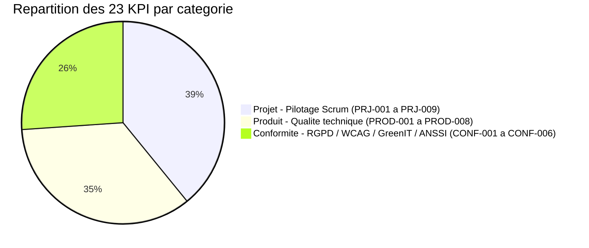

# MYTHOS - Definitions des Indicateurs de Performance (KPI)

**Projet** : MYTHOS - Plateforme web de jeux narratifs multijoueurs avec MJ IA
**Version** : 1.0
**Date de creation** : 14/02/2026
**Methodologie** : Scrum (7 sprints de 2 semaines)
**Perimetre** : 47 tickets | 196 story points
**Outils de monitoring** : GitHub Projects, UptimeRobot, Google Lighthouse, GreenIT Analysis, WAVE
**Budget monitoring** : 308 EUR

Les KPI ont ete definis collectivement lors de notre atelier de cadrage en Sprint 0. Samy, en tant que Scrum Master, est responsable du suivi global des indicateurs projet. Chaque membre de l'equipe est responsable des KPI lies a son domaine d'expertise. On a mis du temps a se mettre d'accord sur les seuils KPI -- Samy voulait etre plus strict, Kays plus realiste. Au final on a trouve un compromis qui tenait la route pour une equipe de 4 etudiants.

---

## Table des matieres

1. [Methodologie de definition des KPI](#1-methodologie-de-definition-des-kpi)
2. [KPI Projet (Pilotage Scrum)](#2-kpi-projet-pilotage-scrum)
3. [KPI Produit (Qualite technique)](#3-kpi-produit-qualite-technique)
4. [KPI Conformite](#4-kpi-conformite)
5. [Tableau recapitulatif global](#5-tableau-recapitulatif-global)

---

## 1. Methodologie de definition des KPI

### 1.1 Approche SMART

Chaque KPI defini dans ce document respecte la methode SMART :

| Critere | Description | Application MYTHOS |
|---------|-------------|-------------------|
| **S**pecifique | L'indicateur mesure un aspect precis et non ambigu | Chaque KPI est associe a une formule de calcul exacte |
| **M**esurable | La valeur peut etre quantifiee objectivement | Toutes les sources de donnees sont identifiees et accessibles |
| **A**tteignable | La cible est realiste pour l'equipe et le contexte | Les cibles sont calibrees sur les benchmarks du secteur et la capacite de l'equipe |
| **R**ealiste | L'indicateur est pertinent par rapport aux objectifs du projet | Chaque KPI est rattache a un objectif strategique du projet |
| **T**emporel | La mesure est effectuee a une frequence definie | Chaque KPI a une frequence de mesure explicite |

### 1.2 Structure de chaque fiche KPI

Chaque indicateur est documente selon le schema suivant :

```
- Nom du KPI
- Identifiant unique (format : CAT-XXX)
- Description detaillee
- Objectif strategique rattache
- Formule de calcul
- Unite de mesure
- Source de donnees
- Frequence de mesure
- Valeur cible (zone verte)
- Seuil d'alerte (zone jaune)
- Seuil critique (zone rouge)
- Responsable de la mesure
- Action corrective si hors cible
```

### 1.3 Systeme de zones de couleur

| Zone | Couleur | Signification | Action requise |
|------|---------|---------------|----------------|
| Normale | VERT | KPI dans la cible | Aucune action corrective |
| Alerte | JAUNE | KPI en degradation, tendance preoccupante | Analyse des causes, plan d'action sous 48h |
| Critique | ROUGE | KPI hors tolerance, risque pour le projet | Escalade immediate, action corrective sous 24h |

### 1.4 Gouvernance des KPI

- **Revue des KPI Projet** : a chaque Sprint Review (fin de sprint, toutes les 2 semaines)
- **Revue des KPI Produit** : en continu via monitoring automatise + revue bi-mensuelle
- **Revue des KPI Conformite** : a chaque fin de sprint + audit complet a mi-projet (Sprint 4) et en fin de projet (Sprint 7)
- **Responsable global du suivi** : Samy (SM) / Kays (PO)
- **Outil de centralisation** : GitHub Projects (vues personnalisees) + tableur de suivi

### 1.5 Repartition des KPI par categorie

Le projet MYTHOS s'appuie sur 23 indicateurs de performance repartis en trois categories complementaires. Le diagramme ci-dessous illustre cette repartition equilibree entre le pilotage Scrum, la qualite technique du produit et la conformite reglementaire.



---

## 2. KPI Projet (Pilotage Scrum)

### 2.1 PRJ-001 : Velocite d'equipe

| Champ | Valeur |
|-------|--------|
| **Identifiant** | PRJ-001 |
| **Nom** | Velocite d'equipe |
| **Description** | Nombre de story points livres (Done) a la fin de chaque sprint. Indicateur fondamental de la capacite de production de l'equipe. Permet de prevoir la charge des sprints suivants et de detecter les variations de productivite. |
| **Objectif strategique** | Livrer 196 story points en 7 sprints pour respecter le calendrier du projet |
| **Formule de calcul** | `Velocite = Somme des story points des tickets passes en "Done" durant le sprint` |
| **Unite** | Story points / sprint |
| **Source de donnees** | GitHub Projects - colonne "Done" du board Scrum, filtree par sprint |
| **Frequence de mesure** | A chaque fin de sprint (toutes les 2 semaines) |
| **Valeur cible (VERT)** | 28 SP/sprint (196 SP / 7 sprints = 28 SP/sprint en moyenne) |
| **Seuil d'alerte (JAUNE)** | < 22 SP/sprint (moins de 80% de la cible) |
| **Seuil critique (ROUGE)** | < 17 SP/sprint (moins de 60% de la cible) |
| **Responsable** | Samy (SM) |
| **Action corrective** | **JAUNE** : Analyser les impediments en retrospective, re-evaluer la complexite des tickets, identifier les facteurs bloquants. **ROUGE** : Reunion d'urgence avec l'equipe, re-planification du backlog, reduction du scope si necessaire, negociation avec Kays (PO) sur les priorites. |

**Note** : La velocite est un indicateur de tendance, pas une metrique de performance individuelle. Les premiers sprints (1-2) servent a calibrer la velocite de reference.

**Projection de velocite attendue** :

| Sprint | Velocite attendue | Cumul attendu | Remarque |
|--------|-------------------|---------------|----------|
| Sprint 1 | 22 SP | 22 SP | Sprint de demarrage, velocite reduite |
| Sprint 2 | 26 SP | 48 SP | Montee en competence |
| Sprint 3 | 28 SP | 76 SP | Velocite de croisiere |
| Sprint 4 | 30 SP | 106 SP | Pic de productivite |
| Sprint 5 | 30 SP | 136 SP | Pic de productivite |
| Sprint 6 | 32 SP | 168 SP | Fonctionnalites avancees |
| Sprint 7 | 28 SP | 196 SP | Sprint de stabilisation |

---

### 2.2 PRJ-002 : Burndown Chart / Burnup Chart

| Champ | Valeur |
|-------|--------|
| **Identifiant** | PRJ-002 |
| **Nom** | Burndown Chart (sprint) / Burnup Chart (projet) |
| **Description** | **Burndown** : Representation graphique du travail restant dans le sprint courant, mis a jour quotidiennement. La courbe reelle est comparee a la droite ideale. **Burnup** : Representation du travail accompli cumulativement depuis le debut du projet, comparee a la courbe previsionnelle. |
| **Objectif strategique** | Visualiser l'avancement en temps reel et detecter les derives le plus tot possible |
| **Formule de calcul** | **Burndown** : `Travail_restant(j) = SP_sprint - Somme(SP_done de jour 1 a jour j)` / **Burnup** : `Travail_fait(sprint_n) = Somme(SP_done de sprint 1 a sprint n)` |
| **Unite** | Story points (axe Y) vs Jours ou Sprints (axe X) |
| **Source de donnees** | GitHub Projects - board Scrum, historique des transitions de statut |
| **Frequence de mesure** | **Burndown** : Quotidienne (chaque jour ouvre) / **Burnup** : A chaque fin de sprint |
| **Valeur cible (VERT)** | Ecart <= 10% entre la courbe reelle et la courbe ideale |
| **Seuil d'alerte (JAUNE)** | Ecart entre 10% et 25% a mi-sprint (jour 5 sur 10 jours ouvrables) |
| **Seuil critique (ROUGE)** | Ecart > 25% a mi-sprint OU trajectoire indiquant < 70% d'achevement en fin de sprint |
| **Responsable** | Samy (SM) |
| **Action corrective** | **JAUNE** : Discussion en Daily Stand-up, identification des blocages, re-priorisation des taches du sprint. **ROUGE** : Negociation de scope avec Kays (PO), retrait de tickets du sprint si necessaire, mobilisation de ressources supplementaires. |

**Modele de Burndown sprint (ASCII)** :

```
SP restants
28 |*
   | *
24 |  *  <-- courbe ideale
   |   *
20 |    *
   |  o  *
16 |   o  *
   |    o  *
12 |      o *
   |       o *
 8 |         o*
   |          o *    o = courbe reelle
 4 |            *  o
   |             o
 0 +--+--+--+--+--+--+--+--+--+--+
   J1 J2 J3 J4 J5 J6 J7 J8 J9 J10
```

---

### 2.3 PRJ-003 : Taux de completion de sprint

| Champ | Valeur |
|-------|--------|
| **Identifiant** | PRJ-003 |
| **Nom** | Taux de completion de sprint |
| **Description** | Pourcentage des tickets planifies dans le sprint qui ont ete effectivement livres (statut "Done") a la fin du sprint. Mesure la fiabilite de la planification et la capacite de l'equipe a tenir ses engagements. |
| **Objectif strategique** | Assurer une planification fiable et une livraison previsible a chaque iteration |
| **Formule de calcul** | `Taux_completion = (Nombre de tickets Done / Nombre de tickets planifies au Sprint Planning) x 100` |
| **Unite** | Pourcentage (%) |
| **Source de donnees** | GitHub Projects - comparaison du Sprint Backlog initial (capture au Sprint Planning) vs le board en fin de sprint |
| **Frequence de mesure** | A chaque fin de sprint |
| **Valeur cible (VERT)** | >= 85% |
| **Seuil d'alerte (JAUNE)** | 70% - 84% |
| **Seuil critique (ROUGE)** | < 70% |
| **Responsable** | Samy (SM) |
| **Action corrective** | **JAUNE** : Ameliorer l'estimation (Planning Poker plus serieux), reduire le nombre de tickets embarques au prochain sprint. **ROUGE** : Revue complete du processus d'estimation, analyse des causes racines (tickets mal definis, dependencies non identifiees, interruptions externes), mise en place de buffers de capacite (15-20%). |

**Historique de reference (cible)** :

| Sprint | Tickets planifies | Objectif completion | Tickets Done cible |
|--------|-------------------|--------------------|--------------------|
| Sprint 1 | 6-7 | >= 85% | >= 5-6 |
| Sprint 2 | 6-7 | >= 85% | >= 5-6 |
| Sprint 3 | 7-8 | >= 85% | >= 6-7 |
| Sprint 4 | 7-8 | >= 90% | >= 6-7 |
| Sprint 5 | 7-8 | >= 90% | >= 6-7 |
| Sprint 6 | 7-8 | >= 90% | >= 6-7 |
| Sprint 7 | 5-6 | >= 95% | >= 5-6 |

---

### 2.4 PRJ-004 : Taux de bugs par sprint

| Champ | Valeur |
|-------|--------|
| **Identifiant** | PRJ-004 |
| **Nom** | Taux de bugs par sprint |
| **Description** | Nombre de bugs decouverts durant le sprint, rapporte au nombre total de tickets livres. Indicateur de la qualite du code produit et de l'efficacite des processus de test et de code review. Distingue les bugs par severite (critique, majeur, mineur). |
| **Objectif strategique** | Maintenir un niveau de qualite eleve et eviter l'accumulation de dette technique |
| **Formule de calcul** | `Taux_bugs = (Nombre de bugs ouverts durant le sprint / Nombre de tickets livres dans le sprint) x 100` |
| **Unite** | Pourcentage (%) + nombre absolu par severite |
| **Source de donnees** | GitHub Issues (label "bug" + labels de severite "critical", "major", "minor") |
| **Frequence de mesure** | A chaque fin de sprint + suivi continu |
| **Valeur cible (VERT)** | <= 15% (ratio) ET 0 bugs critiques ouverts en fin de sprint |
| **Seuil d'alerte (JAUNE)** | 15% - 25% OU 1 bug critique ouvert depuis > 48h |
| **Seuil critique (ROUGE)** | > 25% OU >= 2 bugs critiques ouverts OU 1 bug critique ouvert depuis > 5 jours |
| **Responsable** | Kays / Developpeurs |
| **Action corrective** | **JAUNE** : Renforcer les code reviews, ajouter des tests unitaires sur les modules concernes, organiser un bug bash en fin de sprint. **ROUGE** : Sprint de stabilisation (dedier 50% de la capacite aux corrections), revue de l'architecture des modules les plus defaillants, mise en place de tests de regression automatises. |

**Classification des bugs** :

| Severite | Description | Exemples MYTHOS | Delai de resolution max |
|----------|-------------|-----------------|------------------------|
| Critique | Bloquant, perte de donnees, securite | Crash du serveur WebSocket, fuite de donnees utilisateur | 24h |
| Majeur | Fonctionnalite core inutilisable | MJ IA ne repond plus, session de jeu impossible a creer | 48h |
| Mineur | Cosmétique, contournement possible | Faute d'affichage, bouton mal place | Fin de sprint |

---

### 2.5 PRJ-005 : Lead Time

| Champ | Valeur |
|-------|--------|
| **Identifiant** | PRJ-005 |
| **Nom** | Lead Time (temps entre creation et livraison d'un ticket) |
| **Description** | Duree totale entre la creation d'un ticket dans le backlog et son passage en "Done" (deploye ou merge). Inclut le temps d'attente en backlog, la planification, le developpement, la review et le deploiement. Indicateur du temps de reaction global de l'equipe. |
| **Objectif strategique** | Optimiser le flux de livraison de bout en bout pour maximiser la reactivite |
| **Formule de calcul** | `Lead_time = Date_Done - Date_creation_ticket` (en jours ouvrables) |
| **Unite** | Jours ouvrables |
| **Source de donnees** | GitHub Projects - timestamps des colonnes (date de creation de l'issue + date de passage en Done) |
| **Frequence de mesure** | A chaque fin de sprint (moyenne et mediane calculees sur les tickets livres) |
| **Valeur cible (VERT)** | Mediane <= 10 jours ouvrables |
| **Seuil d'alerte (JAUNE)** | Mediane entre 10 et 15 jours ouvrables |
| **Seuil critique (ROUGE)** | Mediane > 15 jours ouvrables |
| **Responsable** | Samy (SM) |
| **Action corrective** | **JAUNE** : Analyser les goulets d'etranglement dans le workflow (ou les tickets stagnent-ils ?), limiter le Work In Progress (WIP). **ROUGE** : Revoir le processus de priorisation du backlog, mettre en place des WIP limits stricts, identifier et eliminer les dependances externes bloquantes, ameliorer le processus de refinement pour que les tickets soient "prets" plus rapidement. |

---

### 2.6 PRJ-006 : Cycle Time

| Champ | Valeur |
|-------|--------|
| **Identifiant** | PRJ-006 |
| **Nom** | Cycle Time (temps de developpement actif) |
| **Description** | Duree entre le debut du travail effectif sur un ticket ("In Progress") et sa completion ("Done"). Mesure l'efficacite du processus de developpement pur, sans le temps d'attente en backlog. |
| **Objectif strategique** | Reduire le temps de developpement actif pour augmenter le debit de livraison |
| **Formule de calcul** | `Cycle_time = Date_Done - Date_In_Progress` (en jours ouvrables) |
| **Unite** | Jours ouvrables |
| **Source de donnees** | GitHub Projects - timestamps des transitions de colonnes (In Progress -> Done) |
| **Frequence de mesure** | A chaque fin de sprint (moyenne et mediane) |
| **Valeur cible (VERT)** | Mediane <= 3 jours ouvrables |
| **Seuil d'alerte (JAUNE)** | Mediane entre 3 et 5 jours ouvrables |
| **Seuil critique (ROUGE)** | Mediane > 5 jours ouvrables |
| **Responsable** | Kays |
| **Action corrective** | **JAUNE** : Decouper les tickets trop gros (> 8 SP), ameliorer les Definition of Ready, reduire le WIP par developpeur a 1-2 tickets max. **ROUGE** : Revue systematique des tickets > 5 jours, pair programming sur les tickets complexes, ameliorer la documentation technique pour reduire le temps de comprehension, verifier que les tickets sont suffisamment specifies. |

**Relation Lead Time / Cycle Time** :

```
|<-------------- Lead Time (PRJ-005) ----------------->|
|                                                       |
| Backlog  | Ready | In Progress | Review | Done        |
|          |       |<--- Cycle Time (PRJ-006) --->|     |
|          |       |                               |     |
| Attente  | Pret  | Dev actif   | Review | Merge/Deploy|
```

---

### 2.7 PRJ-007 : Code Review Turnaround Time

| Champ | Valeur |
|-------|--------|
| **Identifiant** | PRJ-007 |
| **Nom** | Code Review Turnaround Time |
| **Description** | Temps ecoule entre l'ouverture d'une Pull Request et sa premiere review substantive (commentaire de review ou approbation/demande de changement). Indicateur de la reactivite de l'equipe et de la fluidite du processus de review. |
| **Objectif strategique** | Eviter les goulots d'etranglement au niveau des code reviews pour maintenir un flux de livraison constant |
| **Formule de calcul** | `Review_turnaround = Date_premiere_review - Date_ouverture_PR` (en heures ouvrees) |
| **Unite** | Heures ouvrees |
| **Source de donnees** | GitHub - API Pull Requests (timestamps de creation et de premier review event) |
| **Frequence de mesure** | A chaque fin de sprint (moyenne et mediane sur toutes les PR du sprint) |
| **Valeur cible (VERT)** | Mediane <= 4 heures ouvrees (soit dans la demi-journee) |
| **Seuil d'alerte (JAUNE)** | Mediane entre 4 et 8 heures ouvrees (soit dans la journee) |
| **Seuil critique (ROUGE)** | Mediane > 8 heures ouvrees (plus d'une journee de travail) |
| **Responsable** | Kays |
| **Action corrective** | **JAUNE** : Instaurer des creneaux dedies de review (debut et fin de journee), activer les notifications GitHub, limiter la taille des PR (< 400 lignes). **ROUGE** : Instaurer une politique de "review first" (les reviews passent avant le dev en cours), mettre en place un systeme de rotation des reviewers, decouper les grosses PR en PR incrementales. |

**Bonnes pratiques de review pour MYTHOS** :

| Aspect | Regle |
|--------|-------|
| Taille de PR | Maximum 400 lignes changees (hors fichiers generes) |
| Description de PR | Template obligatoire (contexte, changements, tests, screenshots) |
| Nombre de reviewers | Minimum 1, recommande 2 pour les modules critiques (IA, WebSocket, auth) |
| Politique de merge | Squash merge sur `develop`, merge commit vers `main` |

---

### 2.8 PRJ-008 : Schedule Performance Index (SPI)

| Champ | Valeur |
|-------|--------|
| **Identifiant** | PRJ-008 |
| **Nom** | Schedule Performance Index (SPI) - Respect du calendrier |
| **Description** | Indicateur issu de la methode Earned Value Management (EVM). Le SPI mesure l'efficacite de l'utilisation du temps. Un SPI de 1.0 signifie que le projet est parfaitement dans les temps. Inferieur a 1.0 = retard. Superieur a 1.0 = avance. |
| **Objectif strategique** | Livrer le projet dans le calendrier prevu de 14 semaines (7 sprints x 2 semaines) |
| **Formule de calcul** | `SPI = EV / PV` ou `EV (Earned Value) = SP livres cumulatifs` et `PV (Planned Value) = SP planifies cumulatifs a cette date` |
| **Unite** | Ratio (sans unite) |
| **Source de donnees** | GitHub Projects (SP livres) + planning previsionnel (SP planifies) |
| **Frequence de mesure** | A chaque fin de sprint |
| **Valeur cible (VERT)** | SPI >= 0.90 (soit au maximum 10% de retard) |
| **Seuil d'alerte (JAUNE)** | SPI entre 0.75 et 0.89 |
| **Seuil critique (ROUGE)** | SPI < 0.75 (retard superieur a 25%) |
| **Responsable** | Samy (SM) / Kays (PO) |
| **Action corrective** | **JAUNE** : Identifier les causes du retard, negocier le scope avec Kays (PO), augmenter la capacite si possible (heures supplementaires ponctuelles). **ROUGE** : Re-planification complete du projet, reduction du scope (retrait de features non essentielles), communication aux parties prenantes, plan de rattrapage formalise. |

**Exemple de calcul** :

```
Fin du Sprint 3 :
- PV (Planned Value) = 76 SP (selon la projection de velocite)
- EV (Earned Value) = 70 SP (reellement livres)
- SPI = 70 / 76 = 0.92 --> VERT (dans la cible)
```

**Tableau de suivi SPI previsionnel** :

| Sprint | PV cumule | EV cible (min VERT) | EV seuil JAUNE | EV seuil ROUGE |
|--------|-----------|---------------------|----------------|----------------|
| Sprint 1 | 22 SP | >= 20 SP | 17-19 SP | < 17 SP |
| Sprint 2 | 48 SP | >= 43 SP | 36-42 SP | < 36 SP |
| Sprint 3 | 76 SP | >= 68 SP | 57-67 SP | < 57 SP |
| Sprint 4 | 106 SP | >= 95 SP | 80-94 SP | < 80 SP |
| Sprint 5 | 136 SP | >= 122 SP | 102-121 SP | < 102 SP |
| Sprint 6 | 168 SP | >= 151 SP | 126-150 SP | < 126 SP |
| Sprint 7 | 196 SP | >= 176 SP | 147-175 SP | < 147 SP |

---

### 2.9 PRJ-009 : Cost Performance Index (CPI)

| Champ | Valeur |
|-------|--------|
| **Identifiant** | PRJ-009 |
| **Nom** | Cost Performance Index (CPI) - Respect du budget |
| **Description** | Indicateur EVM mesurant l'efficacite de l'utilisation du budget. Un CPI de 1.0 signifie que le budget est consomme conformement au plan. Inferieur a 1.0 = depassement budgetaire. Pour MYTHOS, le budget est essentiellement constitue des couts d'outils et de services (API IA, hebergement, monitoring). |
| **Objectif strategique** | Respecter l'enveloppe budgetaire de 308 EUR pour les outils et services |
| **Formule de calcul** | `CPI = EV / AC` ou `EV = Valeur du travail produit (en EUR)` et `AC (Actual Cost) = Depenses reelles cumulees (en EUR)` |
| **Unite** | Ratio (sans unite) |
| **Source de donnees** | Tableur de suivi budgetaire + factures des services (API OpenAI/Anthropic, hebergement, domaine) |
| **Frequence de mesure** | A chaque fin de sprint |
| **Valeur cible (VERT)** | CPI >= 0.90 |
| **Seuil d'alerte (JAUNE)** | CPI entre 0.75 et 0.89 |
| **Seuil critique (ROUGE)** | CPI < 0.75 |
| **Responsable** | Kays (PO) |
| **Action corrective** | **JAUNE** : Revue des depenses, identification des postes en depassement, recherche d'alternatives moins couteuses. **ROUGE** : Gel des depenses non essentielles, renegociation des services, passage a des tiers gratuits si possible, communication au sponsor. |

**Ventilation budgetaire previsionnelle MYTHOS** :

| Poste de depense | Budget previsionnel | Frequence | Sprint 1-7 |
|-----------------|--------------------|-----------| ------------|
| API IA (OpenAI/Anthropic) | 50-80 EUR | Mensuel (pay-as-you-go) | Cumulatif |
| Hebergement (Vercel/Railway free tier) | 0 EUR | - | Gratuit |
| Domaine (.fr ou .dev) | 10-15 EUR | Annuel | Unique |
| UptimeRobot (plan gratuit) | 0 EUR | - | Gratuit |
| Services divers (emails, etc.) | 10-20 EUR | Ponctuel | Variable |
| Marge de securite | 30-85 EUR | - | Reserve |
| **TOTAL** | **308 EUR** | | |

---

## 3. KPI Produit (Qualite technique)

### 3.1 PROD-001 : Temps de reponse API IA (P50, P95, P99)

| Champ | Valeur |
|-------|--------|
| **Identifiant** | PROD-001 |
| **Nom** | Temps de reponse API IA (percentiles P50, P95, P99) |
| **Description** | Temps de reponse mesure entre l'envoi d'un prompt au service IA (OpenAI/Anthropic) et la reception complete de la reponse. Les percentiles P50 (mediane), P95 et P99 permettent de comprendre la distribution des temps de reponse, y compris les cas extremes. Critique pour l'experience de jeu en temps reel. |
| **Objectif strategique** | Assurer une experience de jeu fluide ou le MJ IA repond en temps raisonnable, sans casser l'immersion narrative |
| **Formule de calcul** | `P50 = valeur en dessous de laquelle se trouvent 50% des temps de reponse` / `P95 = 95%` / `P99 = 99%` |
| **Unite** | Millisecondes (ms) |
| **Source de donnees** | Logs applicatifs (middleware de mesure cote serveur), timestamps avant/apres appel API IA |
| **Frequence de mesure** | Continue (chaque appel est logue) + aggregation quotidienne et par sprint |
| **Valeur cible (VERT)** | P50 <= 2000ms, P95 <= 5000ms, P99 <= 8000ms |
| **Seuil d'alerte (JAUNE)** | P50 entre 2000-3500ms OU P95 entre 5000-8000ms OU P99 entre 8000-12000ms |
| **Seuil critique (ROUGE)** | P50 > 3500ms OU P95 > 8000ms OU P99 > 12000ms |
| **Responsable** | Kays / Samy (IA) |
| **Action corrective** | **JAUNE** : Optimiser les prompts (reduire la taille), activer le streaming de reponses, mettre en cache les reponses frequentes, verifier les quotas API. **ROUGE** : Implementer un systeme de fallback (reponses pre-generees en cas de timeout), revoir l'architecture (queue asynchrone), envisager un changement de modele IA (modele plus rapide), ajouter un indicateur de "reflexion en cours" pour l'utilisateur. |

**Strategie de mesure** :

```javascript
// Exemple de middleware de mesure (Node.js/NestJS 10+)
const measureAIResponse = async (prompt) => {
  const start = performance.now();
  const response = await aiService.generate(prompt);
  const duration = performance.now() - start;

  // Log structuré pour analyse
  logger.info({
    type: 'ai_response_time',
    duration_ms: Math.round(duration),
    prompt_tokens: response.usage.prompt_tokens,
    completion_tokens: response.usage.completion_tokens,
    model: response.model,
    timestamp: new Date().toISOString()
  });

  return response;
};
```

---

### 3.2 PROD-002 : Latence WebSocket

| Champ | Valeur |
|-------|--------|
| **Identifiant** | PROD-002 |
| **Nom** | Latence WebSocket |
| **Description** | Temps de propagation d'un message entre le serveur et les clients connectes via WebSocket. Essentiel pour le jeu multijoueur en temps reel : les actions des joueurs et les reponses du MJ IA doivent etre diffusees instantanement a tous les participants de la session. |
| **Objectif strategique** | Assurer une communication temps reel fluide entre les joueurs et le MJ IA |
| **Formule de calcul** | `Latence_WS = Timestamp_reception_client - Timestamp_emission_serveur` (mesure par ping/pong WebSocket) |
| **Unite** | Millisecondes (ms) |
| **Source de donnees** | Mecanisme de heartbeat WebSocket (ping/pong toutes les 30s) + logs serveur |
| **Frequence de mesure** | Continue (heartbeat toutes les 30 secondes) + aggregation par sprint |
| **Valeur cible (VERT)** | P50 <= 100ms, P95 <= 250ms |
| **Seuil d'alerte (JAUNE)** | P50 entre 100-200ms OU P95 entre 250-500ms |
| **Seuil critique (ROUGE)** | P50 > 200ms OU P95 > 500ms OU taux de deconnexions > 5% |
| **Responsable** | Samy (IA/Temps reel) |
| **Action corrective** | **JAUNE** : Verifier la configuration du serveur WebSocket (compression, buffer size), optimiser la serialisation des messages (passer a un format binaire si necessaire). **ROUGE** : Revoir l'architecture WebSocket (scaling horizontal avec Redis adapter), implementer un mecanisme de reconnexion automatique cote client, ajouter un CDN ou un edge server, implementer le message queuing pour absorber les pics. |

---

### 3.3 PROD-003 : Core Web Vitals (LCP, FID, CLS)

| Champ | Valeur |
|-------|--------|
| **Identifiant** | PROD-003 |
| **Nom** | Core Web Vitals - Temps de chargement |
| **Description** | Les trois metriques Core Web Vitals de Google mesurant l'experience utilisateur : **LCP** (Largest Contentful Paint) = temps d'affichage du plus grand element visible, **FID/INP** (First Input Delay / Interaction to Next Paint) = reactivite a la premiere interaction, **CLS** (Cumulative Layout Shift) = stabilite visuelle de la page. |
| **Objectif strategique** | Offrir une experience utilisateur de qualite et favoriser le referencement naturel (critere de classement Google) |
| **Formule de calcul** | Mesures automatiques par Google Lighthouse (lab data) et par le navigateur (field data via Web Vitals API) |
| **Unite** | LCP : secondes (s) / FID/INP : millisecondes (ms) / CLS : score sans unite |
| **Source de donnees** | Google Lighthouse (audit automatise) + Web Vitals API integree dans l'application |
| **Frequence de mesure** | A chaque fin de sprint (audit Lighthouse) + monitoring continu (Web Vitals API) |
| **Valeur cible (VERT)** | LCP <= 2.5s, INP <= 200ms, CLS <= 0.1 |
| **Seuil d'alerte (JAUNE)** | LCP entre 2.5-4.0s OU INP entre 200-500ms OU CLS entre 0.1-0.25 |
| **Seuil critique (ROUGE)** | LCP > 4.0s OU INP > 500ms OU CLS > 0.25 |
| **Responsable** | Youri (Frontend) |
| **Action corrective** | **JAUNE** : Optimiser les images (formats modernes : WebP/AVIF), mettre en place le lazy loading, reduire le JavaScript bloque (code splitting). **ROUGE** : Audit complet des performances frontend, server-side rendering (SSR) pour les pages critiques, preloading des ressources critiques, suppression des bibliotheques lourdes non essentielles, mise en cache agressive (Service Worker). |

**Pages cles a monitorer** :

| Page | LCP critique | Frequence Lighthouse |
|------|-------------|---------------------|
| Page d'accueil | Hero section / CTA principal | Chaque sprint |
| Lobby de creation de partie | Formulaire de jeu | Chaque sprint |
| Interface de jeu (gameplay) | Zone de narration principale | Chaque sprint |
| Profil joueur | Historique des parties | Sprints 4-7 |

---

### 3.4 PROD-004 : Uptime / Disponibilite

| Champ | Valeur |
|-------|--------|
| **Identifiant** | PROD-004 |
| **Nom** | Uptime / Disponibilite |
| **Description** | Pourcentage de temps pendant lequel l'application est accessible et fonctionnelle pour les utilisateurs. Mesure a la fois la disponibilite du frontend (site web) et du backend (API + WebSocket). Les interruptions planifiees (maintenance) ne sont pas comptees comme indisponibilite si elles sont annoncees. |
| **Objectif strategique** | Avoir une plateforme fiable accessible a tout moment pour les joueurs |
| **Formule de calcul** | `Uptime = ((Temps_total - Temps_indisponible_non_planifie) / Temps_total) x 100` |
| **Unite** | Pourcentage (%) |
| **Source de donnees** | UptimeRobot (plan gratuit : 50 moniteurs, check toutes les 5 minutes) |
| **Frequence de mesure** | Continue (toutes les 5 minutes via UptimeRobot) + rapport mensuel |
| **Valeur cible (VERT)** | >= 99.0% (soit max ~7.3h d'indisponibilite par mois) |
| **Seuil d'alerte (JAUNE)** | 97.0% - 98.9% (soit entre 8h et 22h d'indisponibilite par mois) |
| **Seuil critique (ROUGE)** | < 97.0% (soit plus de 22h d'indisponibilite par mois) |
| **Responsable** | Yassir (UX/DevOps) |
| **Action corrective** | **JAUNE** : Analyser les incidents (logs, metriques serveur), mettre en place des healthchecks plus granulaires, ameliorer le processus de deploiement (zero-downtime). **ROUGE** : Audit d'infrastructure complet, mise en place de replicas/failover, ameliorer les alertes (notifications Slack/Discord via UptimeRobot), documenter et automatiser les procedures de recovery. |

**Configuration UptimeRobot recommandee** :

| Moniteur | Type | URL/Host | Intervalle | Alerte |
|----------|------|----------|------------|--------|
| Frontend (site web) | HTTP(s) | https://mythos.example.com | 5 min | Email + Discord |
| API Backend | HTTP(s) | https://api.mythos.example.com/health | 5 min | Email + Discord |
| WebSocket | Port | wss://api.mythos.example.com/ws | 5 min | Email + Discord |
| Base de donnees | Keyword | https://api.mythos.example.com/health/db | 5 min | Email |

---

### 3.5 PROD-005 : Taux de completion de session de jeu

| Champ | Valeur |
|-------|--------|
| **Identifiant** | PROD-005 |
| **Nom** | Taux de completion de session de jeu |
| **Description** | Pourcentage des sessions de jeu demarrees qui se terminent normalement (fin narrative ou decision des joueurs) par opposition aux sessions abandonnees (joueurs deconnectes, erreur technique, timeout). KPI metier fondamental qui mesure la valeur reelle delivree aux utilisateurs. |
| **Objectif strategique** | S'assurer que les joueurs puissent terminer leurs sessions de jeu sans interruption technique |
| **Formule de calcul** | `Taux_completion_session = (Sessions terminees normalement / Sessions demarrees) x 100` |
| **Unite** | Pourcentage (%) |
| **Source de donnees** | Base de donnees applicative (table sessions : statut, timestamps debut/fin, raison de fin) |
| **Frequence de mesure** | Hebdomadaire + aggregation par sprint |
| **Valeur cible (VERT)** | >= 80% |
| **Seuil d'alerte (JAUNE)** | 65% - 79% |
| **Seuil critique (ROUGE)** | < 65% |
| **Responsable** | Kays (PO) + Samy (IA/Temps reel) |
| **Action corrective** | **JAUNE** : Analyser les motifs d'abandon (technique vs volontaire), ameliorer la gestion des deconnexions (reconnexion automatique, sauvegarde de session), optimiser les temps de reponse IA. **ROUGE** : Investigation approfondie des causes (analytics par etape de session), implementation de mecanismes de persistence de session, amelioration de l'UX pour guider les joueurs, ajout de feedback utilisateur in-app. |

---

### 3.6 PROD-006 : Taux d'erreurs API IA

| Champ | Valeur |
|-------|--------|
| **Identifiant** | PROD-006 |
| **Nom** | Taux d'erreurs API IA (reponses non-parsables) |
| **Description** | Pourcentage d'appels a l'API IA qui retournent une reponse inutilisable : erreur HTTP (429, 500, 503), timeout, reponse mal formatee (JSON invalide), reponse hors contexte narratif (hallucination severe), ou reponse vide. Indicateur critique de la fiabilite du coeur fonctionnel de MYTHOS. |
| **Objectif strategique** | Assurer que le MJ IA produit des reponses exploitables dans au moins 95% des cas |
| **Formule de calcul** | `Taux_erreurs_IA = (Nombre de reponses en erreur ou non-parsables / Nombre total d'appels IA) x 100` |
| **Unite** | Pourcentage (%) |
| **Source de donnees** | Logs applicatifs (middleware d'appel IA avec categorisation des erreurs) |
| **Frequence de mesure** | Continue (chaque appel) + aggregation quotidienne et par sprint |
| **Valeur cible (VERT)** | <= 5% |
| **Seuil d'alerte (JAUNE)** | 5% - 10% |
| **Seuil critique (ROUGE)** | > 10% |
| **Responsable** | Samy (IA/Temps reel) |
| **Action corrective** | **JAUNE** : Revoir les prompts systeme (clarifier le format attendu), ajouter une validation de schema sur les reponses, implementer un retry automatique avec backoff exponentiel. **ROUGE** : Implementer un systeme de fallback (templates de reponses pre-ecrites), revoir completement le prompt engineering, envisager un changement de modele, ajouter une couche de post-traitement pour corriger les reponses malformees. |

**Categorisation des erreurs IA** :

| Type d'erreur | Code | Description | Retry possible |
|---------------|------|-------------|----------------|
| Timeout | TIMEOUT | Pas de reponse dans le delai imparti (30s) | Oui (1 retry) |
| Rate limit | RATE_LIMIT | Quota API depasse (HTTP 429) | Oui (apres backoff) |
| Erreur serveur | SERVER_ERROR | Erreur cote fournisseur IA (HTTP 5xx) | Oui (1 retry) |
| JSON invalide | PARSE_ERROR | Reponse non parsable en JSON | Non (fallback) |
| Hors contexte | CONTEXT_ERROR | Reponse sans rapport avec le jeu | Non (nouveau prompt) |
| Reponse vide | EMPTY | Reponse vide ou trop courte (< 10 chars) | Oui (1 retry) |

---

### 3.7 PROD-007 : Couverture de tests

| Champ | Valeur |
|-------|--------|
| **Identifiant** | PROD-007 |
| **Nom** | Couverture de tests (backend et frontend) |
| **Description** | Pourcentage du code source couvert par au moins un test automatise (unitaire, integration, ou end-to-end). Mesuree separement pour le backend (Node.js/NestJS 10+) et le frontend (React/Next.js). Indicateur de la confiance dans la qualite et la maintenabilite du code. |
| **Objectif strategique** | Avoir un filet de securite contre les regressions et faciliter la refactorisation |
| **Formule de calcul** | `Couverture = (Lignes de code executees par les tests / Lignes de code total) x 100` |
| **Unite** | Pourcentage (%) |
| **Source de donnees** | Rapports de couverture Jest/Vitest (coverage report), integres dans la CI GitHub Actions |
| **Frequence de mesure** | A chaque Pull Request (CI automatique) + rapport de sprint |
| **Valeur cible (VERT)** | Backend >= 70%, Frontend >= 60% |
| **Seuil d'alerte (JAUNE)** | Backend 50-69% OU Frontend 40-59% |
| **Seuil critique (ROUGE)** | Backend < 50% OU Frontend < 40% |
| **Responsable** | Kays + Developpeurs |
| **Action corrective** | **JAUNE** : Instaurer une regle "pas de merge sans tests" sur les nouveaux modules, organiser des sessions de test writing en pair. **ROUGE** : Dedier une part du sprint au rattrapage de couverture (minimum 20% de la capacite), identifier les modules critiques non testes (IA, auth, WebSocket) et les prioriser. |

**Objectifs par module** :

| Module | Couverture cible | Priorite | Types de tests |
|--------|-----------------|----------|----------------|
| Auth / Securite | >= 80% | Haute | Unitaires + Integration |
| Service IA (prompts, parsing) | >= 75% | Haute | Unitaires + Mocks |
| WebSocket (sessions temps reel) | >= 65% | Haute | Integration |
| API REST (CRUD) | >= 70% | Moyenne | Unitaires + Integration |
| Composants UI (React) | >= 60% | Moyenne | Unitaires (Testing Library) |
| Pages / Routing | >= 50% | Basse | E2E (si capacite) |

---

### 3.8 PROD-008 : Dette technique

| Champ | Valeur |
|-------|--------|
| **Identifiant** | PROD-008 |
| **Nom** | Dette technique (nombre d'issues tech debt ouvertes) |
| **Description** | Nombre d'issues GitHub etiquetees "tech-debt" ouvertes a un instant donne. La dette technique represente les raccourcis pris durant le developpement qui devront etre corriges ulterieurement. Un nombre croissant indique une accumulation qui ralentira le developpement futur. |
| **Objectif strategique** | Maintenir la dette technique a un niveau gerable pour preserver la velocite de l'equipe |
| **Formule de calcul** | `Dette_technique = Count(issues ouvertes avec label "tech-debt")` + `Ratio_dette = Issues_tech_debt_ouvertes / Total_issues_ouvertes x 100` |
| **Unite** | Nombre absolu + pourcentage du backlog |
| **Source de donnees** | GitHub Issues (filtre par label "tech-debt") |
| **Frequence de mesure** | A chaque fin de sprint |
| **Valeur cible (VERT)** | <= 5 issues tech-debt ouvertes ET ratio <= 15% du backlog |
| **Seuil d'alerte (JAUNE)** | 6-10 issues OU ratio 15-25% |
| **Seuil critique (ROUGE)** | > 10 issues OU ratio > 25% OU 1+ issue tech-debt critique non traitee depuis 2 sprints |
| **Responsable** | Kays |
| **Action corrective** | **JAUNE** : Allouer 15-20% de la capacite du prochain sprint a la reduction de dette, prioriser les items de dette qui impactent la velocite. **ROUGE** : Sprint de stabilisation dedie (50% de la capacite a la dette), revue d'architecture pour identifier les causes structurelles, definition de standards de code plus stricts, mise en place de linting automatique. |

---

## 4. KPI Conformite

Les KPI de conformite ont ete les plus longs a calibrer. Yassir a pris le lead sur l'accessibilite et l'eco-index, et il a propose des seuils qu'on a ajustes ensemble apres avoir fait des premiers audits Lighthouse sur des pages de test.

### 4.1 CONF-001 : Score Lighthouse Accessibility

| Champ | Valeur |
|-------|--------|
| **Identifiant** | CONF-001 |
| **Nom** | Score Lighthouse Accessibility |
| **Description** | Score d'accessibilite calcule par Google Lighthouse, base sur les criteres WCAG 2.1. Evalue automatiquement les contrastes de couleur, les attributs ARIA, les labels de formulaire, la navigation au clavier, les textes alternatifs, et la structure semantique HTML. Score sur 100. |
| **Objectif strategique** | Assurer l'accessibilite de la plateforme conformement aux exigences RGAA/WCAG et aux bonnes pratiques inclusives |
| **Formule de calcul** | Score automatique Lighthouse (0-100), calcule comme la moyenne ponderee des audits d'accessibilite passes |
| **Unite** | Score sur 100 |
| **Source de donnees** | Google Lighthouse (Chrome DevTools ou CLI `lighthouse --only-categories=accessibility`) |
| **Frequence de mesure** | A chaque fin de sprint + avant chaque release |
| **Valeur cible (VERT)** | Score >= 90/100 |
| **Seuil d'alerte (JAUNE)** | Score entre 75/100 et 89/100 |
| **Seuil critique (ROUGE)** | Score < 75/100 |
| **Responsable** | Samy (SM/Frontend) |
| **Action corrective** | **JAUNE** : Corriger les items identifies par Lighthouse (contraste, labels manquants, structure headings), ajouter des tests d'accessibilite automatiques dans la CI. **ROUGE** : Audit d'accessibilite approfondi (outil WAVE en complement), correction en priorite des items bloquants (navigation clavier, lecteur d'ecran), formation de l'equipe aux bonnes pratiques d'accessibilite. |

**Pages auditees** :

| Page | Priorite | Criteres specifiques |
|------|----------|---------------------|
| Page d'accueil | Haute | Navigation, contrastes, CTA |
| Page de connexion/inscription | Haute | Formulaires, labels, erreurs |
| Lobby de jeu | Haute | Listes, boutons, etats |
| Interface de jeu | Haute | Zone de chat, actions, notifications temps reel |
| Profil utilisateur | Moyenne | Formulaires, navigation |

---

### 4.2 CONF-002 : Score WAVE (erreurs)

| Champ | Valeur |
|-------|--------|
| **Identifiant** | CONF-002 |
| **Nom** | Score WAVE - Nombre d'erreurs d'accessibilite |
| **Description** | Nombre d'erreurs detectees par l'outil WAVE (Web Accessibility Evaluation Tool). Contrairement a Lighthouse qui donne un score global, WAVE fournit un comptage precis des erreurs, alertes et elements de structure. Permet une analyse plus fine et des corrections ciblees. |
| **Objectif strategique** | Completer l'audit Lighthouse avec une detection d'erreurs plus granulaire et atteindre zero erreur critique d'accessibilite |
| **Formule de calcul** | `Score_WAVE = Nombre total d'erreurs (errors)` separement des alertes (alerts) et des elements de structure (structural elements) |
| **Unite** | Nombre d'erreurs (entier) |
| **Source de donnees** | Extension WAVE (wave.webaim.org) ou WAVE API |
| **Frequence de mesure** | A chaque fin de sprint (audit des pages principales) |
| **Valeur cible (VERT)** | 0 erreurs (errors) sur toutes les pages auditees |
| **Seuil d'alerte (JAUNE)** | 1-3 erreurs au total (toutes pages confondues) |
| **Seuil critique (ROUGE)** | > 3 erreurs OU 1+ erreur sur la page de jeu (page critique) |
| **Responsable** | Samy (SM/Frontend) |
| **Action corrective** | **JAUNE** : Corriger les erreurs identifiees dans le sprint en cours, documenter les corrections. **ROUGE** : Prioriser la correction des erreurs WAVE au-dessus des nouvelles features, organiser une session de correction en pair programming, verifier les corrections avec un lecteur d'ecran (VoiceOver/NVDA). |

**Types d'erreurs WAVE a surveiller** :

| Type | Exemples | Impact |
|------|----------|--------|
| Errors | Images sans alt, labels manquants, contrastes insuffisants | Bloquant pour l'accessibilite |
| Alerts | Liens redondants, texte tres petit, liens suspects | Potentiellement problematique |
| Features | Attributs ARIA, roles, landmarks | Elements positifs (a maintenir) |
| Structural | Headings, listes, regions | Structure de la page |

---

### 4.3 CONF-003 : Eco-index (GreenIT)

| Champ | Valeur |
|-------|--------|
| **Identifiant** | CONF-003 |
| **Nom** | Eco-index (GreenIT Analysis) |
| **Description** | Score d'eco-conception calcule par l'extension GreenIT Analysis. Evalue l'impact environnemental d'une page web en analysant le nombre de requetes HTTP, le poids de la page (transfere) et la complexite du DOM. Score de A (meilleur) a G (pire), avec une note sur 100. |
| **Objectif strategique** | Minimiser l'empreinte environnementale de la plateforme et respecter les principes d'eco-conception |
| **Formule de calcul** | `Eco-index = f(taille_DOM, nombre_requetes, poids_page)` (algorithme GreenIT Analysis, score 0-100 puis grade A-G) |
| **Unite** | Grade (A-G) + score numerique (0-100) |
| **Source de donnees** | Extension navigateur GreenIT Analysis |
| **Frequence de mesure** | A chaque fin de sprint (audit des 3-4 pages principales) |
| **Valeur cible (VERT)** | Grade B ou mieux (score >= 56/100) sur toutes les pages |
| **Seuil d'alerte (JAUNE)** | Grade C (score 36-55) sur une ou plusieurs pages |
| **Seuil critique (ROUGE)** | Grade D ou pire (score < 36) sur une page OU Grade E-F-G sur n'importe quelle page |
| **Responsable** | Youri (Frontend) |
| **Action corrective** | **JAUNE** : Reduire le nombre de requetes HTTP (bundling, sprites), compresser les assets (gzip/brotli), simplifier le DOM. **ROUGE** : Audit complet d'eco-conception, suppression des ressources inutilisees, optimisation agressive des images, mise en place de lazy loading, pagination des donnees, reduction des dependances JavaScript. |

**Correspondance Eco-index / Grades** :

| Grade | Score | Interpretation |
|-------|-------|----------------|
| A | 76-100 | Excellent |
| B | 56-75 | Tres bien |
| C | 36-55 | Bien |
| D | 16-35 | Moyen |
| E | 6-15 | Mauvais |
| F | 1-5 | Tres mauvais |
| G | 0 | Non evaluable |

---

### 4.4 CONF-004 : Poids moyen des pages

| Champ | Valeur |
|-------|--------|
| **Identifiant** | CONF-004 |
| **Nom** | Poids moyen des pages |
| **Description** | Taille totale transferee (compresse) pour charger une page complete, incluant le HTML, CSS, JavaScript, images, fonts et autres ressources. Indicateur direct de l'impact sur la bande passante, le temps de chargement et l'empreinte carbone. |
| **Objectif strategique** | Maintenir des pages legeres pour un chargement rapide et un faible impact environnemental |
| **Formule de calcul** | `Poids_page = Somme de toutes les ressources transferees (compressees)` mesuree via l'onglet Network de Chrome DevTools ou via Lighthouse |
| **Unite** | Kilooctets (Ko) ou Megaoctets (Mo) |
| **Source de donnees** | Google Lighthouse (report section "Network") + GreenIT Analysis + Chrome DevTools Network tab |
| **Frequence de mesure** | A chaque fin de sprint |
| **Valeur cible (VERT)** | <= 500 Ko par page (en transfert compresse) |
| **Seuil d'alerte (JAUNE)** | 500 Ko - 1 Mo |
| **Seuil critique (ROUGE)** | > 1 Mo |
| **Responsable** | Youri (Frontend) |
| **Action corrective** | **JAUNE** : Identifier les ressources les plus lourdes (images, bundles JS), les optimiser individuellement, verifier la compression serveur (Brotli). **ROUGE** : Audit asset par asset, remplacement des images lourdes par des formats modernes (WebP, AVIF) ou des SVG, code splitting agressif du JavaScript, suppression des polices inutilisees, implementation de tree-shaking. |

**Budget de performance par type de ressource** :

| Type de ressource | Budget max recommande | Outils d'optimisation |
|-------------------|----------------------|----------------------|
| HTML | 50 Ko | Minification, compression |
| CSS | 50 Ko | PurgeCSS, minification |
| JavaScript (total) | 200 Ko | Code splitting, tree-shaking |
| Images (total) | 150 Ko | WebP/AVIF, lazy loading, compression |
| Fonts | 50 Ko | Subset, woff2, font-display: swap |
| **Total** | **500 Ko** | |

---

### 4.5 CONF-005 : Conformite RGPD

| Champ | Valeur |
|-------|--------|
| **Identifiant** | CONF-005 |
| **Nom** | Conformite RGPD (% traitements documentes) |
| **Description** | Pourcentage des traitements de donnees personnelles qui sont documentes dans le registre de traitement, avec base legale, finalite, duree de conservation, et mesures de securite identifiees. Inclut egalement la conformite des mecanismes de consentement et des droits des utilisateurs. |
| **Objectif strategique** | Assurer la conformite legale de la plateforme avec le RGPD (Reglement General sur la Protection des Donnees) |
| **Formule de calcul** | `Conformite_RGPD = (Nombre de traitements documentes / Nombre total de traitements identifies) x 100` |
| **Unite** | Pourcentage (%) |
| **Source de donnees** | Registre de traitement (document interne) + checklist RGPD du projet |
| **Frequence de mesure** | A chaque fin de sprint (verification incrementale) + audit complet a mi-projet et en fin de projet |
| **Valeur cible (VERT)** | 100% des traitements documentes |
| **Seuil d'alerte (JAUNE)** | 80% - 99% des traitements documentes |
| **Seuil critique (ROUGE)** | < 80% OU un traitement critique (auth, paiement) non documente |
| **Responsable** | Kays (PO) / Responsable conformite |
| **Action corrective** | **JAUNE** : Identifier les traitements non documentes, les ajouter au registre dans le sprint en cours. **ROUGE** : Suspendre les developpements impliquant des donnees personnelles jusqu'a mise en conformite, organiser une revue de conformite avec l'equipe, documenter en urgence les traitements critiques. |

**Traitements de donnees identifies pour MYTHOS** :

| Traitement | Donnees | Base legale | Duree conservation | Documente |
|-----------|---------|-------------|-------------------|-----------|
| Inscription utilisateur | Email, pseudo, mot de passe (hashe) | Contrat | Duree du compte + 3 ans | A verifier |
| Session de jeu | Actions des joueurs, historique narratif | Contrat | 1 an apres derniere activite | A verifier |
| Analytics | Donnees de navigation anonymisees | Interet legitime | 13 mois | A verifier |
| Logs techniques | Adresses IP, user-agent | Interet legitime | 6 mois | A verifier |
| Cookies de session | Identifiant de session | Consentement / Necessaire | Duree de la session | A verifier |

**Checklist RGPD** :

- [ ] Registre de traitement a jour
- [ ] Politique de confidentialite publiee
- [ ] Bandeau de consentement cookies conforme
- [ ] Mecanisme d'exercice des droits (acces, rectification, suppression, portabilite)
- [ ] Chiffrement des donnees sensibles (mots de passe hashes, donnees en transit HTTPS)
- [ ] Clauses contractuelles avec les sous-traitants (API IA, hebergeur)
- [ ] Analyse d'impact (PIA) si traitements a risque
- [ ] Notification de violation de donnees (procedure documentee)

---

### 4.6 CONF-006 : Conformite ANSSI

| Champ | Valeur |
|-------|--------|
| **Identifiant** | CONF-006 |
| **Nom** | Conformite ANSSI (checklist securite) |
| **Description** | Pourcentage de conformite aux recommandations de securite de l'ANSSI (Agence Nationale de la Securite des Systemes d'Information), basee sur le Guide d'hygiene informatique et les bonnes pratiques de securisation des applications web. Evaluee via une checklist personnalisee adaptee au contexte de MYTHOS. |
| **Objectif strategique** | Assurer un niveau de securite conforme aux standards nationaux et proteger les donnees des utilisateurs |
| **Formule de calcul** | `Conformite_ANSSI = (Nombre de criteres respectes / Nombre total de criteres applicables) x 100` |
| **Unite** | Pourcentage (%) |
| **Source de donnees** | Checklist ANSSI interne (auto-evaluation) + rapport de scan de securite |
| **Frequence de mesure** | A mi-projet (Sprint 4) + en fin de projet (Sprint 7) + a chaque ajout de fonctionnalite de securite |
| **Valeur cible (VERT)** | >= 90% des criteres applicables respectes |
| **Seuil d'alerte (JAUNE)** | 75% - 89% |
| **Seuil critique (ROUGE)** | < 75% OU un critere critique non respecte (authentification, chiffrement) |
| **Responsable** | Kays / Yassir (UX/DevOps) |
| **Action corrective** | **JAUNE** : Identifier et planifier la correction des criteres non respectes dans les sprints suivants. **ROUGE** : Priorisation immediate des correctifs de securite, revue de securite avec l'ensemble de l'equipe, report des features non securitaires tant que les criteres critiques ne sont pas respectes. |

**Checklist ANSSI adaptee a MYTHOS** :

| # | Critere | Categorie | Critique | Statut |
|---|---------|-----------|----------|--------|
| 1 | HTTPS partout (TLS 1.2+) | Transport | Oui | A verifier |
| 2 | Mots de passe hashes (bcrypt/argon2) | Authentification | Oui | A verifier |
| 3 | Protection CSRF | Application web | Oui | A verifier |
| 4 | En-tetes de securite HTTP (CSP, HSTS, X-Frame-Options) | Application web | Oui | A verifier |
| 5 | Validation et assainissement des entrees | Application web | Oui | A verifier |
| 6 | Protection contre les injections SQL/NoSQL | Base de donnees | Oui | A verifier |
| 7 | Gestion des sessions securisee (expiration, invalidation) | Authentification | Oui | A verifier |
| 8 | Rate limiting sur les endpoints sensibles | Application web | Non | A verifier |
| 9 | Journalisation des evenements de securite | Journalisation | Non | A verifier |
| 10 | Mise a jour des dependances (pas de CVE connues) | Maintenance | Non | A verifier |
| 11 | Principe de moindre privilege (droits d'acces) | Architecture | Non | A verifier |
| 12 | Sauvegarde des donnees | Infrastructure | Non | A verifier |
| 13 | Protection XSS (echappement des sorties) | Application web | Oui | A verifier |
| 14 | Variables d'environnement pour les secrets (pas de secrets en dur) | Configuration | Oui | A verifier |
| 15 | CORS correctement configure | Application web | Non | A verifier |

---

## 5. Tableau recapitulatif global

### 5.1 Vue synthetique de tous les KPI

```
LEGENDE :  [VERT] = dans la cible    [JAUNE] = alerte    [ROUGE] = critique
```

#### KPI Projet (Pilotage Scrum)

| ID | KPI | Unite | Cible [VERT] | Alerte [JAUNE] | Critique [ROUGE] | Freq. | Responsable |
|----|-----|-------|-------------|----------------|------------------|-------|-------------|
| PRJ-001 | Velocite d'equipe | SP/sprint | >= 28 | 22-27 | < 22 | Sprint | Samy (SM) |
| PRJ-002 | Burndown/Burnup | % ecart | <= 10% | 10-25% | > 25% | Quotidien | Samy (SM) |
| PRJ-003 | Taux completion sprint | % | >= 85% | 70-84% | < 70% | Sprint | Samy (SM) |
| PRJ-004 | Taux de bugs | % | <= 15% | 15-25% | > 25% | Sprint | Kays |
| PRJ-005 | Lead Time | Jours | <= 10j | 10-15j | > 15j | Sprint | Samy (SM) |
| PRJ-006 | Cycle Time | Jours | <= 3j | 3-5j | > 5j | Sprint | Kays |
| PRJ-007 | Review Turnaround | Heures | <= 4h | 4-8h | > 8h | Sprint | Kays |
| PRJ-008 | SPI (calendrier) | Ratio | >= 0.90 | 0.75-0.89 | < 0.75 | Sprint | Kays (PO) |
| PRJ-009 | CPI (budget) | Ratio | >= 0.90 | 0.75-0.89 | < 0.75 | Sprint | Kays (PO) |

#### KPI Produit (Qualite technique)

| ID | KPI | Unite | Cible [VERT] | Alerte [JAUNE] | Critique [ROUGE] | Freq. | Responsable |
|----|-----|-------|-------------|----------------|------------------|-------|-------------|
| PROD-001 | Temps reponse IA (P50) | ms | <= 2000 | 2000-3500 | > 3500 | Continu | Kays / Samy |
| PROD-001 | Temps reponse IA (P95) | ms | <= 5000 | 5000-8000 | > 8000 | Continu | Kays / Samy |
| PROD-002 | Latence WebSocket (P50) | ms | <= 100 | 100-200 | > 200 | Continu | Samy (IA/Temps reel) |
| PROD-003 | LCP | s | <= 2.5 | 2.5-4.0 | > 4.0 | Sprint | Youri (Frontend) |
| PROD-003 | INP | ms | <= 200 | 200-500 | > 500 | Sprint | Youri (Frontend) |
| PROD-003 | CLS | score | <= 0.1 | 0.1-0.25 | > 0.25 | Sprint | Youri (Frontend) |
| PROD-004 | Uptime | % | >= 99.0% | 97-98.9% | < 97% | Continu | Yassir (UX/DevOps) |
| PROD-005 | Completion sessions | % | >= 80% | 65-79% | < 65% | Hebdo | Kays (PO) + Samy |
| PROD-006 | Erreurs API IA | % | <= 5% | 5-10% | > 10% | Continu | Samy (IA/Temps reel) |
| PROD-007 | Couverture tests (BE) | % | >= 70% | 50-69% | < 50% | PR / Sprint | Kays |
| PROD-007 | Couverture tests (FE) | % | >= 60% | 40-59% | < 40% | PR / Sprint | Kays |
| PROD-008 | Dette technique | Nb issues | <= 5 | 6-10 | > 10 | Sprint | Kays |

#### KPI Conformite

| ID | KPI | Unite | Cible [VERT] | Alerte [JAUNE] | Critique [ROUGE] | Freq. | Responsable |
|----|-----|-------|-------------|----------------|------------------|-------|-------------|
| CONF-001 | Lighthouse Accessibility | /100 | >= 90 | 75-89 | < 75 | Sprint | Samy (SM/Frontend) |
| CONF-002 | WAVE (erreurs) | Nb | 0 | 1-3 | > 3 | Sprint | Samy (SM/Frontend) |
| CONF-003 | Eco-index | Grade | A-B | C | D ou pire | Sprint | Youri (Frontend) |
| CONF-004 | Poids des pages | Ko | <= 500 | 500-1000 | > 1000 | Sprint | Youri (Frontend) |
| CONF-005 | Conformite RGPD | % | 100% | 80-99% | < 80% | Sprint | Kays (PO) |
| CONF-006 | Conformite ANSSI | % | >= 90% | 75-89% | < 75% | Mi/Fin projet | Kays / Yassir |

### 5.2 Calendrier de mesure par sprint

| Sprint | KPI Projet | KPI Produit | KPI Conformite |
|--------|-----------|-------------|----------------|
| Sprint 1 | Tous (calibrage initial) | PROD-003, PROD-007 (baseline) | CONF-001, CONF-003, CONF-004 (baseline) |
| Sprint 2 | Tous | PROD-001 a PROD-008 | CONF-001 a CONF-004 |
| Sprint 3 | Tous | Tous | Tous |
| Sprint 4 | Tous | Tous | Tous + **Audit mi-projet ANSSI/RGPD** |
| Sprint 5 | Tous | Tous | Tous |
| Sprint 6 | Tous | Tous | Tous |
| Sprint 7 | Tous + bilan final | Tous + benchmarks finaux | Tous + **Audit final complet** |

### 5.3 Matrice de responsabilite (RACI)

| KPI | Kays (PO/Architecte) | Samy (SM/Backend+IA) | Youri (Frontend) | Yassir (UX/DevOps) |
|-----|----------------------|----------------------|-----------------|-------------------|
| PRJ-001 a PRJ-003 | I | **R** | I | I |
| PRJ-004 | **R** | A | A | I |
| PRJ-005 a PRJ-007 | A | **R** | C | I |
| PRJ-008 a PRJ-009 | **R** | A | I | I |
| PROD-001 a PROD-002 | C | **R/A** | I | I |
| PROD-003 a PROD-004 | I | C | **R/A** | A |
| PROD-005 | **R** | A | C | C |
| PROD-006 | I | **R/A** | I | I |
| PROD-007 | **R** | A | A | I |
| PROD-008 | **R** | A | A | C |
| CONF-001 a CONF-004 | I | **R/A** | C | C |
| CONF-005 | **R** | I | I | A |
| CONF-006 | **R** | A | C | A |

**Legende RACI** : R = Responsable (fait le travail), A = Approbateur (valide), C = Consulte, I = Informe

---

*Document genere le 09/02/2026 - Projet MYTHOS*
*Prochaine revision prevue : debut du Sprint 1*
