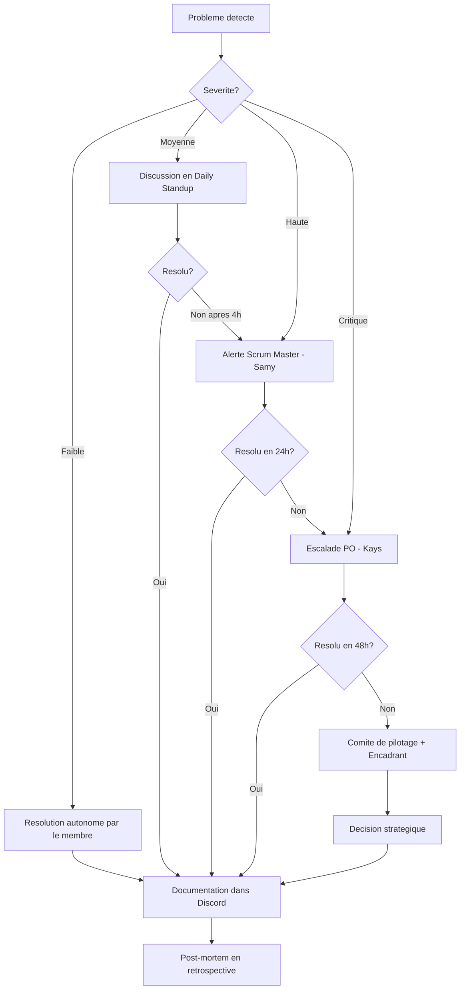

# Plan de Supervision et Pilotage du Projet MYTHOS

> **Projet** : MYTHOS -- Plateforme de jeux narratifs multijoueur avec IA Maitre du Jeu
> **Entreprise** : Mythos Interactive (SAS)
> **Version** : 1.0
> **Date** : 14 Fevrier 2026
> **Competence RNCP** : C1.7 -- Supervision et controle du projet
> **Methodologie** : Scrum (Agile) -- 7 sprints de 2 semaines (14 semaines)

En tant que Product Owner et architecte du projet, j'ai mis en place ce cadre de supervision pour que l'equipe ait des processus clairs de gouvernance, d'escalade et de resolution de problemes. Ce document s'inspire des bonnes pratiques ITIL et Scrum, adaptees a notre contexte de projet etudiant de 14 semaines. Concretement, on a construit ces processus au fur et a mesure -- le processus d'escalade par exemple a ete formalise apres qu'on ait perdu une demi-journee sur un blocage que personne n'avait remonte.

---

## Table des matieres

1. [Gouvernance du projet](#1-gouvernance-du-projet)
2. [Supervision operationnelle](#2-supervision-operationnelle)
3. [Processus de resolution de problemes](#3-processus-de-resolution-de-problemes)
4. [Ajustement et actualisation](#4-ajustement-et-actualisation)

---

## 1. Gouvernance du projet

### 1.1 Organigramme du projet

```
                    ┌─────────────────────────┐
                    │   COMITE DE PILOTAGE     │
                    │  (Encadrant academique   │
                    │   + Client fictif)       │
                    └────────────┬────────────┘
                                 │
                    ┌────────────▼────────────┐
                    │    PRODUCT OWNER         │
                    │    Kays ZAHIDI            │
                    │    (Chef de projet /     │
                    │     Architecte)          │
                    └────────────┬────────────┘
                                 │
              ┌──────────────────┼──────────────────┐
              │                  │                   │
   ┌──────────▼─────────┐ ┌─────▼──────────┐ ┌─────▼──────────────┐
   │  SM / BACKEND / IA  │ │ DEV FRONTEND   │ │  FRONTEND / UX     │
   │  Samy ZEROUALI      │ │ Youri EMMANUEL  │ │  + DEVOPS          │
   │                     │ │                │ │  Yassir SABBAR      │
   └─────────────────────┘ └────────────────┘ └────────────────────┘
```

#### Roles et responsabilites detailles

| Membre | Role Scrum | Role technique | Responsabilites detaillees |
|--------|-----------|----------------|---------------------------|
| **Kays ZAHIDI** | Product Owner | Chef de projet / Architecte | - Definition et priorisation du backlog produit |
| | | | - Vision produit et decisions de perimetre |
| | | | - Validation des livrables a chaque Sprint Review |
| | | | - Interface avec le client fictif (Mythos Interactive) |
| | | | - Decisions architecturales majeures |
| | | | - Redaction et maintien du cahier des charges |
| | | | - Arbitrage MoSCoW (Must/Should/Could/Won't) |
| | | | - Suivi budgetaire (couts API IA, hebergement) |
| **Samy ZEROUALI** | Scrum Master | Dev Backend + IA + Temps reel | - Facilitation de toutes les ceremonies Scrum |
| | | | - Suivi de la velocite et du burndown chart |
| | | | - Identification et resolution des blocages |
| | | | - Backend NestJS : API REST, Game Engine, WebSocket Gateway |
| | | | - Service IA : prompt engineering, appels API Anthropic |
| | | | - Integration et parsing des reponses LLM (JSON structure) |
| | | | - Strategie duale Haiku/Sonnet |
| | | | - Redaction et test des Scenario Packs |
| | | | - Monitoring des couts et performances IA |
| **Youri EMMANUEL** | Developpeur | Developpeur Frontend | - Developpement de l'interface utilisateur (Next.js, React) |
| | | | - Implementation du design system (TailwindCSS) |
| | | | - Game UI : narration, choix, discussion, jauges |
| | | | - Integration WebSocket cote client (Socket.io) |
| | | | - Responsive design mobile-first |
| | | | - Tests frontend (Vitest) |
| **Yassir SABBAR** | Developpeur | Frontend / UX-UI + DevOps | - Maquettes UI/UX (Figma) |
| | | | - Design system et charte graphique |
| | | | - Developpement frontend complementaire (composants UI) |
| | | | - Accessibilite WCAG 2.1 AA (audit + corrections) |
| | | | - CI/CD avec GitHub Actions |
| | | | - Deploiement Vercel (front) + Railway (back) |
| | | | - Monitoring et health checks (UptimeRobot) |
| | | | - Mesure eco-index (GreenIT Analysis) |

#### Matrice RACI

| Activite | Kays (PO/Archi) | Samy (SM/Back/IA) | Youri (Front) | Yassir (UX/DevOps) |
|----------|:-:|:-:|:-:|:-:|
| Vision produit & backlog | **R/A** | C | I | I |
| Decisions architecture | **R/A** | C | I | I |
| Ceremonies Scrum | C | **R/A** | C | C |
| Suivi KPI & velocite | I | **R/A** | I | I |
| Developpement frontend | I | I | **R/A** | R |
| Developpement backend | A | **R/A** | I | I |
| Service IA | A | **R/A** | I | I |
| WebSocket / temps reel | I | **R** | C | I |
| Maquettes UI/UX | A | I | C | **R** |
| CI/CD & deploiement | I | I | I | **R/A** |
| Accessibilite | A | I | C | **R** |
| Tests E2E | A | **R** | **R** | C |
| Communication client | **R/A** | C | I | I |
| Communication encadrant | C | **R/A** | I | I |
| Documentation projet | **R** | **R** | C | C |

> **R** = Responsable (fait le travail) | **A** = Accountable (rend des comptes) | **C** = Consulte | **I** = Informe

---

### 1.2 Instances de pilotage

#### 1.2.1 Daily Standup (Asynchrone)

| Attribut | Detail |
|----------|--------|
| **Objectif** | Synchroniser l'equipe sur l'avancement quotidien, identifier les blocages immediatement |
| **Participants** | Toute l'equipe de developpement (4 membres) |
| **Frequence** | Quotidien (lundi au vendredi) |
| **Duree** | 5 minutes (asynchrone, message ecrit) |
| **Canal** | Discord -- canal `#daily-standup` |
| **Horaire** | Avant 10h00 chaque jour |
| **Qui anime** | Scrum Master (Samy ZEROUALI) -- verifie que tous les messages sont postes |
| **Qui decide** | Pas de decision ; identification des blocages uniquement |
| **Ordre du jour type** | Chaque membre poste : |
| | 1. Ce que j'ai fait hier |
| | 2. Ce que je vais faire aujourd'hui |
| | 3. Mes blocages / besoin d'aide |
| **Livrables attendus** | Messages postes par tous les membres avant 10h |
| **Regles** | - Pas de discussion technique detaillee (a traiter en aparté) |
| | - Si blocage identifie : le SM planifie un point dans l'heure |
| | - Les messages non postes sont relances par le SM a 10h15 |

#### 1.2.2 Sprint Planning

| Attribut | Detail |
|----------|--------|
| **Objectif** | Definir le contenu du sprint a venir : selectionner les user stories, estimer, s'engager collectivement |
| **Participants** | Toute l'equipe (PO + SM + devs) |
| **Frequence** | Debut de chaque sprint (toutes les 2 semaines) |
| **Duree** | 1h00 a 1h30 |
| **Canal** | Discord -- vocal `#reunion-equipe` + partage ecran GitHub Projects |
| **Horaire** | Lundi matin, premiere semaine du sprint |
| **Qui anime** | Scrum Master (Samy ZEROUALI) |
| **Qui decide** | Product Owner (Kays ZAHIDI) pour la priorisation ; equipe pour l'estimation et l'engagement |
| **Ordre du jour type** | 1. Revue de la velocite du sprint precedent (5 min) |
| | 2. Presentation des stories prioritaires par le PO (15 min) |
| | 3. Clarification et questions (10 min) |
| | 4. Estimation en story points -- Planning Poker (20 min) |
| | 5. Selection des stories pour le sprint (10 min) |
| | 6. Definition de l'objectif du sprint (5 min) |
| | 7. Repartition initiale des taches (10 min) |
| **Livrables attendus** | - Sprint Backlog valide (stories selectionnees + estimees) |
| | - Objectif du sprint formule |
| | - Board GitHub Projects mis a jour |
| | - Chaque story assignee a un responsable |

#### 1.2.3 Sprint Review (Demo)

| Attribut | Detail |
|----------|--------|
| **Objectif** | Demonstrer les fonctionnalites livrees, recueillir le feedback du client et de l'encadrant |
| **Participants** | Equipe + encadrant academique + client fictif (Mythos Interactive) |
| **Frequence** | Fin de chaque sprint (toutes les 2 semaines) |
| **Duree** | 30 a 45 minutes |
| **Canal** | Discord -- vocal `#reunion-equipe` + partage ecran de la demo |
| **Horaire** | Vendredi apres-midi, derniere semaine du sprint |
| **Qui anime** | Product Owner (Kays ZAHIDI) |
| **Qui decide** | Client fictif + encadrant (feedback) ; PO (validation des stories) |
| **Ordre du jour type** | 1. Rappel de l'objectif du sprint (2 min) |
| | 2. Demo des fonctionnalites livrees (15-20 min) |
| | 3. Presentation des KPI du sprint (5 min) |
| | 4. Feedback du client et de l'encadrant (10 min) |
| | 5. Questions / ajustements proposes (5 min) |
| | 6. Validation des stories "Done" (3 min) |
| **Livrables attendus** | - Compte-rendu de Sprint Review (template en section Communication) |
| | - Stories validees marquees "Done" dans GitHub Projects |
| | - Feedback documente et actionnable |
| | - Backlog mis a jour avec les retours |

#### 1.2.4 Retrospective

| Attribut | Detail |
|----------|--------|
| **Objectif** | Amelioration continue du processus de travail de l'equipe |
| **Participants** | Equipe uniquement (pas de client ni d'encadrant) |
| **Frequence** | Fin de chaque sprint, apres la Sprint Review |
| **Duree** | 30 minutes |
| **Canal** | Discord -- vocal `#reunion-equipe` |
| **Horaire** | Vendredi apres-midi, apres la Sprint Review |
| **Qui anime** | Scrum Master (Samy ZEROUALI) |
| **Qui decide** | L'equipe collectivement (vote sur les actions d'amelioration) |
| **Ordre du jour type** | 1. Ice-breaker rapide (2 min) |
| | 2. Collecte individuelle : Start / Stop / Continue (5 min) |
| | 3. Partage et regroupement des idees (10 min) |
| | 4. Vote sur les actions a entreprendre (5 min) |
| | 5. Definition des 2-3 actions d'amelioration pour le prochain sprint (5 min) |
| | 6. Revue des actions du sprint precedent (3 min) |
| **Livrables attendus** | - Compte-rendu de retrospective (Start/Stop/Continue) |
| | - 2-3 actions d'amelioration concretes avec responsable et deadline |
| | - Actions du sprint precedent evaluees (fait / pas fait / en cours) |

#### 1.2.5 Comite de pilotage (COPIL)

| Attribut | Detail |
|----------|--------|
| **Objectif** | Revue strategique du projet : avancement global, risques majeurs, decisions de perimetre |
| **Participants** | PO (Kays ZAHIDI) + SM (Samy ZEROUALI) + encadrant academique + client fictif |
| **Frequence** | Mensuelle (toutes les 4 semaines, soit tous les 2 sprints) |
| **Duree** | 30 a 45 minutes |
| **Canal** | Visioconference (Discord ou Google Meet) |
| **Horaire** | A fixer avec l'encadrant |
| **Qui anime** | Product Owner (Kays ZAHIDI) |
| **Qui decide** | Decisions strategiques : PO + encadrant ; decisions budgetaires : PO ; arbitrages perimetre : PO avec avis client |
| **Ordre du jour type** | 1. Etat d'avancement global (planning prevu vs realise) (5 min) |
| | 2. Tableau de bord KPI (velocite, budget, qualite) (5 min) |
| | 3. Revue des risques majeurs et actions en cours (5 min) |
| | 4. Points de decision / arbitrages necessaires (10 min) |
| | 5. Previsionnel pour les 4 prochaines semaines (5 min) |
| | 6. Questions ouvertes (5 min) |
| **Livrables attendus** | - Compte-rendu de COPIL avec decisions prises |
| | - Risques mis a jour |
| | - Plan d'action pour les 4 prochaines semaines |

#### 1.2.6 Point technique (Tech Review)

| Attribut | Detail |
|----------|--------|
| **Objectif** | Revue de l'architecture, des choix techniques, et de la dette technique |
| **Participants** | Equipe technique (Kays, Youri, Samy, Yassir) |
| **Frequence** | Hebdomadaire (ou sur demande si probleme technique) |
| **Duree** | 15 a 30 minutes |
| **Canal** | Discord -- vocal `#tech-review` |
| **Horaire** | Mercredi apres-midi |
| **Qui anime** | Architecte (Kays ZAHIDI) |
| **Qui decide** | Architecte pour les choix techniques ; equipe pour les conventions |
| **Ordre du jour type** | 1. Revue des PRs en attente (5 min) |
| | 2. Discussion sur les choix techniques en cours (10 min) |
| | 3. Dette technique identifiee (5 min) |
| | 4. Spike techniques a planifier (5 min) |
| **Livrables attendus** | - Decisions techniques documentees |
| | - Issues techniques creees si necessaire |

---

### 1.3 Circuit de decision

```
┌────────────────────────────────────────────────────────────┐
│                   CIRCUIT DE DECISION                       │
├────────────────────────┬───────────────────────────────────┤
│  TYPE DE DECISION      │  QUI DECIDE                       │
├────────────────────────┼───────────────────────────────────┤
│                        │                                   │
│  PERIMETRE PRODUIT     │  Product Owner (Kays ZAHIDI)       │
│  - Ajout/retrait de    │  avec avis du client fictif       │
│    fonctionnalite      │  Decision en Sprint Planning      │
│  - Priorisation        │  ou COPIL si impact majeur        │
│    backlog             │                                   │
│                        │                                   │
├────────────────────────┼───────────────────────────────────┤
│                        │                                   │
│  TECHNIQUE             │  Architecte (Kays ZAHIDI)          │
│  - Choix de            │  avec consultation de l'equipe    │
│    technologie         │  technique en Tech Review         │
│  - Architecture        │  Decisions mineures : le dev      │
│  - Dette technique     │  concerne decide seul             │
│                        │                                   │
├────────────────────────┼───────────────────────────────────┤
│                        │                                   │
│  PLANNING              │  Scrum Master (Samy ZEROUALI)    │
│  - Repartition des     │  avec engagement de l'equipe      │
│    taches              │  en Sprint Planning               │
│  - Ajustement sprint   │  PO valide si replanification     │
│                        │                                   │
├────────────────────────┼───────────────────────────────────┤
│                        │                                   │
│  BUDGET                │  Product Owner (Kays ZAHIDI)       │
│  - Couts API IA        │  Escalade vers l'encadrant        │
│  - Hebergement         │  si depassement > 20%             │
│  - Outils              │                                   │
│                        │                                   │
├────────────────────────┼───────────────────────────────────┤
│                        │                                   │
│  PROCESSUS EQUIPE      │  Decision collective              │
│  - Conventions de      │  en Retrospective (vote)          │
│    code                │  SM facilite                      │
│  - Outils de travail   │                                   │
│                        │                                   │
├────────────────────────┼───────────────────────────────────┤
│                        │                                   │
│  URGENCE / INCIDENT    │  Personne qui detecte             │
│  - Bug critique prod   │  alerte immediatement             │
│  - Indisponibilite     │  SM coordonne la resolution       │
│    service             │  PO valide le correctif           │
│                        │                                   │
└────────────────────────┴───────────────────────────────────┘
```

---

### 1.4 Escalade des problemes

#### Niveaux d'escalade

```
NIVEAU 3 (Strategique)          ┌──────────────────────────────┐
Escalade vers l'encadrant       │  Encadrant academique        │
academique                      │  + Client fictif             │
Delai : sous 48h               │  Decision en COPIL           │
                                └──────────────┬───────────────┘
                                               │
NIVEAU 2 (Tactique)             ┌──────────────▼───────────────┐
Escalade vers le PO             │  Product Owner (Kays ZAHIDI)  │
+ Scrum Master                  │  + Scrum Master (Samy)    │
Delai : sous 24h               │  Decision en reunion adhoc   │
                                └──────────────┬───────────────┘
                                               │
NIVEAU 1 (Operationnel)        ┌──────────────▼───────────────┐
Resolution par l'equipe         │  Equipe de developpement     │
en autonomie                    │  Resolution directe          │
Delai : sous 4h                │  Daily standup + Discord     │
                                └──────────────────────────────┘
```

#### Criteres d'escalade detailles

| Niveau | Criteres de declenchement | Exemples concrets MYTHOS | Processus | Delai de resolution |
|--------|--------------------------|--------------------------|-----------|-------------------|
| **Niveau 1** (Operationnel) | - Bug mineur non bloquant | - Erreur d'affichage UI | 1. Le dev identifie le probleme | Sous 4h |
| | - Question technique simple | - Test qui echoue | 2. Poste un message sur Discord `#help` | |
| | - Besoin de clarification | - Besoin de precision sur une US | 3. Un collegue repond ou aide | |
| | - Tache prenant plus longtemps que prevu | - Integration Socket.io plus complexe | 4. Resolu et documente | |
| **Niveau 2** (Tactique) | - Blocage technique non resolu en N1 | - API Anthropic en panne > 2h | 1. Le dev alerte le SM sur Discord `#alertes` | Sous 24h |
| | - Retard > 1 jour sur une tache critique | - Incoherence narrative persistante de l'IA | 2. SM convoque une reunion adhoc | |
| | - Conflit technique entre membres | - Desaccord sur l'architecture du Game Engine | 3. PO + SM analysent l'impact | |
| | - Depassement budgetaire ponctuel | - Pic de couts API IA imprevus | 4. Decision et plan d'action | |
| | - Dependance bloquante entre taches | - Le backend n'est pas pret pour le frontend | 5. Communication a l'equipe | |
| **Niveau 3** (Strategique) | - Retard > 1 semaine sur un jalon | - Sprint entier non livre | 1. PO prepare un rapport de situation | Sous 48h |
| | - Risque critique non mitige | - Couts IA explosent le budget | 2. Demande de COPIL extraordinaire | |
| | - Perte d'un membre de l'equipe | - Membre indisponible > 1 semaine | 3. Encadrant + client fictif consultes | |
| | - Changement majeur de perimetre | - Abandon d'un scenario du MVP | 4. Decision strategique prise | |
| | - Probleme non resolu en N2 sous 24h | - Bug critique persistant en prod | 5. Plan de remediation documente | |

#### Processus d'escalade

```
┌─────────────────┐     Non resolu     ┌─────────────────┐    Non resolu     ┌──────────────────┐
│   DETECTION     │    apres 4h        │   ESCALADE N2   │   apres 24h      │   ESCALADE N3    │
│                 ├───────────────────>│                 ├──────────────────>│                  │
│ 1. Identifier   │                    │ 1. Alerte SM    │                   │ 1. Rapport PO    │
│ 2. Qualifier    │                    │ 2. Reunion adhoc│                   │ 2. COPIL extra   │
│ 3. Tenter de    │                    │ 3. Plan action  │                   │ 3. Decision      │
│    resoudre     │                    │ 4. Suivi 4h     │                   │    strategique   │
│ 4. Documenter   │                    │ 5. Documenter   │                   │ 4. Plan remedia. │
└─────────────────┘                    └─────────────────┘                   └──────────────────┘
```

#### Diagramme du processus d'escalade

Le diagramme ci-dessous modelise le flux d'escalade des problemes au sein de l'equipe MYTHOS, depuis la detection initiale jusqu'a la resolution documentee, en passant par les differents niveaux selon la severite et les delais de resolution.



---

## 2. Supervision operationnelle

### 2.1 Processus de suivi quotidien -- Daily Standup Asynchrone

#### Template Discord pour le Daily Standup

```markdown
## Daily Standup - [Prenom] - [JJ/MM/AAAA]

**Hier j'ai :**
- [ Description de la tache terminee ou avancee ]
- [ Autre tache ]

**Aujourd'hui je vais :**
- [ Description de la tache prevue ]
- [ Autre tache ]

**Blocages / Besoins :**
- [ Description du blocage ] --> @mention de la personne qui peut aider
- Aucun blocage

**Ticket(s) en cours :** S3-05, S3-06
**Progression estimee :** 70%
```

#### Exemple rempli

```markdown
## Daily Standup - Youri - 17/03/2026

**Hier j'ai :**
- Termine le composant `NarrationPanel` avec l'effet de streaming (S3-06)
- Commence le composant `ChoicePanel` avec le timer

**Aujourd'hui je vais :**
- Finir le `ChoicePanel` et connecter a l'evenement WS `game:options`
- Commencer le `DiscussionPanel` (chat)

**Blocages / Besoins :**
- J'ai besoin que l'evenement `game:options` soit emis cote backend --> @Samy
- Le format JSON des options n'est pas documente --> @Kays

**Ticket(s) en cours :** S3-06
**Progression estimee :** 45%
```

#### Regles du daily standup asynchrone

| Regle | Detail |
|-------|--------|
| **Deadline** | Message poste avant 10h00 chaque jour ouvrable |
| **Canal** | Discord `#daily-standup` (canal dedie, pas de discussion) |
| **Format** | Template ci-dessus strictement respecte |
| **Relance** | Le SM envoie un rappel a 10h15 pour les messages manquants |
| **Suivi** | Le SM compile les blocages et planifie les resolutions avant 11h |
| **Discussions** | Les echanges techniques se font dans `#general` ou `#tech`, pas dans `#daily-standup` |
| **Weekend** | Pas de daily le samedi et dimanche |

---

### 2.2 Processus de suivi hebdomadaire -- Point d'avancement

#### Objectif

Produire un rapport d'avancement hebdomadaire synthetique pour l'encadrant academique et maintenir une visibilite constante sur l'etat du projet.

#### Frequence et responsable

| Attribut | Detail |
|----------|--------|
| **Frequence** | Chaque vendredi |
| **Responsable** | Scrum Master (Samy ZEROUALI) redige, Product Owner (Kays ZAHIDI) valide |
| **Destinataire** | Encadrant academique (via Notion, lien partage) |
| **Copie** | Toute l'equipe (notification Discord `#rapports`) |

#### Contenu du rapport hebdomadaire

Le rapport hebdomadaire contient les elements suivants :

1. **Synthese en 3 lignes** : etat global du projet (sur la bonne voie / attention requise / en difficulte)
2. **Avancement du sprint en cours** : % de completion, stories Done vs In Progress vs To Do
3. **Burndown chart** : capture d'ecran GitHub Projects
4. **Taches cles de la semaine** : ce qui a ete livre
5. **Taches prevues semaine prochaine** : ce qui est prevu
6. **Blocages et risques actifs** : liste avec statut et action prevue
7. **Metriques cles** : velocite, couverture de tests, temps de reponse IA
8. **Budget** : consommation API IA et hebergement (si applicable)
9. **Decisions a prendre** : questions ouvertes pour l'encadrant

> Le template complet du rapport hebdomadaire est disponible dans le document `COMMUNICATION_PARTIES_PRENANTES.md`.

---

### 2.3 Processus de suivi bi-hebdomadaire -- Sprint Review + Retrospective

#### Sprint Review

**Deroulement detaille :**

| Etape | Duree | Responsable | Detail |
|-------|-------|-------------|--------|
| 1. Accueil et rappel objectif | 2 min | PO | Rappeler l'objectif du sprint et le contexte |
| 2. Demo des fonctionnalites | 15-20 min | Devs concernes | Chaque dev demontre les stories qu'il a livrees |
| 3. KPI du sprint | 5 min | SM | Velocite, burndown, couverture tests, performance IA |
| 4. Feedback | 10 min | Client + encadrant | Questions, remarques, suggestions |
| 5. Validation | 3 min | PO | Les stories sont marquees "Done" ou "A revoir" |
| 6. Cloture | 2 min | PO | Prochaines etapes, date du prochain sprint planning |

**Checklist pre-Sprint Review :**

- [ ] Toutes les stories "Done" sont deployees en environnement de test
- [ ] Les demos sont preparees et testees (pas de demo improvisee)
- [ ] Le burndown chart est a jour
- [ ] Les KPI sont compiles
- [ ] L'encadrant et le client fictif sont invites (notification envoyee 48h avant)
- [ ] Le compte-rendu precedent est relu pour verifier les actions

#### Retrospective

**Deroulement detaille :**

| Etape | Duree | Responsable | Detail |
|-------|-------|-------------|--------|
| 1. Ice-breaker | 2 min | SM | Question rapide pour detendre l'atmosphere |
| 2. Revue des actions precedentes | 3 min | SM | Statut des actions decidees au sprint precedent |
| 3. Collecte individuelle | 5 min | Chacun | Chaque membre ecrit ses Start / Stop / Continue |
| 4. Partage et regroupement | 10 min | SM | Tour de table, regroupement par themes |
| 5. Vote | 5 min | Equipe | Chaque membre vote pour les 2 sujets les plus importants |
| 6. Plan d'action | 5 min | SM | 2-3 actions concretes avec responsable et deadline |

**Template Start / Stop / Continue :**

```
START (ce qu'on devrait commencer a faire) :
- _____________________________________________________
- _____________________________________________________

STOP (ce qu'on devrait arreter de faire) :
- _____________________________________________________
- _____________________________________________________

CONTINUE (ce qui fonctionne bien et qu'on doit maintenir) :
- _____________________________________________________
- _____________________________________________________
```

---

### 2.4 Revue de code (Code Review)

#### Processus de code review

```
┌───────────┐     ┌──────────────┐     ┌──────────────┐     ┌───────────┐
│ Dev cree  │────>│  PR ouverte  │────>│  Reviewer    │────>│  Merge    │
│ une       │     │  sur GitHub  │     │  assigne     │     │  dans     │
│ branche   │     │  (template   │     │  review      │     │  develop  │
│ feature/* │     │   rempli)    │     │  sous 24h    │     │           │
└───────────┘     └──────────────┘     └──────────────┘     └───────────┘
                         │                    │
                         │              ┌─────▼──────┐
                         │              │ Changements│
                         │              │ demandes ? │
                         │              └─────┬──────┘
                         │                    │ Oui
                         │              ┌─────▼──────┐
                         │              │ Dev corrige│
                         │              │ et re-push │
                         └──────────────┤            │
                                        └────────────┘
```

#### SLA de code review

| Metrique | Cible | Mesure |
|----------|-------|--------|
| **Delai de premiere review** | Sous 24h apres ouverture de la PR | Timestamp GitHub |
| **Nombre de reviewers requis** | Minimum 1 approbation | Regle branche GitHub |
| **Delai de correction apres feedback** | Sous 12h | Timestamp GitHub |
| **Taille maximale d'une PR** | < 400 lignes modifiees | Si > 400 : decouvrir en PRs plus petites |

#### Checklist de code review

Le reviewer verifie systematiquement les points suivants :

**Qualite du code :**

- [ ] Le code compile et les tests passent (CI verte)
- [ ] Le code respecte les conventions du projet (ESLint / Prettier)
- [ ] Les noms de variables/fonctions sont explicites et en anglais
- [ ] Pas de code duplique (DRY)
- [ ] Pas de code mort ou commente inutilement
- [ ] Les fonctions font une seule chose (SRP -- Single Responsibility)
- [ ] La complexite cyclomatique est raisonnable (pas de nesting > 3 niveaux)

**Architecture :**

- [ ] Le code respecte l'architecture definie (modules NestJS, composants React)
- [ ] Les dependances sont correctement injectees (pas d'import circulaire)
- [ ] Les types TypeScript sont correctement definis (pas de `any` injustifie)
- [ ] Les DTOs sont valides avec `class-validator` (backend)

**Securite :**

- [ ] Pas de secret en dur dans le code (cles API, mots de passe)
- [ ] Les entrees utilisateur sont validees et sanitisees
- [ ] Les endpoints sont correctement proteges (JWT, guards)
- [ ] Pas de vulnerabilite d'injection (SQL, XSS)

**Tests :**

- [ ] Les tests unitaires sont ecrits pour la nouvelle fonctionnalite
- [ ] La couverture de tests ne diminue pas
- [ ] Les cas limites sont testes (erreurs, timeout, null)

**Performance / IA (si applicable) :**

- [ ] Les appels API IA sont optimises (pas d'appel inutile)
- [ ] Le cache est utilise quand c'est pertinent
- [ ] Les prompts sont concis et structurent la reponse en JSON

**Documentation :**

- [ ] Les fonctions complexes sont commentees (JSDoc)
- [ ] Le README est mis a jour si necessaire
- [ ] Les changements d'API sont documentes

#### Template de Pull Request

```markdown
## Description
[Breve description du changement]

## Type de changement
- [ ] Nouvelle fonctionnalite (feature)
- [ ] Correction de bug (fix)
- [ ] Refactoring (pas de changement fonctionnel)
- [ ] Documentation
- [ ] Configuration / CI/CD
- [ ] Test

## Ticket(s) lie(s)
Closes #[numero_issue]

## Changements effectues
- [ Detail du changement 1 ]
- [ Detail du changement 2 ]

## Captures d'ecran (si UI)
[Avant / Apres si applicable]

## Checklist avant merge
- [ ] Tests ecrits et passent
- [ ] Lint passe sans erreur
- [ ] PR < 400 lignes
- [ ] Auto-review effectuee
- [ ] Documentation mise a jour si necessaire

## Notes pour le reviewer
[Contexte additionnel, points d'attention]
```

---

### 2.5 Monitoring technique en production

Yassir a configure tout le monitoring (UptimeRobot, alertes Discord, health checks) en une apres-midi pendant le Sprint 0. Ca nous a bien rassures d'avoir les alertes en place avant meme le premier deploiement staging.

#### Health checks

| Endpoint | Service | Frequence | Outil | Alerte si |
|----------|---------|-----------|-------|-----------|
| `GET /api/health` | Backend NestJS | Toutes les 5 min | UptimeRobot | HTTP != 200 pendant > 2 min |
| `GET /` | Frontend Next.js | Toutes les 5 min | UptimeRobot | HTTP != 200 pendant > 2 min |
| Connexion WebSocket | Socket.io Gateway | Toutes les 10 min | Script custom (cron) | Echec de connexion |
| `SELECT 1` | PostgreSQL | Toutes les 5 min | Railway health check | Connexion echouee |
| `PING` | Redis | Toutes les 5 min | Railway health check | Connexion echouee |

#### Alertes

| Type d'alerte | Canal de notification | Responsable | Action attendue |
|---------------|----------------------|-------------|-----------------|
| **Service down** (backend/frontend) | Discord `#alertes-prod` + email DevOps | Yassir SABBAR (DevOps) | Verifier les logs, redemarrer le service, escalader si > 15 min |
| **Latence API IA > 10s** | Discord `#alertes-prod` | Samy ZEROUALI (Dev IA) | Verifier le statut d'Anthropic, activer le fallback |
| **Taux d'erreur IA > 10%** | Discord `#alertes-prod` | Samy ZEROUALI (Dev IA) | Analyser les logs, corriger les prompts |
| **Base de donnees inaccessible** | Discord `#alertes-prod` + email | Yassir SABBAR (DevOps) | Verifier Railway, tenter reconnexion |
| **Depassement budget API IA** | Discord `#alertes-prod` | Kays ZAHIDI (PO) + Samy | Analyser la consommation, activer les limites |

#### Logs

| Composant | Format | Niveaux | Outil | Retention |
|-----------|--------|---------|-------|-----------|
| Backend NestJS | JSON structure | `info`, `warn`, `error`, `debug` | Console Railway + export | 7 jours |
| Frontend Next.js | Console + Vercel Logs | `info`, `error` | Vercel Analytics | 7 jours |
| AI Service | JSON structure (prompt + reponse + duree + cout) | `info`, `warn`, `error` | Logs backend | 14 jours |
| WebSocket Gateway | JSON (connexions, deconnexions, evenements) | `info`, `warn` | Logs backend | 7 jours |

#### Metriques suivies en continu

| Metrique | Cible | Seuil d'alerte | Outil |
|----------|-------|----------------|-------|
| Temps de reponse IA (P95) | < 5s | > 10s | Logs backend |
| Temps de reponse API REST (P95) | < 500ms | > 2s | Logs backend |
| Latence WebSocket (P95) | < 200ms | > 500ms | Socket.io admin UI |
| Taux d'erreur IA | < 5% | > 10% | Logs AI Service |
| Taux de completion de session | > 70% | < 50% | Logs backend |
| Uptime | > 95% | < 90% | UptimeRobot |
| Cout API IA (mensuel) | < 80EUR | > 100EUR | Dashboard Anthropic |

---

## 3. Processus de resolution de problemes

### 3.1 Classification des problemes

| Severite | Definition | Exemples MYTHOS | SLA de resolution | Processus |
|----------|-----------|-----------------|-------------------|-----------|
| **BLOQUANT** (P0) | Empeche le fonctionnement du produit ou bloque plusieurs membres de l'equipe | - Application inaccessible en production | **Resolution sous 4h** | 1. Alerte immediate Discord `#alertes-prod` |
| | | - Bug critique : les parties ne peuvent pas demarrer | | 2. Assignation au dev concerne |
| | | - API IA completement down | | 3. Hotfix prioritaire (bypass la file) |
| | | - Perte de donnees | | 4. Deploy en urgence |
| | | - Faille de securite critique | | 5. Post-mortem obligatoire |
| **MAJEUR** (P1) | Fonctionnalite importante degradee ou indisponible, contournement difficile | - La narration IA est incoherente dans 50% des cas | **Resolution sous 24h** | 1. Issue GitHub label `critical` |
| | | - Le streaming IA ne fonctionne plus | | 2. Priorise en haut du sprint backlog |
| | | - Les WebSocket se deconnectent frequemment | | 3. Assignation immediate |
| | | - Un scenario (TRIBUNAL ou DEEP) est injouable | | 4. Fix + review + deploy sous 24h |
| | | - Le lobby ne fonctionne plus | | |
| **MINEUR** (P2) | Fonctionnalite secondaire impactee, contournement facile | - Erreur d'affichage CSS sur un seul navigateur | **Resolution sous 1 semaine** | 1. Issue GitHub label `bug` |
| | | - Le timer ne s'affiche pas correctement | | 2. Integre au sprint en cours si capacite |
| | | - Message d'erreur peu explicite | | 3. Sinon reporte au sprint suivant |
| | | - Un texte n'est pas traduit | | 4. Fix classique (PR + review) |

---

### 3.2 Methode des 5 Pourquoi

#### Principe

La methode des 5 Pourquoi permet de remonter a la cause racine d'un probleme en posant iterativement la question "Pourquoi ?". L'objectif est de depasser les symptomes pour identifier la cause profonde et eviter la recurrence.

#### Template

```
┌─────────────────────────────────────────────────────────────────────┐
│                    ANALYSE DES 5 POURQUOI                            │
├─────────────────────────────────────────────────────────────────────┤
│ Date : ___/___/______                                               │
│ Probleme observe : ________________________________________________ │
│ Detecte par : _____________________________________________________│
│ Impact : __________________________________________________________│
├─────────────────────────────────────────────────────────────────────┤
│                                                                     │
│ POURQUOI 1 : Pourquoi [le probleme] s'est-il produit ?              │
│ Reponse : _________________________________________________________│
│                                                                     │
│ POURQUOI 2 : Pourquoi [la reponse 1] ?                              │
│ Reponse : _________________________________________________________│
│                                                                     │
│ POURQUOI 3 : Pourquoi [la reponse 2] ?                              │
│ Reponse : _________________________________________________________│
│                                                                     │
│ POURQUOI 4 : Pourquoi [la reponse 3] ?                              │
│ Reponse : _________________________________________________________│
│                                                                     │
│ POURQUOI 5 : Pourquoi [la reponse 4] ?                              │
│ Reponse : _________________________________________________________│
│                                                                     │
├─────────────────────────────────────────────────────────────────────┤
│ CAUSE RACINE IDENTIFIEE :                                           │
│ ___________________________________________________________________ │
│                                                                     │
│ ACTION CORRECTIVE :                                                 │
│ ___________________________________________________________________ │
│                                                                     │
│ RESPONSABLE : ________________  DEADLINE : ___/___/______           │
│                                                                     │
│ ACTION PREVENTIVE (pour eviter la recurrence) :                     │
│ ___________________________________________________________________ │
│                                                                     │
│ RESPONSABLE : ________________  DEADLINE : ___/___/______           │
└─────────────────────────────────────────────────────────────────────┘
```

#### Exemple concret : "L'IA a genere du contenu incoherent"

```
┌─────────────────────────────────────────────────────────────────────┐
│                    ANALYSE DES 5 POURQUOI                            │
├─────────────────────────────────────────────────────────────────────┤
│ Date : 18/03/2026                                                   │
│ Probleme observe : L'IA (Claude) a genere une narration incoherente │
│   au tour 4 du scenario TRIBUNAL : un personnage mort au tour 2     │
│   est reapparu comme temoin actif.                                  │
│ Detecte par : Youri EMMANUEL (testeur) pendant le test E2E Sprint 3   │
│ Impact : MAJEUR - Brise l'immersion, scenario illogique             │
├─────────────────────────────────────────────────────────────────────┤
│                                                                     │
│ POURQUOI 1 : Pourquoi l'IA a genere un personnage mort ?            │
│ Reponse : Le game_state envoye au tour 4 ne contenait pas           │
│   l'information que le personnage avait ete elimine au tour 2.      │
│                                                                     │
│ POURQUOI 2 : Pourquoi le game_state ne contenait pas cette info ?   │
│ Reponse : La fonction `buildPromptContext()` ne prend en compte     │
│   que les joueurs actifs (status: "alive"), pas les elimines.       │
│                                                                     │
│ POURQUOI 3 : Pourquoi la fonction n'inclut pas les elimines ?       │
│ Reponse : Le developpeur a suppose que l'IA n'avait besoin que      │
│   des joueurs vivants pour generer la narration.                    │
│                                                                     │
│ POURQUOI 4 : Pourquoi cette hypothese n'a-t-elle pas ete validee ?  │
│ Reponse : La specification du prompt ne detaillait pas le format    │
│   exact du game_state a envoyer (pas de spec du contrat d'interface │
│   entre le Game State Manager et le AI Service).                    │
│                                                                     │
│ POURQUOI 5 : Pourquoi la specification etait incomplete ?            │
│ Reponse : Le sprint 2 etait tres charge (34 SP) et la documentation │
│   du contrat d'interface a ete reportee au profit du code.          │
│                                                                     │
├─────────────────────────────────────────────────────────────────────┤
│ CAUSE RACINE IDENTIFIEE :                                           │
│ Absence de specification formelle du contrat d'interface entre le   │
│ Game State Manager et le AI Service, combinee a une surcharge du    │
│ sprint 2 qui a conduit a negliger la documentation technique.       │
│                                                                     │
│ ACTION CORRECTIVE :                                                 │
│ 1. Modifier `buildPromptContext()` pour inclure les joueurs         │
│    elimines avec leur historique (status, tour d'elimination)       │
│ 2. Ajouter un test de regression : "scenario avec personnage       │
│    elimine au tour N, verifier coherence au tour N+2"              │
│                                                                     │
│ RESPONSABLE : Samy ZEROUALI (Dev IA)   DEADLINE : 20/03/2026        │
│                                                                     │
│ ACTION PREVENTIVE (pour eviter la recurrence) :                     │
│ 1. Rediger une specification formelle du game_state envoye a l'IA  │
│    (champs obligatoires, format, exemples)                         │
│ 2. Ajouter a la Definition of Done : "contrat d'interface          │
│    documente pour tout echange entre services"                     │
│                                                                     │
│ RESPONSABLE : Kays ZAHIDI (PO/Archi)  DEADLINE : 22/03/2026         │
└─────────────────────────────────────────────────────────────────────┘
```

---

### 3.3 Diagramme d'Ishikawa (Causes et Effets)

#### Principe

Le diagramme d'Ishikawa (ou diagramme en aretes de poisson) permet d'identifier toutes les causes potentielles d'un probleme, classees par categories. Pour un projet logiciel, les categories sont : Methode, Main-d'oeuvre, Materiel, Milieu, Mesure, Matiere.

#### Template

```
                                         PROBLEME
                                         ========
                                            │
        METHODE              MAIN-D'OEUVRE  │  MATERIEL           MILIEU
        -------              --------------  │  --------           ------
           \                      |          │       /                /
            \                     |          │      /                /
             \                    |          │     /                /
              ──────────────────────────────────────────────────────
             /                    |          │     \                \
            /                     |          │      \                \
           /                      |          │       \                \
        MESURE               MATIERE         │
        ------               -------         │
```

#### Exemple concret : "Latence excessive de l'IA (> 10 secondes)"

```
                                  LATENCE IA > 10s
                                  ================
                                         │
    METHODE                 MAIN-D'OEUVRE │   MATERIEL              MILIEU
    -------                 ------------- │   --------              ------
    │                            │        │        │                   │
    ├─ Prompt trop long          │        │        ├─ API Anthropic    ├─ Heure de pointe
    │  (> 4000 tokens)           │        │        │  surchargee       │  (usage mondial)
    │                            │        │        │                   │
    ├─ Pas de cache des          ├─ Manque│        ├─ Modele Sonnet    ├─ Connexion reseau
    │  intros de scenarios       │  d'exp.│        │  utilise pour     │  instable
    │                            │  prompt│        │  des phases       │  (etudiant)
    ├─ Game state complet        │  engin.│        │  simples          │
    │  envoye a chaque tour      │        │        │                   ├─ Latence Railway
    │  (pas de resume)           ├─ Dev   │        ├─ Pas de timeout   │  (serveur loin)
    │                            │  IA    │        │  cote client      │
    ├─ Pas de strategie          │  seul  │        │                   │
    │  de retry optimisee        │  (pas  │        ├─ Pas de CDN       │
    │                            │  de    │        │  pour le backend   │
    ──────────────────────────── backup)──────────────────────────────
    │                            │        │        │                   │
    ├─ Pas de metrique           ├─ Pas de│        │                   │
    │  de latence en prod        │  tests │        │                   │
    │                            │  de    │        │                   │
    ├─ Seuil d'alerte            │  perf. │        │                   │
    │  pas configure             │  des   │        │                   │
    │                            │  prompts│       │                   │
    MESURE                  MATIERE       │
    ------                  -------       │
```

**Actions identifiees suite a l'analyse :**

| Cause identifiee | Action corrective | Priorite | Responsable |
|------------------|-------------------|----------|-------------|
| Prompt trop long | Implementer un resume automatique du game_state (max 2000 tokens) | Haute | Samy ZEROUALI |
| Pas de cache | Mettre en cache les intros de scenarios et les descriptions de roles | Haute | Samy ZEROUALI |
| Sonnet pour phases simples | Activer la strategie duale : Haiku pour setup/validation, Sonnet pour narration | Haute | Samy ZEROUALI |
| Pas de metrique en prod | Configurer le monitoring du temps de reponse IA avec alerte a 10s | Moyenne | Yassir SABBAR |
| Pas de timeout client | Ajouter un timeout de 15s cote client avec message "L'IA prend un peu de temps..." | Moyenne | Youri EMMANUEL |
| Dev IA seul | Former un 2eme membre (Kays) sur le prompt engineering pour backup | Faible | Samy + Kays |

---

### 3.4 Registre des problemes

#### Template du registre

| ID | Date detection | Severite | Description | Impact | Detecte par | Assigne a | Statut | Cause racine | Action corrective | Date resolution | Post-mortem |
|----|---------------|----------|-------------|--------|-------------|-----------|--------|-------------|-------------------|----------------|-------------|
| PB-001 | JJ/MM/AAAA | P0/P1/P2 | Description du probleme | Impact sur le projet | Nom | Nom | Ouvert / En cours / Resolu / Clos | Cause identifiee | Action entreprise | JJ/MM/AAAA | Lien |
| PB-002 | | | | | | | | | | | |

#### Exemple de registre rempli

| ID | Date detection | Severite | Description | Impact | Detecte par | Assigne a | Statut | Cause racine | Action corrective | Date resolution | Post-mortem |
|----|---------------|----------|-------------|--------|-------------|-----------|--------|-------------|-------------------|----------------|-------------|
| PB-001 | 18/03/2026 | P1 | Personnage elimine reapparait dans la narration au tour 4 | Incoherence narrative, immersion brisee | Youri EMMANUEL | Samy ZEROUALI | Resolu | Game state incomplet envoye a l'IA (joueurs elimines absents) | Modification de `buildPromptContext()` pour inclure les elimines + test regression | 20/03/2026 | Voir analyse 5P ci-dessus |
| PB-002 | 25/03/2026 | P0 | Application inaccessible en prod pendant 45 min | Aucun utilisateur ne peut acceder au service | UptimeRobot (alerte auto) | Yassir SABBAR | Resolu | Certificat SSL expire sur Railway | Renouvellement SSL + ajout rappel calendrier 30j avant expiration | 25/03/2026 | PM-001 |
| PB-003 | 02/04/2026 | P2 | Timer de choix ne s'affiche pas sur Safari mobile | UX degradee sur Safari iOS (15% des utilisateurs) | Youri EMMANUEL | Youri EMMANUEL | En cours | API `setInterval` comportement different sur Safari | Investigation en cours, fix prevu sprint 5 | - | - |

#### Statuts possibles

| Statut | Definition |
|--------|-----------|
| **Ouvert** | Probleme detecte, pas encore pris en charge |
| **En cours** | Investigation ou correction en cours |
| **En attente** | Bloque par une dependance externe |
| **Resolu** | Fix deploye et verifie |
| **Clos** | Resolution confirmee, pas de regression, post-mortem fait si P0 |

---

### 3.5 Post-mortem pour incident majeur

#### Quand realiser un post-mortem

Un post-mortem est **obligatoire** pour :
- Tout incident P0 (bloquant)
- Tout incident P1 ayant dure plus de 4h
- Tout incident ayant impacte les utilisateurs en production

Un post-mortem est **recommande** pour :
- Les incidents techniques recurrents
- Les retards significatifs (> 3 jours sur un jalon)

#### Template de post-mortem

```
┌─────────────────────────────────────────────────────────────────────┐
│                      POST-MORTEM INCIDENT                            │
├─────────────────────────────────────────────────────────────────────┤
│                                                                     │
│ ID : PM-___                                                         │
│ Date de l'incident : ___/___/______                                 │
│ Date du post-mortem : ___/___/______                                │
│ Redige par : ______________________                                 │
│ Participants : _____________________________________________________│
│                                                                     │
│ ================================================================    │
│ 1. RESUME EXECUTIF                                                  │
│ ================================================================    │
│                                                                     │
│ Description en 2-3 phrases :                                        │
│ ___________________________________________________________________ │
│ ___________________________________________________________________ │
│                                                                     │
│ Duree de l'incident : __h__min                                      │
│ Impact utilisateurs : _____________________________________________ │
│ Severite : P0 / P1                                                  │
│                                                                     │
│ ================================================================    │
│ 2. CHRONOLOGIE                                                      │
│ ================================================================    │
│                                                                     │
│ | Heure   | Evenement                              | Acteur       | │
│ |---------|----------------------------------------|--------------|│
│ | HH:MM   | [Detection de l'incident]              | [Qui]        | │
│ | HH:MM   | [Premiere action]                      | [Qui]        | │
│ | HH:MM   | [Escalade si applicable]               | [Qui]        | │
│ | HH:MM   | [Identification de la cause]           | [Qui]        | │
│ | HH:MM   | [Deploiement du correctif]             | [Qui]        | │
│ | HH:MM   | [Confirmation de la resolution]        | [Qui]        | │
│                                                                     │
│ ================================================================    │
│ 3. ANALYSE DES CAUSES                                               │
│ ================================================================    │
│                                                                     │
│ Cause directe :                                                     │
│ ___________________________________________________________________ │
│                                                                     │
│ Cause racine (5 Pourquoi) :                                         │
│ ___________________________________________________________________ │
│                                                                     │
│ Facteurs contributifs :                                             │
│ - _________________________________________________________________ │
│ - _________________________________________________________________ │
│                                                                     │
│ ================================================================    │
│ 4. CE QUI A BIEN FONCTIONNE                                        │
│ ================================================================    │
│                                                                     │
│ - _________________________________________________________________ │
│ - _________________________________________________________________ │
│                                                                     │
│ ================================================================    │
│ 5. CE QUI AURAIT PU ETRE MIEUX                                     │
│ ================================================================    │
│                                                                     │
│ - _________________________________________________________________ │
│ - _________________________________________________________________ │
│                                                                     │
│ ================================================================    │
│ 6. ACTIONS CORRECTIVES ET PREVENTIVES                               │
│ ================================================================    │
│                                                                     │
│ | Action                   | Type        | Responsable | Deadline  |│
│ |--------------------------|-------------|-------------|-----------|│
│ | [Action 1]               | Corrective  | [Nom]       | JJ/MM    |│
│ | [Action 2]               | Preventive  | [Nom]       | JJ/MM    |│
│ | [Action 3]               | Preventive  | [Nom]       | JJ/MM    |│
│                                                                     │
│ ================================================================    │
│ 7. LECONS APPRISES                                                  │
│ ================================================================    │
│                                                                     │
│ ___________________________________________________________________ │
│ ___________________________________________________________________ │
│                                                                     │
│ ================================================================    │
│ 8. METRIQUES                                                        │
│ ================================================================    │
│                                                                     │
│ Time to Detect (TTD) : __h__min                                     │
│ Time to Resolve (TTR) : __h__min                                    │
│ Utilisateurs impactes : ___                                         │
│ Sessions perdues : ___                                              │
│                                                                     │
└─────────────────────────────────────────────────────────────────────┘
```

#### Regles du post-mortem

1. **Pas de blame** : Le post-mortem est un outil d'apprentissage, pas de reproche. On analyse les processus, pas les personnes.
2. **Factuel** : S'appuyer sur les logs, les metriques et la chronologie reelle.
3. **Actionnable** : Chaque lecon doit se traduire en une action concrete avec un responsable et une deadline.
4. **Partage** : Le post-mortem est partage avec toute l'equipe et archive dans Notion.
5. **Delai** : Le post-mortem doit etre realise dans les 48h suivant la resolution de l'incident.

---

## 4. Ajustement et actualisation

### 4.1 Processus de re-planification

#### Quand re-planifier

La re-planification est declenchee lorsqu'un ou plusieurs criteres d'ajustement sont atteints (voir section 4.2). Elle peut aussi etre demandee par n'importe quel membre de l'equipe via le Scrum Master.

#### Comment re-planifier

```
┌───────────────┐   ┌───────────────┐   ┌───────────────┐   ┌───────────────┐
│ 1. DETECTION  │──>│ 2. ANALYSE    │──>│ 3. DECISION   │──>│ 4. EXECUTION  │
│               │   │               │   │               │   │               │
│ - Critere     │   │ - Impact sur  │   │ - Scenario    │   │ - Backlog     │
│   d'ajustement│   │   le planning │   │   d'ajustement│   │   mis a jour  │
│   atteint     │   │ - Impact sur  │   │   choisi      │   │ - Planning    │
│ - Alerte SM   │   │   le budget   │   │ - Valide par  │   │   actualise   │
│   ou PO       │   │ - Impact sur  │   │   PO + equipe │   │ - Communique  │
│               │   │   la qualite  │   │ - Communique  │   │   aux parties │
│               │   │ - Stories     │   │   aux parties │   │   prenantes   │
│               │   │   impactees   │   │   prenantes   │   │               │
└───────────────┘   └───────────────┘   └───────────────┘   └───────────────┘
```

#### Qui decide

| Type de re-planification | Decideur | Processus |
|--------------------------|----------|-----------|
| **Intra-sprint** (reordonnancement des taches) | Scrum Master + equipe | Decision en daily standup |
| **Report de stories au sprint suivant** | Product Owner | Decision en point adhoc ou Sprint Review |
| **Changement de perimetre MVP** | Product Owner + client fictif + encadrant | Decision en COPIL |
| **Ajout de sprint de rattrapage** | Product Owner + encadrant | Decision en COPIL extraordinaire |
| **Re-estimation du budget** | Product Owner | Decision avec validation encadrant |

---

### 4.2 Criteres de declenchement d'un ajustement

| Critere | Seuil | Niveau d'ajustement | Action |
|---------|-------|---------------------|--------|
| Retard sur une tache | > 2 jours par rapport a l'estimation | Mineur | Reassignation ou aide d'un collegue |
| Retard sur le sprint | > 20% des story points non livres a J-3 | Moyen | Reduction du perimetre du sprint (stories reportees) |
| Retard sur un jalon | > 1 semaine | Majeur | Sprint de rattrapage, COPIL extraordinaire |
| Budget API IA | > 120% du previsionnel mensuel | Moyen | Passage a Haiku uniquement, reduction des tests |
| Budget hebergement | > 150% du previsionnel | Majeur | Migration vers des tiers gratuits, optimisation |
| Bug critique non resolu | > 24h ouvert | Majeur | Toute l'equipe sur le fix, sprint mis en pause |
| Couverture de tests | Baisse de > 10% en 1 sprint | Mineur | Sprint suivant inclut un ticket de rattrapage tests |
| Velocite | Baisse de > 30% vs sprint precedent | Moyen | Analyse en retrospective, ajustement du planning |
| Membre indisponible | > 3 jours consecutifs | Moyen a Majeur | Plan de continuite (voir section 4.3) |
| Temps de reponse IA | P95 > 10s pendant > 24h | Moyen | Spike technique d'optimisation des prompts |
| Taux d'erreur IA | > 15% pendant > 24h | Majeur | Revision des prompts et du parsing, possible changement de modele |

---

### 4.3 Scenarios d'ajustement predefinis

#### Scenario 1 : Retard leger (< 3 jours)

| Attribut | Detail |
|----------|--------|
| **Declencheur** | Une ou plusieurs taches ont pris 1-3 jours de plus que prevu |
| **Impact** | Sprint en cours legèrement en retard, jalon non menace |
| **Decision par** | Scrum Master + equipe (decision en daily standup) |
| **Actions** | 1. Identifier les taches les moins prioritaires du sprint |
| | 2. Reaffecter les ressources : le membre le plus disponible aide le membre en retard |
| | 3. Si necessaire : passer des stories "Should Have" en "Won't" pour ce sprint |
| | 4. Mettre a jour le burndown chart et le board |
| **Communication** | Information dans le daily standup |
| **Suivi** | Verification quotidienne jusqu'a retour a la normale |

#### Scenario 2 : Retard moyen (3-7 jours)

| Attribut | Detail |
|----------|--------|
| **Declencheur** | Le sprint risque de ne pas atteindre son objectif (> 20% stories non livrees a J-3) |
| **Impact** | Sprint en cours impacte, possible effet sur le sprint suivant |
| **Decision par** | Product Owner (validation des stories a reporter) |
| **Actions** | 1. Le PO re-priorise le Sprint Backlog |
| | 2. Les stories les moins critiques sont reportees au sprint suivant |
| | 3. L'equipe se concentre sur les stories Must Have restantes |
| | 4. Un point rapide supplementaire est organise (15 min) |
| | 5. L'objectif du sprint est ajuste et communique |
| **Communication** | Notification a l'encadrant via le rapport hebdomadaire |
| **Suivi** | Point quotidien jusqu'a fin du sprint |

#### Scenario 3 : Retard majeur (> 1 semaine)

| Attribut | Detail |
|----------|--------|
| **Declencheur** | Un jalon majeur est depasse de plus d'une semaine ou un sprint entier est compromis |
| **Impact** | Planning global du projet menace, possible impact sur la soutenance |
| **Decision par** | Product Owner + encadrant (COPIL extraordinaire) |
| **Actions** | 1. Convoquer un COPIL extraordinaire |
| | 2. Analyser les causes du retard (5 Pourquoi) |
| | 3. Evaluer les options : |
| |    a. Sprint de rattrapage (utiliser le sprint Buffer) |
| |    b. Reduction du perimetre MVP (retrait d'un scenario, de fonctionnalites "Should Have") |
| |    c. Augmentation temporaire de la charge de travail (heures supplementaires limitees) |
| | 4. Choisir l'option et formaliser le plan de remediation |
| | 5. Mettre a jour le backlog, le planning et la documentation |
| **Communication** | COPIL extraordinaire + notification a toutes les parties prenantes |
| **Suivi** | Points quotidiens + rapport d'avancement tous les 2 jours a l'encadrant |

#### Scenario 4 : Perte d'un membre de l'equipe

| Attribut | Detail |
|----------|--------|
| **Declencheur** | Un membre est absent > 3 jours (maladie, empechement) ou quitte le projet |
| **Impact** | Capacite de l'equipe reduite de 20-25%, taches du membre non couvertes |
| **Decision par** | Scrum Master + Product Owner |
| **Actions** | **Absence temporaire (< 2 semaines) :** |
| | 1. Redistribuer les taches du membre absent entre les autres |
| | 2. Prioriser uniquement les stories Must Have |
| | 3. Reduire la velocite cible du sprint de 20-25% |
| | 4. Le membre absent documente son travail en cours avant de partir (si possible) |
| | |
| | **Absence prolongee (> 2 semaines) ou depart :** |
| | 1. COPIL extraordinaire |
| | 2. Reduire le perimetre du MVP (1 seul scenario au lieu de 2) |
| | 3. Redistribuer les responsabilites du role (voir tableau ci-dessous) |
| | 4. Augmenter les sessions de pair programming pour transfert de connaissance |
| | 5. Mettre a jour le planning avec une velocite ajustee |
| **Communication** | Information immediate a l'encadrant |
| **Suivi** | Adaptation continue a chaque Sprint Planning |

**Plan de redistribution en cas de perte d'un membre :**

| Membre absent | Redistribution de ses taches |
|---------------|------------------------------|
| **Kays ZAHIDI** (PO/Archi) | Samy (SM) reprend le role PO temporairement ; decisions archi par vote equipe |
| **Samy ZEROUALI** (SM/Front) | Kays (PO) cumule PO + SM ; taches front redistribuees a Youri |
| **Youri EMMANUEL** (Frontend) | Samy (SM) prend le relais frontend ; Yassir (UX/DevOps) aide sur les composants |
| **Samy ZEROUALI** (IA/Temps reel) | Kays (Archi) reprend l'AI Service ; Youri gere le WebSocket cote client |
| **Yassir SABBAR** (UX/DevOps) | Samy gere le CI/CD ; maquettes gerees par Youri ; accessibilite reportee |

#### Scenario 5 : Depassement budget IA

| Attribut | Detail |
|----------|--------|
| **Declencheur** | Couts API Anthropic > 120% du previsionnel mensuel |
| **Impact** | Risque de depasser le budget total du projet |
| **Decision par** | Product Owner (Kays ZAHIDI) + Dev IA (Samy ZEROUALI) |
| **Actions** | **Niveau 1 (> 120%) :** |
| | 1. Passer a Claude Haiku pour toutes les phases sauf la narration principale |
| | 2. Activer le cache agressif (intros, descriptions, prompts recurrents) |
| | 3. Reduire la taille des prompts (resume du game_state plus court) |
| | |
| | **Niveau 2 (> 150%) :** |
| | 4. Limiter le nombre de parties de test par jour (quota equipe) |
| | 5. Utiliser des mocks pour les tests (pas d'appel API reel en CI) |
| | 6. Reporter les tests de scenarios complets au sprint Buffer |
| | |
| | **Niveau 3 (> 200%) :** |
| | 7. Evaluer le passage a un modele moins cher (GPT-4o-mini, Mistral) |
| | 8. Reduire le nombre de tours par partie (5 -> 3 pour TRIBUNAL) |
| | 9. COPIL extraordinaire pour decision strategique |
| **Communication** | Alerte dans `#alertes-prod` + point avec PO sous 24h |
| **Suivi** | Monitoring quotidien des couts via le dashboard Anthropic |

#### Scenario 6 : Bug critique en production (Hotfix Process)

| Attribut | Detail |
|----------|--------|
| **Declencheur** | Bug P0 detecte en production (application inaccessible, perte de donnees, faille securite) |
| **Impact** | Service indisponible ou degrade pour les utilisateurs |
| **Decision par** | Scrum Master coordonne ; DevOps et dev concerne executent |
| **Actions** | 1. **Minute 0-5** : Detection (UptimeRobot ou signalement) |
| | 2. **Minute 5-10** : Alerte dans Discord `#alertes-prod` + @everyone |
| | 3. **Minute 10-15** : Diagnostic initial (logs, metriques, reproduction) |
| | 4. **Minute 15-30** : Si le fix est simple : creer une branche `hotfix/description` |
| | 5. **Minute 30-60** : Developper le fix, test minimal, PR expedite (1 reviewer, review immediate) |
| | 6. **Heure 1-2** : Merge dans main, deploiement automatique via CI/CD |
| | 7. **Heure 2-3** : Verification en production, monitoring renforce |
| | 8. **Heure 4** : Confirmation de resolution dans `#alertes-prod` |
| | 9. **Sous 48h** : Post-mortem redige et partage |
| **Communication** | Alerte temps reel Discord + post-mortem a l'equipe + mention dans le rapport hebdomadaire |
| **Suivi** | Monitoring renforce pendant 48h apres le fix |

**Processus hotfix :**

```
     main          hotfix/fix-xxx
       │                │
       │     ┌──────────┤
       │     │  1. Branch hotfix
       │     │
       │     │  2. Fix + test minimal
       │     │
       │     │  3. PR expedite
       │     │     (1 reviewer)
       │     │
       │◄────┤  4. Merge direct
       │     │     dans main
       │
       │  5. Deploy auto (CI/CD)
       │
       │  6. Verif en prod
       │
       ▼
```

---

### 4.4 Registre des ajustements effectues

#### Template

| ID | Date | Sprint | Type d'ajustement | Declencheur | Decision prise | Impact | Decide par | Communique a | Statut |
|----|------|--------|-------------------|-------------|----------------|--------|-----------|-------------|--------|
| ADJ-001 | JJ/MM | Sprint X | Perimetre / Planning / Budget / Equipe / Technique | Description du declencheur | Description de la decision | Impact mesure | Qui | Qui | En cours / Fait |

#### Exemple de registre rempli

| ID | Date | Sprint | Type d'ajustement | Declencheur | Decision prise | Impact | Decide par | Communique a | Statut |
|----|------|--------|-------------------|-------------|----------------|--------|-----------|-------------|--------|
| ADJ-001 | 07/03/2026 | Sprint 2 | Perimetre | Sprint 2 tres charge (34 SP), estimation du Game Loop Manager (S2-06) sous-evaluee | Reporter le ticket S2-07 (tests integration Game Engine) au Sprint 3 | -5 SP Sprint 2, +5 SP Sprint 3 ; tests retardes d'une semaine | PO (Kays) | Equipe + encadrant | Fait |
| ADJ-002 | 21/03/2026 | Sprint 3 | Budget | Couts API Anthropic du mois a 95EUR (previsionnel : 60EUR) | Passage a Haiku pour les phases setup et validation ; cache active pour les intros | Reduction attendue de 40% des couts ; qualite narrative inchangee (Sonnet pour narration) | PO + Dev IA | Equipe | Fait |
| ADJ-003 | 04/04/2026 | Sprint 4 | Equipe | Yassir SABBAR (DevOps) absente 4 jours (maladie) | Samy prend en charge le CI/CD temporairement ; audit accessibilite reporte au Sprint 5 | Velocite Sprint 4 reduite de 31 a 26 SP ; accessibilite decalee d'un sprint | SM + PO | Equipe + encadrant | Fait |
| ADJ-004 | 18/04/2026 | Sprint 5 | Technique | Temps de reponse IA P95 a 12s (cible < 5s) depuis le deploiement prod | Spike technique de 2 jours : optimisation prompts, activation streaming, cache agressif | P95 ramene a 4.5s ; cout d'un spike de 2 jours-homme | Equipe tech | Equipe | Fait |
| ADJ-005 | 25/04/2026 | Buffer | Perimetre | Panel admin non termine (60% seulement) | Livrer le panel admin en mode "lecture seule" (stats uniquement, pas de gestion users) | Feature F12.2 (gestion users) retiree du MVP, reportee en V2 | PO + client fictif | Toutes les parties prenantes | Fait |

---

### 4.5 Synthese du cadre de supervision

```
┌─────────────────────────────────────────────────────────────────────────────┐
│                                                                             │
│                    CADRE DE SUPERVISION MYTHOS                               │
│                                                                             │
│  ┌─────────────────┐  ┌───────────────────┐  ┌─────────────────────────┐   │
│  │  QUOTIDIEN       │  │  HEBDOMADAIRE     │  │  BI-HEBDOMADAIRE        │   │
│  │                  │  │                   │  │  (par sprint)           │   │
│  │  - Daily async   │  │  - Rapport        │  │                         │   │
│  │    (Discord)     │  │    avancement     │  │  - Sprint Planning      │   │
│  │  - Monitoring    │  │    (encadrant)    │  │  - Sprint Review        │   │
│  │    prod (auto)   │  │  - Tech Review    │  │  - Retrospective        │   │
│  │  - Alertes       │  │  - Point risques  │  │  - Mise a jour backlog  │   │
│  │    (auto)        │  │                   │  │  - Bilan KPI            │   │
│  └─────────────────┘  └───────────────────┘  └─────────────────────────┘   │
│                                                                             │
│  ┌─────────────────┐  ┌───────────────────┐  ┌─────────────────────────┐   │
│  │  MENSUEL         │  │  SUR INCIDENT     │  │  FIN DE PROJET          │   │
│  │                  │  │                   │  │                         │   │
│  │  - COPIL         │  │  - Escalade N1-3  │  │  - Bilan final          │   │
│  │    (encadrant    │  │  - Post-mortem    │  │  - Retour d'experience  │   │
│  │    + client)     │  │  - 5 Pourquoi     │  │  - Preparation          │   │
│  │  - Bilan budget  │  │  - Ishikawa       │  │    soutenance           │   │
│  │  - Revue risques │  │  - Hotfix process │  │  - Documentation        │   │
│  │    strategiques  │  │                   │  │    finale               │   │
│  └─────────────────┘  └───────────────────┘  └─────────────────────────┘   │
│                                                                             │
│  OUTILS : Discord (comm) | GitHub Projects (backlog) | Notion (docs)       │
│           UptimeRobot (monitoring) | GitHub Actions (CI/CD)                 │
│                                                                             │
└─────────────────────────────────────────────────────────────────────────────┘
```

---

## Annexes

### Annexe A : Calendrier des instances de pilotage (14 semaines)

| Semaine | Sprint | Lundi | Mercredi | Vendredi |
|---------|--------|-------|----------|----------|
| Sem 1 | Sprint 0 | Sprint Planning 0 | Tech Review | Rapport hebdo |
| Sem 2 | Sprint 0 | Daily | Tech Review | Sprint Review 0 + Retro 0 + Rapport hebdo |
| Sem 3 | Sprint 1 | Sprint Planning 1 | Tech Review | Rapport hebdo |
| Sem 4 | Sprint 1 | Daily | Tech Review + **COPIL 1** | Sprint Review 1 + Retro 1 + Rapport hebdo |
| Sem 5 | Sprint 2 | Sprint Planning 2 | Tech Review | Rapport hebdo |
| Sem 6 | Sprint 2 | Daily | Tech Review | Sprint Review 2 + Retro 2 + Rapport hebdo |
| Sem 7 | Sprint 3 | Sprint Planning 3 | Tech Review | Rapport hebdo |
| Sem 8 | Sprint 3 | Daily | Tech Review + **COPIL 2** | Sprint Review 3 + Retro 3 + Rapport hebdo |
| Sem 9 | Sprint 4 | Sprint Planning 4 | Tech Review | Rapport hebdo |
| Sem 10 | Sprint 4 | Daily | Tech Review | Sprint Review 4 + Retro 4 + Rapport hebdo |
| Sem 11 | Sprint 5 | Sprint Planning 5 | Tech Review | Rapport hebdo |
| Sem 12 | Sprint 5 | Daily | Tech Review + **COPIL 3** | Sprint Review 5 + Retro 5 + Rapport hebdo |
| Sem 13 | Buffer | Sprint Planning Buffer | Tech Review | Rapport hebdo |
| Sem 14 | Buffer | Daily | Tech Review | Sprint Review finale + Retro finale + **COPIL final** |

> **Note** : Le daily standup asynchrone a lieu chaque jour ouvrable (lundi-vendredi) en continu.

### Annexe B : Liste des canaux Discord

| Canal | Usage | Qui y poste |
|-------|-------|-------------|
| `#general` | Discussions generales, questions, annonces | Toute l'equipe |
| `#daily-standup` | Daily standup asynchrone (template strict) | Toute l'equipe |
| `#tech` | Discussions techniques, questions de code | Devs |
| `#alertes-prod` | Alertes automatiques + manuelles de production | Bots + DevOps |
| `#rapports` | Liens vers les rapports hebdomadaires (Notion) | SM |
| `#veille` | Partage d'articles, decouvertes techniques | Toute l'equipe |
| `#random` | Hors sujet, detente | Toute l'equipe |
| `Vocal: reunion-equipe` | Sprint Planning, Review, Retro, COPIL | Selon la reunion |
| `Vocal: tech-review` | Point technique hebdomadaire | Equipe technique |
| `Vocal: pair-programming` | Sessions de pair programming | 2 devs a la fois |

### Annexe C : Mapping competences RNCP C1.7

Ce document couvre la competence **C1.7 -- Superviser et controler l'avancement du projet** du bloc de competences RNCP38822 :

| Critere d'evaluation C1.7 | Section de ce document | Preuves / livrables |
|---------------------------|----------------------|---------------------|
| Le processus de suivi des activites est defini | Section 2 (Supervision operationnelle) | Daily template, rapport hebdo, Sprint Review process |
| Les instances de pilotage sont identifiees | Section 1.2 (Instances de pilotage) | 6 instances definies avec frequence, participants, livrables |
| Les indicateurs de suivi sont definis | Section 2.5 (Monitoring technique) | Metriques avec cibles et seuils d'alerte |
| Le processus de resolution de problemes est formalise | Section 3 (Resolution de problemes) | Classification, 5 Pourquoi, Ishikawa, registre, post-mortem |
| Le processus d'ajustement est defini | Section 4 (Ajustement et actualisation) | 6 scenarios predefinis, criteres de declenchement, registre |
| La communication avec les parties prenantes est planifiee | Renvoi vers `COMMUNICATION_PARTIES_PRENANTES.md` | Plan de communication complet |

---

> **Document redige dans le cadre du Workshop 5A TL -- S1 -- Bloc 1 RNCP38822**
> **Projet MYTHOS -- Mythos Interactive**
> **Fevrier 2026**
